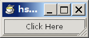
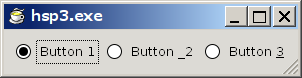
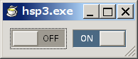
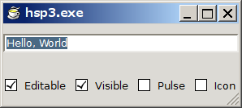

# この文書について

公開者:
: chrono (<https://github.com/kitachro>)

バージョン:
: 0.6.3

最終更新日:
: 2014年12月18日

ライセンス（Copyright）:
: GNU Free Documentation License 1.3 with no Invariant Sections, no Front-Cover Texts, and no Back-Cover Texts

　この文書は、HSP3でGTK+3アプリケーションを書く方法を学ぶためのチュートリアルです。既にHSPが使える人向けです。

　このチュートリアルは、[The Python GTK+ 3 Tutorial](http://python-gtk-3-tutorial.readthedocs.org/en/latest/index.html)のサイトをベースに作成しました。著者は、Sebastian Polsterl氏、dharmatech氏、Tshepang Lekhonkhobe氏、Jim Zhang氏、vaporup氏、その他の方々です。正確な著者情報については、随時変化しているため、<https://github.com/sebp/PyGObject-Tutorial>のサイトにて確認して下さい。

　この文書の透過的複製物は<https://github.com/kitachro/hsp-gtk/tree/master/tutorial>にて公開しています。また、このチュートリアルで挙げている、サンプルプログラムのスクリプトファイルも、同じ場所で公開しています。

====================
# 1　開発環境の準備

====================
## 1.1　GTK+3の入手とインストール

　このチュートリアルでは、[The GTK+ Project](http://www.gtk.org/)で公開されているall-in-one bundleアーカイブのGTK+3を動作確認に利用しています。ダウンロードは、Downloadのページからリンクされている、32bit Windows用アーカイブのページで行えます。アーカイブはただのzipファイルなので、ダウンロード後、解凍してください。

　このチュートリアルで解説、および、サンプルスクリプトの動作確認に使用しているバージョンは、3.6.4です。将来のバージョン、あるいは、Windows以外のOSで利用できる最新版のGTK+では、仕様が変更されている場合があります。

　アーカイブに含まれるファイルの中で、HSPスクリプトのデバッグ実行、およびスクリプトから作った実行ファイルの動作に必ず必要なのは、binフォルダにあるDLLファイルです。まずはデバッグ実行用に、これらのDLLファイルをすべて、HSP用プラグインを使う時と同じようにHSPのインストールフォルダにコピーしてください。

　実行ファイルの動作に必要なDLLは、スクリプトから利用しているものとそれらが依存しているDLLになります。DLLの依存関係を調べるには、Dependency Walkerというフリーウェアが便利です。Dependency Walkerは、他にもDLLに含まれている関数名を表示したり、その一覧をクリップボードにコピーできたりするのでおすすめです。ただしDependency Walkerを使わなくても、エラーなしで実行ファイルが起動するかどうかでDLLがそろっているかどうかを確認できます。

　なお、アーカイブフォルダ以下の、"\share\gtk-doc\html"フォルダに英語のマニュアルが収録されていますので、プログラミングの参考にしてください。このマニュアルは、基本的に[GNOME 開発センター](https://developer.gnome.org/)のサイトにあるAPIリファレンスと同じものですが、アーカイブのバージョンに合った情報が載っており、なおかつ、定数のC言語での定義も載っています。

　このチュートリアルを読むにあたっては、"\share\gtk-doc\html\gtk3\api-index-full.html"、"\share\gtk-doc\html\glib\api-index-full.html"、"\share\gtk-doc\html\gobject\api-index-full.html"などのページを開いておくと、関数の仕様などを簡単に調べることができます。英語ですが、引数や戻り値の型を見るだけでも役に立ちます。

　また、以上で説明した以外のファイルもプログラミングに役立ちますので、捨てずに、アーカイブのフォルダごと任意の場所に移動しておいてください。さらにこれらのファイル内のテキストを一気に全文検索できるソフトウェアを用意しておくと、プログラミングが捗ります。

====================
## 1.2　コールバック関数実装プラグインの入手

　HSPからGTK+を利用するには、HSPでコールバック関数という機能を使えるようにする必要があるのですが、これを実現してくれるのが、ちょくとさんによって公開されているHSP拡張プラグインのhscallbk.dllです。

　hscallbk.dllは、[ちょくとのページ](http://chokuto.ifdef.jp/index.html)内のダウンロードのページでダウンロードできます。非常に簡単に使えますので、Readmeを読んで把握しておいてください。

====================
# 2　GTK+の基礎

　この章では、GTK+において特に重要な、「ウィジェットのプロパティ」と「メインループとシグナル」という2つの概念について説明します。

　この章で挙げているスクリプトの断片は、それだけで実行することはできません。プログラムとして動作するサンプルスクリプトは、3章および5章以降で挙げています。

====================
## 2.1　ウィジェットのプロパティ

　GTK+のウィジェット（widget。GTK+が提供するプログラム部品。例えば、WindowやButton）は、インスタンス（プログラム上で生成済みのウィジェット）ごとにプロパティというものを持っています。

　プロパティは、インスタンスの内部情報や状態を表し、ウィジェットの種類ごとにどんなプロパティを持つかが決まっています。例えば、Button（ボタン）ウィジェットであれば、ボタン上に表示される文字列を表すlabelプロパティを持っています。

　プロパティの値を設定・取得するには、プロパティごとに用意されている設定・取得用関数を実行します。例えば、Buttonウィジェットであれば、gtk_button_set_label、gtk_button_get_label関数によって、labelプロパティの値を設定・取得することができます。

====================
### 2.1.1　ウィジェットのプロパティを設定する

　ウィジェットのプロパティ設定関数には、通常、ウィジェットのインスタンス（ウィジェット生成関数の戻り値がその値です）と、プロパティに設定する値を引数として指定します。

********************
    #uselib "libgtk-3-0.dll"
    #func global gtk_button_set_label "gtk_button_set_label" sptr, str
    （中略）
    	gtk_button_new
    	button = stat
    	gtk_button_set_label button, "text"
********************

　上記のgtk_button_set_label関数の場合であれば、gtk_button_new関数の戻り値と、ラベルに設定する文字列（または文字列が入った変数）を指定します。

====================
### 2.1.2　ウィジェットのプロパティを取得する

　ウィジェットのプロパティ取得関数には、通常、ウィジェットのインスタンスを引数として指定します。

********************
    #uselib "libgtk-3-0.dll"
    #func global gtk_button_get_label "gtk_button_get_label" sptr
    （中略）
    	gtk_button_get_label button
    	ptr = stat
********************

　上記のgtk_button_get_label関数の場合、プロパティの値は、ラベル文字列へのポインタの形で返されます。これをそのまま他の処理に利用したり、HSPのdupptr命令でHSPで利用できる文字列変数に変換したりすることができます。

====================
### 2.1.3　ウィジェットの生成時にプロパティを設定する

　ウィジェットのプロパティのうちのいくつかは、ウィジェットの生成時に値を設定することができます。例えば、Buttonウィジェットであれば、gtk_button_newの代わりにgtk_button_new_with_label関数を使うことによって、単にボタンを生成するだけでなく、関数の引数を介して、ボタン上のラベルテキストを設定することができます。

********************
    #uselib "libgtk-3-0.dll"
    #func global gtk_button_new_with_label "gtk_button_new_with_label" str
    （中略）
    gtk_button_new_with_label "Click!"
********************

　gtk_button_new_with_label関数を使う場合には、引数にボタンに表示したい文字列（または文字列が入った変数）を指定します。生成されたウィジェットが戻り値として返されるのは、gtk_button_new関数と同じです。

====================
## 2.2　メインループとシグナル

====================
### 2.2.1　GTK+アプリケーションの基本構造

　他の多くのGUIツールキットと同じく、GTK+はイベント駆動のプログラミングモデルを採用しています。プログラムのユーザが何もしていない時には、メインループ（ユーザの操作を待つための無限ループ）が繰り返され、GTK+はただ待機しているだけですが、ひとたびユーザによって何らかの操作が行われると、GTK+にイベント（event）が送られます。このイベントを待つという状態は、HSPのstop命令を実行した時と同じようなものです。

　イベントはそれが起こったウィジェットに伝えられ、ウィジェットはイベントの種類に応じて1つ以上のシグナル（signal）を発生させます。プログラムはシグナルによって「何かが起こった」ことを知ることができ、そのシグナルに関連付けられた（connectされた）関数があればそれを実行します。この関数のことをコールバック（callback）関数といいます。

　この「コールバック関数」という名前は、C言語（や同じ機能が使えるその他の言語）の言語機能に着目した場合の呼び方です。GTK+を利用したプログラム内での役割に着目した場合は、シグナルハンドラ（signal handler）と呼ばれます。

　コールバック関数では、通常シグナルの種類（＝プログラムで何が起こったか）に応じた処理を行います。例えば、ファイルを開くためのボタン（Button）が押された（clicked）のであれば、ファイル選択ダイアログ（FileChooserDialog）を表示したりすることが多いでしょう。必要な処理を行った後、コールバック関数がreturnされると、再びメインループに戻り、GTK+は待機状態になります。

====================
### 2.2.2　シグナルとコールバック関数を関連付ける

　次に、コールバック関数のシグナルへの関連付け（connect）について、スクリプトの書式を挙げて説明します。

********************
    g_signal_connect widget, "signal", varptr( callback ), 0
********************

　関連付けはg_signal_connect関数で行います。この関数を使うのに必要な#uselib命令と#func命令の行は、ここでは省略します。詳しくは、3章で説明します。

　g_signal_connect関数の、1つ目の引数の*widget*には、生成済みのウィジェット（インスタンス）を指定します。前節で説明したように、ウィジェットを生成する関数の戻り値（stat）がインスタンスを表す値になっていますので、それを利用します。

　次の"*signal*"には、関連付けしたいシグナルの名前を指定します。シグナル名は、その元となるイベントを表すものになっていることが多いです。起こるイベント（＝受け取れるシグナル）は、プロパティと同じようにウィジェットごとにあらかじめ決まっており、例えば、Buttonウィジェットであれば、clickedシグナルに関数をconnectする場合が圧倒的に多いでしょう。clickedシグナルは、ウィジェットがクリックされた時に発生するシグナルです。

　3番目の*callback*には、コールバック関数実装プラグインhscallbk.dllの、setcallbk命令の引数に指定したコールバック型の変数を指定します。hscallbk.dllを使用した場合、コールバック関数はラベルで始まりreturn命令で終わることになりますが、既に説明した通り、このラベルとreturnの間に、イベントが起こった時に実行したい処理を記述します。

　そして、最後の4つ目の引数ですが、本来ここには、コールバック関数を呼び出す時に引数として渡したいテータが入った変数のポインタを指定できるのですが、HSPからGTK+を利用する場合、g_signal_connect関数で関連付けしたコールバック関数の引数を利用しようとすると、エラーが発生して、スクリプトが強制終了してしまうことがあるため、この引数には、常に0を指定して、機能を利用しないようにすることをおすすめします。

====================
### 2.2.3　シグナルとコールバック関数の関連付けを削除する

　つづいて、シグナルとコールバック関数の関連付けを削除する方法について説明します。ここでも、#uselib命令と#func命令の行は省略しますが、サンプルは3章で見ることができます。

********************
    g_signal_connect widget, "signal", varptr( callback ), 0
    id = stat
    （中略）
    g_signal_handler_disconnect widget, id
********************

　先に説明したg_signal_connect関数の戻り値が関連付けの識別番号になっていますので、その値を引数としてg_signal_handler_disconnect関数を実行することによって、関連付けを削除することができます。g_signal_handler_disconnectを実行した時点で識別番号は無効になります。

====================
### 2.2.4　シグナルとコールバック関数の使用例

　最後に、GTK+におけるシグナルとコールバック関数（シグナルハンドラ）のよくある使用例について説明して、この節を終わります。

　たいていのGTK+アプリケーションは、トップレベルウィンドウ（＝デスクトップ画面に単独で存在できるウィンドウ）のdelete-eventシグナルに、gtk_main_quit関数を呼び出す処理を含むシグナルハンドラをconnectしています。delete-eventシグナルは、プログラムのユーザがウィンドウを閉じようとした時、例えばクローズボタンを押した時などに発生するシグナルです。

　プログラマが上記のようなdelete-eventシグナルのハンドラをconnectするのには理由があり、原因はdelete-eventシグナルのデフォルトのハンドラの仕様にあります。デフォルトハンドラとは、プログラマが明示的にconnectするハンドラとは別に、文字通りデフォルトでconnectされているハンドラのことです。

　このdelete-eventシグナルのデフォルトハンドラ内では、トップレベルウィンドウが破棄される（＝メモリ上から削除され、プログラムのユーザはもちろんプログラマからも利用できなくなる）のですが、ハンドラを抜けた後もプログラムのメインループは回り続けます。

　つまり、プログラムが動き続けるにもかかわらず、プログラムのユーザがプログラムを終了する手段がなくなってしまうということです。そこでこれを防ぐために、メインループから抜けるためのgtk_main_quit関数を呼び出すシグナルハンドラをconnectする必要があるというわけです（ちなみにメインループに入るにはgtk_main関数を実行します）。gtk_main_quit関数を呼び出す責任はプログラマにあります。

　ただし、ユーザがトップレベルウィンドウを閉じようとした時でも、それをキャンセルしたい場合があります。その場合には、プログラマがconnectしたdelete-eventシグナルのハンドラで1を返すことによって、デフォルトハンドラの実行はキャンセルされ、ウィンドウは破棄されずにそのまま残ります。

　gtk_main_quit関数によってメインループを抜けると、プログラムの実行位置はgtk_main関数の呼び出しの直後に戻ります。通常その後ろにはHSPのend命令を書いてプログラムを終了させます。

====================
# 3　はじめの一歩

　この章では、ごくシンプルなサンプルプログラムのスクリプトを挙げて、それについて解説します。

====================
## 3.1　最もシンプルなGTK+3プログラム

　まずは、できる限り短いGTK+3プログラムのスクリプトを示します。このスクリプトを実行すると、縦横200ピクセルの大きさの空のウィンドウが表示されます。ウィンドウを閉じると、プログラムは終了します。

====================
### 3.1.1　サンプルプログラムの全体

********************
    // コールバック関数を使うための準備
    #include "hscallbk.as"
    #uselib ""
    #func cb_window_delete_event ""
    
    // GTK+の関数を使うための準備
    #uselib "libgtk-3-0.dll"
    #func global gtk_init "gtk_init" sptr, sptr
    #func global gtk_window_new "gtk_window_new" int
    #const GTK_WINDOW_TOPLEVEL 0
    #func global gtk_widget_show_all "gtk_widget_show_all" sptr
    #func global gtk_main "gtk_main"
    #func global gtk_main_quit "gtk_main_quit"
    #uselib "libgobject-2.0-0.dll"
    #define g_signal_connect(%1, %2, %3, %4) g_signal_connect_data %1, %2, %3, %4, 0, 0
    #func global g_signal_connect_data "g_signal_connect_data" sptr, str, sptr, sptr, int, int
    
    // ヌルポインタ定数
    #const NULL 0
    
    	// GTK+初期化
    	gtk_init NULL, NULL
    
    	// ウィンドウ生成
    	gtk_window_new GTK_WINDOW_TOPLEVEL
    	win = stat
    	setcallbk cbwindowdeleteevent, cb_window_delete_event, *on_window_delete_event
    	g_signal_connect win, "delete-event", varptr( cbwindowdeleteevent ), NULL
    
    	// ウィンドウの表示とメインループの開始
    	gtk_widget_show_all win
    	gtk_main
    	end
    
    /* シグナルハンドラ */
    *on_window_delete_event
    	gtk_main_quit
    	return
********************

　以後、パートごとにスクリプトの内容について説明していきます。

====================
### 3.1.2　コールバック関数を使うための準備

********************
    #include "hscallbk.as"
    #uselib ""
    #func cb_window_delete_event ""
********************

　冒頭は、hscallbk.dllを利用してコールバック関数を使えるようにするためのスクリプトです。書き方については、hscallbk.dllのreadmeを参照してください。今回のプログラムでは、ウィンドウでdelete-eventシグナルが発生した時に実行する処理をコールバック関数として書く必要があるので、cb_window_delete_eventという名前を使っています。

　また、2.2.2で説明したように、HSPでは、シグナルに関連付けしたコールバック関数の引数は、利用しない方がいいので、ここで登録する関数にも引数は設定しないでください。

====================
### 3.1.3　GTK+3の関数を使うための準備

********************
    #uselib "libgtk-3-0.dll"
    #func global gtk_init "gtk_init" sptr, sptr
    #func global gtk_window_new "gtk_window_new" int
    #const GTK_WINDOW_TOPLEVEL 0
    #func global gtk_widget_show_all "gtk_widget_show_all" sptr
    #func global gtk_main "gtk_main"
    #func global gtk_main_quit "gtk_main_quit"
    #uselib "libgobject-2.0-0.dll"
    #define g_signal_connect(%1, %2, %3, %4) g_signal_connect_data %1, %2, %3, %4, 0, 0
    #func global g_signal_connect_data "g_signal_connect_data" sptr, str, sptr, sptr, int, int
********************

　この部分は、GTK+3のDLLの関数を使えるようにするためのスクリプトです。分量的に全体の半分近くを占める長さですが、他のプログラムでも再利用できる部分です。

　#uselib命令と#func命令の行は、HSPから一般的なDLLを利用するためのスクリプトとしてはありふれたものなので、その意味では難しいことはないと思います。DLLの関数を直接呼び出しますので、1章で紹介した、DLL添付のAPIリファレンスに載っている関数名がそのまま使えます。引数の型についても、リファレンスで調べて指定しています。

　#const命令と#define命令の行は、GTK+3のアーカイブに添付されているC言語用ヘッダファイルの内容をHSP向けに書き直したものです。

　GTK_WINDOW_TOPLEVEL定数は、添付マニュアルにC言語での定義が載っていますが、値は0です。値さえわかれば、マクロは絶対に必要なものではありませんが、毎度、調べたり思い出したりする手間を考えれば、（再利用することを前提に）書いておくのが得策です。

　g_signal_connect関数は、添付マニュアルには載っていますが、DLLには実装されておらず、C言語用ヘッダファイル内のマクロで定義されているので、HSPで書き直してやる必要があります。このマクロについても、g_signal_connect_data関数を使うのが面倒でなければ、省略してしまってもかまいませんが、まあ書いておいた方が後々楽かなと思います。

====================
### 3.1.4　ヌルポインタ定数

********************
    #const NULL 0
********************

　ここは、無効なポインタを表す定数を定義しています。この定数は、GTK+の関数を呼び出す時に、ポインタ型の引数を省略するためによく利用します。

====================
### 3.1.5　GTK+の初期化

********************
    gtk_init NULL, NULL
********************

　ここまでの下準備的なスクリプトの後でまず行わなければいけないことは、gtk_init関数でGTK+を初期化することです。この関数を実行しておかないと、他のGTK+の関数はまともに動きません。

　gtk_init関数に渡す2つの引数は、C言語の場合であれば、main関数の引数として受け取ることができる、argcとargvのアドレスを渡してやればいいのですが、HSPの場合には、これらを簡単に取得する方法がないので、代わりに0（無効なポインタ）を渡してください。

====================
### 3.1.6　ウィンドウの生成

********************
    gtk_window_new GTK_WINDOW_TOPLEVEL
    win = stat
********************

　GTK+のgtk_window_new関数で空のウィンドウを生成して、それを表す値を変数に保存しています。

　gtk_window_new関数の引数には、GTK_WINDOW_TOPLEVEL（既に説明したように、値は0です）、または、GTK_WINDOW_POPUP（添付マニュアルのAPIリファレンスに載っていますが、値は1です）を指定します。

　GTK_WINDOW_TOPLEVELを指定すると、いわゆるメインウィンドウ、トップレベルウィンドウを生成することができます。

　GTK_WINDOW_POPUPは、ポップアップメニューやポップアップのツールチップを1から作りたいときに指定します。この定数はダイアログを生成するためのものではありません。ダイアログを生成するには、別の専用の関数を実行する必要があります。

ダイアログについては、17章で詳しく説明します。

====================
### 3.1.7　ウィンドウのシグナルとコールバック関数の関連付け

********************
    setcallbk cbwindowdeleteevent, cb_window_delete_event, *on_window_delete_event
    g_signal_connect win, "delete-event", varptr( cbwindowdeleteevent ), NULL
********************

　hscallbk.dllのsetcallbk命令で、*on_window_delete_eventラベルで始まるサブルーチンをコールバック関数として呼び出せるようにした上で、g_signal_connect関数を実行して、生成済みのWindowウィジェットのdelete-eventシグナルにconnectしています。

　g_signal_connect関数の4つ目の引数に0を指定する理由は、2.2.2で説明した通りです。

====================
### 3.1.8　ウィンドウの表示

********************
    gtk_widget_show_all win
********************

　gtk_widget_show_all関数は、生成済みのウィジェット（ここではウィンドウ）を中身ごと画面に表示します。

====================
### 3.1.9　メインループの開始

********************
    gtk_main
    end
********************

　ウィンドウの生成、シグナルとそれに対する処理のconnect、ウィンドウの表示、が終わったら、gtk_main関数でメインループに入ってユーザの操作を待ちます。GTK+では、gtk_mainを抜けたらプログラムを終了させるのが普通なので、そのすぐ後ろにend命令を書いておきます。

====================
### 3.1.10　コールバック関数（シグナルハンドラ）の定義

********************
    *on_window_delete_event
    	gtk_main_quit
    	return
********************

　最後は、g_signal_connect関数でdelete-eventシグナルにconnectしたサブルーチンです。gtk_main_quit関数を実行すると、メインループから抜けてgtk_main関数からreturnすることができます。

====================
## 3.2　ウィンドウにウィジェットを1つ配置する

　つづいて、もう1つ、トップレベルウィンドウにウィジェットを1つ置いてそれを動作させるプログラムを挙げます。

　ウィンドウには、Buttonウィジェットを配置します。今回挙げるサンプルでは、clickedシグナルに短いサブルーチンをconnectして利用します。

　Buttonウィジェットを初めとする、ボタン系ウィジェットについては、5章で詳しく説明します。

====================
### 3.2.1　サンプルプログラムの全体

********************
    // コールバック関数を使うための準備
    #include "hscallbk.as"
    #uselib ""
    #func cb_window_delete_event ""
    #func cb_button_clicked ""
    
    // GTK+の関数を使うための準備
    #uselib "libgtk-3-0.dll"
    #func global gtk_init "gtk_init" sptr, sptr
    #func global gtk_window_new "gtk_window_new" int
    #const GTK_WINDOW_TOPLEVEL 0
    #func global gtk_widget_show_all "gtk_widget_show_all" sptr
    #func global gtk_main "gtk_main"
    #func global gtk_main_quit "gtk_main_quit"
    #func global gtk_button_new_with_label "gtk_button_new_with_label" sptr
    #func global gtk_container_add "gtk_container_add" sptr, sptr
    #uselib "libgobject-2.0-0.dll"
    #define g_signal_connect(%1, %2, %3, %4) g_signal_connect_data %1, %2, %3, %4, 0, 0
    #func global g_signal_connect_data "g_signal_connect_data" sptr, str, sptr, sptr, int, int
    ;#func global g_signal_handler_disconnect "g_signal_handler_disconnect" sptr, int 
    
    // ヌルポインタ定数
    #const NULL 0
    
    	// GTK+初期化
    	gtk_init NULL, NULL
    
    	// ウィンドウ生成
    	gtk_window_new GTK_WINDOW_TOPLEVEL
    	win = stat
    	setcallbk cbwindowdeleteevent, cb_window_delete_event, *on_window_delete_event
    	g_signal_connect win, "delete-event", varptr( cbwindowdeleteevent ), NULL
    
    	// ボタン生成
    	gtk_button_new_with_label "Click Here"
    	btn = stat
    	setcallbk cbbuttonclicked, cb_button_clicked, *on_button_clicked
    	g_signal_connect btn, "clicked", varptr( cbbuttonclicked ), NULL
    ;	id = stat
    ;	g_signal_handler_disconnect btn, id
    
    	// ウィンドウの組み立て
    	gtk_container_add win, btn
    
    	// ウィンドウの表示とメインループの開始
    	gtk_widget_show_all win
    	gtk_main
    	end
    
    /* シグナルハンドラ */
    *on_window_delete_event
    	gtk_main_quit
    	return
    
    *on_button_clicked
    	mes "Hello World"
    	return
********************

　以後、前節と同じように各パートの説明になりますが、前節と2章で既に説明した内容は省略します。

====================
### 3.2.2　コメントアウト部分

********************
    ;#func global g_signal_handler_disconnect "g_signal_handler_disconnect" sptr, int 
    （中略）
    ;	id = stat
    ;	g_signal_handler_disconnect btn, id
********************

　まず、スクリプトの中でコメントアウトされている部分ですが、これは、2章で説明した、シグナルとコールバック関数の関連付けを削除するためのスクリプトです。動作を確認したい場合に適宜有効にして実行してください。

====================
### 3.2.3　ボタンの生成

********************
    gtk_button_new_with_label "Click Here"
    btn = stat
    setcallbk cbbuttonclicked, cb_button_clicked, *on_button_clicked
    g_signal_connect btn, "clicked", varptr( cbbuttonclicked ), NULL
********************

　ここでは、ウィンドウに載せるためのButtonウィジェットを生成しています。

　Buttonウィジェットを生成する関数は、いくつかあるのですが、ここでは、gtk_button_new_with_label関数を使っています。

　この関数は、ボタン上に表示する文字列を指定してウィジェットを生成することができます。

　Buttonウィジェットについては、5.1で詳しく説明します。

====================
### 3.2.4　ウィンドウの組み立て

********************
    gtk_container_add win, btn
********************

　この部分では、ウィンドウにボタンを追加しています。

　GTK+のWindowウィジェットに他のウィジェットを子として追加するには、gtk_container_add関数を使います。2つのウィジェットのインスタンスを引数として指定します。

　Windowウィジェット上に複数のウィジェットを配置する方法については、6章で説明します。

====================
# 4　HSPからGTK+を利用する際の、文字コードに関する注意点

====================
## 4.1　GTK+とやりとりする文字列の文字コードについて

　まず1つ目の注意点は、GTK+のウィジェットは基本的にUTF-8エンコーディングの文字列しか扱えない、ということです。これはつまり、GTK+のウィジェットに渡す文字列は、必ずUTF-8エンコードされていなければならず、また、GTK+のウィジェットから返される文字列は、UTF-8エンコードされたものとして扱う必要がある、ということです。

　ただし、ウィジェットに理解してもらう必要がない文字列については、この限りではありません。

====================
## 4.2　HSPスクリプトの保存文字コードについて

　2つ目の注意点は、GTK+のウィジェットがUTF-8しか受け付けないからといって、HSPスクリプトファイルの保存文字コードをUTF-8にしてはいけない、ということです。標準エディタを使っている人は、そのような心配はないとは思いますが、いずれにしても、UTF-8エンコードされたマルチバイト文字（日本語の文字など）を含むHSPスクリプトは、エラーが出て実行できません。HSPスクリプトファイルは、シフトJISで保存されている必要があります。

====================
## 4.3　HSPプログラム内での対処方法

　そこでどうすれば良いかというと、必要に応じて、随時プログラム内で変換します。

　1つの手段としては、HSPに標準で添付されている拡張プラグインのhspinet.dllにあるnkfcnv命令を使うといいでしょう。

　例えば、""で囲まれる形で、HSPのスクリプト上に直接書かれている文字列は、そのままでは当然シフトJISエンコーディングなので、nkfcnv命令でUTF-8エンコーディングに変換した上でGTK+の関数に渡します。

********************
    #include "hspinet.as"
    
    sjis_text = "クリック！"
    nkfcnv utf8_text, sjis_text, "Sw"
    gtk_button_new_with_label utf8_text
********************

　ただし、このようなスクリプトを毎回書くのは面倒なので、モジュール内にごく短い名前のユーザ定義関数を作って、変換処理はその中に書いておき、変換が必要になる度にその関数を呼び出す形にすると、手間を減らすことができます。

********************
    #include "hspinet.as"
    #module
    	/* shift-jis文字列をutf-8に変換 */
    #defcfunc u str chars_
    	chars = chars_
    	nkfcnv@ chars, chars, "Sw"
    	return chars
    #global
    
    	gtk_button_new_with_label u( "クリック！" )
********************

　次の章からは、GTK+が提供するウィジェットやその他機能について、詳しく説明していきます。

====================
# 5　ボタン系ウィジェット

　まずはじめに紹介するボタン系ウィジェットは、非常に使いでがあるウィジェット群です。ボタンは、通常、押されるアクションがあった時に何らかの処理が行われるように設定します。プログラム上では、clickedシグナルにサブルーチンをconnectします。

　ボタンは、画像や文字列をその上に表示することができます。これらのものもウィジェットで、最もよく利用されるのは、文字列を表示するためのLabelウィジェットです。

　単純に画像や文字列を表示するだけではない、複雑なウィジェットを載せることもできなくはないですが、載せられた方のウィジェットをクリックできないなどの制限があるので、あまり意味がありません。

　この章では、用途や機能の異なる7つのボタン系ウィジェットを紹介します。

====================
## 5.1　ボタン（Button）

　まずは、最もシンプルなボタンであるButtonウィジェットです。

　Buttonウィジェットを生成するには、gtk_button_new、gtk_button_new_with_label、gtk_button_new_with_mnemonic、gtk_button_new_from_stock、の4つの関数のうちのいずれかを実行します。

　最も基本的な関数は、特にプロパティを設定せずにウィジェットを生成するためのgtk_button_new関数です。引数はありません。戻り値をインスタンスとして利用するのは、ウィンドウ生成関数と同じです。

　Buttonウィジェットには、文字列を表示することができますが、この機能はボタン上のLabelウィジェットが担当しています。このLabelウィジェットを操作することによって、文字列の表示フォントや文字色を変更することができます。（Labelウィジェット単体としては、7章で詳しく説明しています）

　Buttonウィジェットに画像を表示する最も簡単な方法は、ストックアイテム（StockItem）を利用することです。

　ストックアイテムとは、簡単に言うと、メニューやツールバー項目、その他ウィジェットに利用することができる、アイコンとキャプション文字列のセットです。GTK+には、組み込みのストックアイテムが多数用意されており、プログラム上では、ストックID（stock ID）と呼ばれる「名前」（文字列）によって、個々のストックアイテムを参照します。ストックアイテムの一覧は、添付マニュアルの"\share\gtk-doc\html\gtk3\gtk3-Stock-Items.html"のページに載っています。

　また、Buttonウィジェットには、ニーモニックを設定することができます。

　ニーモニックとは、キーボードアクセラレータとも呼ばれる機能で、キーボード操作によってウィジェットを動作させるためのものです。プログラム上では、アンダーライン付きの文字として表示され、Windowsでは、[Alt+(アルファベット)]キーを押すことによって作動します。

　ニーモニックも、Buttonウィジェット上のLabelウィジェットが持つ機能の1つですが、設定のためにLabelウィジェットを直接操作する必要はなく、Buttonウィジェットに用意された関数を利用します。

　次のページから、Buttonウィジェットの使用例として、サンプルプログラムを挙げて、そのスクリプトについて説明していきますが、スクリプト中で、ウィンドウに複数のウィジェットを並べるためのHBoxという名前のウィジェットを使っています。これについては、6.1で詳しく説明します。

====================
### 5.1.1　サンプルプログラムの全体

********************
    // よく使う関数
    #include "hspinet.as"
    #module
    #defcfunc u str chars_ ; shift-jis文字列をutf-8に変換
    	chars = chars_
    	nkfcnv@ chars, chars, "Sw"
    	return chars
    #global
    
    // コールバック関数を使うための準備
    #include "hscallbk.as"
    #uselib ""
    #func cb_window_delete_event ""
    #func cb_button1_clicked ""
    #func cb_button2_clicked ""
    #func cb_button3_clicked ""
    
    // GTK+の関数を使うための準備
    #uselib "libgtk-3-0.dll"
    #func global gtk_init "gtk_init" sptr, sptr
    #func global gtk_window_new "gtk_window_new" int
    #const GTK_WINDOW_TOPLEVEL 0
    #func global gtk_container_set_border_width "gtk_container_set_border_width" sptr, int
    #func global gtk_container_add "gtk_container_add" sptr, sptr
    #func global gtk_widget_show_all "gtk_widget_show_all" sptr
    #func global gtk_main "gtk_main"
    #func global gtk_main_quit "gtk_main_quit"
    #func global gtk_hbox_new "gtk_hbox_new" int, int
    #func global gtk_button_new_with_label "gtk_button_new_with_label" sptr
    #func global gtk_button_new_from_stock "gtk_button_new_from_stock" sptr
    #func global gtk_button_new_with_mnemonic "gtk_button_new_with_mnemonic" sptr 
    #define GTK_STOCK_OPEN "gtk-open"
    #func global gtk_container_get_children "gtk_container_get_children" sptr
    #func gtk_widget_override_font "gtk_widget_override_font" sptr, sptr
    #func global gtk_box_pack_start "gtk_box_pack_start" sptr, sptr, int, int, int
    
    #uselib "libgobject-2.0-0.dll"
    #define g_signal_connect(%1, %2, %3, %4) g_signal_connect_data %1, %2, %3, %4, 0, 0
    #func global g_signal_connect_data "g_signal_connect_data" sptr, str, sptr, sptr, int, int
    
    #uselib "libpango-1.0-0.dll"
    #func pango_font_description_from_string "pango_font_description_from_string" str
    
    #uselib "libglib-2.0-0.dll"
    #func global g_list_nth_data "g_list_nth_data" sptr, int
    
    // よく使う定数
    ; ヌルポインタ
    #const NULL 0
    ; 真偽値
    #const FALSE 0
    #const TRUE 1
    
    	// GTK+初期化
    	gtk_init NULL, NULL
    
    	// ウィンドウ生成
    	gtk_window_new GTK_WINDOW_TOPLEVEL
    	win = stat
    	gtk_container_set_border_width win, 10
    	setcallbk cbwindowdeleteevent, cb_window_delete_event, *on_window_delete_event
    	g_signal_connect win, "delete-event", varptr( cbwindowdeleteevent ), NULL
    
    	// HBox生成
    	gtk_hbox_new FALSE, 6
    	hbox = stat
    
    	// ボタン群生成
    	; ボタン1
    	gtk_button_new_with_label u( "クリック！" )
    	btn1 = stat
    	setcallbk cbbutton1clicked, cb_button1_clicked, *on_button1_clicked
    	g_signal_connect btn1, "clicked", varptr( cbbutton1clicked ), 0
    
    	; ボタン1のラベルのフォントを設定
    	gtk_container_get_children btn1
    	g_list_nth_data stat, 0
    	lbl = stat
    	pango_font_description_from_string "ms ui gothic 10"
    	gtk_widget_override_font lbl, stat
    
    	; ボタン2
    	gtk_button_new_from_stock GTK_STOCK_OPEN
    	btn2 = stat
    	setcallbk cbbutton2clicked, cb_button2_clicked, *on_button2_clicked
    	g_signal_connect btn2, "clicked", varptr( cbbutton2clicked ), 0
    
    	; ボタン3
    	gtk_button_new_with_mnemonic "_Close"
    	btn3 = stat
    	setcallbk cbbutton3clicked, cb_button3_clicked, *on_button3_clicked
    	g_signal_connect btn3, "clicked", varptr( cbbutton3clicked ), 0
    
    	// ウィンドウの組み立て
    	gtk_box_pack_start hbox, btn1, TRUE, TRUE, 0
    	gtk_box_pack_start hbox, btn2, TRUE, TRUE, 0
    	gtk_box_pack_start hbox, btn3, TRUE, TRUE, 0
    	gtk_container_add win, hbox
    
    	// ウィンドウの表示とメインループの開始
    	gtk_widget_show_all win
    	gtk_main
    	end
    
    /* シグナルハンドラ */
    *on_window_delete_event
    	gtk_main_quit
    	return
    
    *on_button1_clicked
    	mes "\"クリック！\" ボタンがクリックされました。"
    	return
    
    *on_button2_clicked
    	mes "\"Open\" ボタンがクリックされました。"
    	return
    
    *on_button3_clicked
    	dialog "\"Close\" ボタンがクリックされました。"
    	gtk_main_quit
    	return
********************

　次のページから、各部分について説明します。今までの章で既出の事は省略します。

====================
## 5.2　トグルボタン（ToggleButton）

　トグルボタンは、ボタン（Button）と非常によく似た形をしていますが、1つ違うのは、一度クリックされて押された（凹んだ）状態になると、もう一度クリックされるまでその状態が続くことです。

　トグルボタンは、クリックされて状態が変わるごとに、toggledシグナルを発生させます。

　ボタンの状態を知りたい時には、gtk_toggle_button_get_active関数を実行します。

　ボタンの状態を変更したい時には、gtk_toggle_button_set_active関数を実行してください。この関数を実行すると、クリックされた時と同じようにtoggledシグナルが発生します。

　次のページから、サンプルプログラムのスクリプトと、その説明です。

====================
### 5.2.1　サンプルプログラムの全体

********************
    // コールバック関数を使うための準備
    #include "hscallbk.as"
    #uselib ""
    #func cb_window_delete_event ""
    #func cb_button1_toggled ""
    #func cb_button2_toggled ""
    
    // GTK+の関数を使うための準備
    #uselib "libgtk-3-0.dll"
    #func global gtk_init "gtk_init" sptr, sptr
    #func global gtk_window_new "gtk_window_new" int
    #const GTK_WINDOW_TOPLEVEL 0
    #func global gtk_container_set_border_width "gtk_container_set_border_width" sptr, int
    #func global gtk_container_add "gtk_container_add" sptr, sptr
    #func global gtk_widget_show_all "gtk_widget_show_all" sptr
    #func global gtk_main "gtk_main"
    #func global gtk_main_quit "gtk_main_quit"
    #func global gtk_hbox_new "gtk_hbox_new" int, int
    #func global gtk_box_pack_start "gtk_box_pack_start" sptr, sptr, int, int, int
    #func global gtk_toggle_button_new_with_label "gtk_toggle_button_new_with_label" sptr
    #func global gtk_toggle_button_new_with_mnemonic "gtk_toggle_button_new_with_mnemonic" sptr
    #func global gtk_toggle_button_get_active "gtk_toggle_button_get_active" sptr
    
    #uselib "libgobject-2.0-0.dll"
    #define g_signal_connect(%1, %2, %3, %4) g_signal_connect_data %1, %2, %3, %4, 0, 0
    #func global g_signal_connect_data "g_signal_connect_data" sptr, str, sptr, sptr, int, int
    
    // よく使う定数
    ; ヌルポインタ
    #const NULL 0
    ; 真偽値
    #const FALSE 0
    #const TRUE 1
    
    	// GTK+初期化
    	gtk_init NULL, NULL
    
    	// ウィンドウ生成
    	gtk_window_new GTK_WINDOW_TOPLEVEL
    	win = stat
    	gtk_container_set_border_width win, 10
    	setcallbk cbwindowdeleteevent, cb_window_delete_event, *on_window_delete_event
    	g_signal_connect win, "delete-event", varptr( cbwindowdeleteevent ), 0
    
    	// HBox生成
    	gtk_hbox_new FALSE, 6
    	hbox = stat
    
    	// ボタン群生成
    	gtk_toggle_button_new_with_label "Button 1"
    	btn1 = stat
    	setcallbk cbbutton1toggled, cb_button1_toggled, *on_button1_toggled
    	g_signal_connect btn1, "toggled", varptr( cbbutton1toggled ), 0
    
    	gtk_toggle_button_new_with_mnemonic "_Button 2"
    	btn2 = stat
    	setcallbk cbbutton2toggled, cb_button2_toggled, *on_button2_toggled
    	g_signal_connect btn2, "toggled", varptr( cbbutton2toggled ), 0
    
    	// ウィンドウの組み立て
    	gtk_box_pack_start hbox, btn1, TRUE, TRUE, 0
    	gtk_box_pack_start hbox, btn2, TRUE, TRUE, 0
    	gtk_container_add win, hbox
    
    	// ウィンドウの表示とメインループの開始
    	gtk_widget_show_all win
    	gtk_main
    	end
    
    /* シグナルハンドラ */
    *on_window_delete_event
    	gtk_main_quit
    	return
    
    *on_button1_toggled
    	btn = btn1
    	num_btn = 1
    	gosub *show_message
    	return
    
    *on_button2_toggled
    	btn = btn2
    	num_btn = 2
    	gosub *show_message
    	return
    
    *show_message
    	gtk_toggle_button_get_active btn
    	if stat {
    		text_state = "ON"
    	}
    	else {
    		text_state = "OFF"
    	}
    	mes "Button " + num_btn + "が" + text_state + "になりました。"
    	return
********************

====================
## 5.3　チェックボタン（CheckButton）

　チェックボタンは、基本的にトグルボタンと同じものです。違うのは、ウィジェットの見栄えと、ウィジェットを生成するための関数名だけです。new系の関数名の"toggle"を"check"に変えてください。

　サンプルスクリプトは省略します。

====================
## 5.4　ラジオボタン（RadioButton）

　ラジオボタンは、チェックボタンとほぼ同じものですが、グループという概念が追加されています。

　同じグループに登録されているラジオボタンは、それらのうち、一度に1つしかアクティブ（オン）にすることができません。プログラムのユーザに、固定の選択肢の中から1つだけを選んでもらう機能を作るのに便利です。

　ラジオボタンを生成するには、gtk_radio_button_new_from_widget、gtk_radio_button_new_with_label_from_widget、gtk_radio_button_new_with_mnemonic_from_widget、の3つの関数のうちのいずれかを実行します。

　この時、1つ目の引数に、登録するグループの情報を指定します。

　同じグループとして扱うボタンのうち、1つ目のものを生成する場合には、0を指定してください。

　2つ目以降のものを生成する時には、同じグループの生成済みのウィジェットを指定してください。

　ボタンの生成直後は、同じグループ内で最初に作ったボタンがアクティブになっています。プログラムからアクティブなボタンを変更するには、gtk_toggle_button_set_active関数を実行します。

　ボタンのグループを後から変更したい時には、gtk_radio_button_join_group関数を実行してください。

　次のページから、サンプルプログラムのスクリプトとその説明になります。

====================
### 5.4.1　サンプルプログラムの全体

********************
    // コールバック関数を使うための準備
    #include "hscallbk.as"
    #uselib ""
    #func cb_window_delete_event ""
    #func cb_button1_toggled ""
    #func cb_button2_toggled ""
    #func cb_button3_toggled ""
    
    // GTK+の関数を使うための準備
    #uselib "libgtk-3-0.dll"
    #func global gtk_init "gtk_init" sptr, sptr
    #func global gtk_window_new "gtk_window_new" int
    #const GTK_WINDOW_TOPLEVEL 0
    #func global gtk_container_set_border_width "gtk_container_set_border_width" sptr, int
    #func global gtk_container_add "gtk_container_add" sptr, sptr
    #func global gtk_widget_show_all "gtk_widget_show_all" sptr
    #func global gtk_main "gtk_main"
    #func global gtk_main_quit "gtk_main_quit"
    #func global gtk_hbox_new "gtk_hbox_new" int, int
    #func global gtk_box_pack_start "gtk_box_pack_start" sptr, sptr, int, int, int
    #func global gtk_radio_button_new_with_label_from_widget "gtk_radio_button_new_with_label_from_widget" sptr, sptr
    #func global gtk_radio_button_new_with_mnemonic_from_widget "gtk_radio_button_new_with_mnemonic_from_widget" sptr, sptr
    #func global gtk_toggle_button_get_active "gtk_toggle_button_get_active" sptr
    
    #uselib "libgobject-2.0-0.dll"
    #define g_signal_connect(%1, %2, %3, %4) g_signal_connect_data %1, %2, %3, %4, 0, 0
    #func global g_signal_connect_data "g_signal_connect_data" sptr, str, sptr, sptr, int, int
    
    // よく使う定数
    ; ヌルポインタ
    #const NULL 0
    ; 真偽値
    #const FALSE 0
    #const TRUE 1
    
    	// GTK+初期化
    	gtk_init NULL, NULL
    
    	// ウィンドウ生成
    	gtk_window_new GTK_WINDOW_TOPLEVEL
    	win = stat
    	gtk_container_set_border_width win, 10
    	setcallbk cbwindowdeleteevent, cb_window_delete_event, *on_window_delete_event
    	g_signal_connect win, "delete-event", varptr( cbwindowdeleteevent ), NULL
    
    	// HBox生成
    	gtk_hbox_new FALSE, 6
    	hbox = stat
    
    	// ボタン群生成
    	gtk_radio_button_new_with_label_from_widget 0, "Button 1"
    	btn1 = stat
    	setcallbk cbbutton1toggled, cb_button1_toggled, *on_button1_toggled
    	g_signal_connect btn1, "toggled", varptr( cbbutton1toggled ), NULL
    
    	gtk_radio_button_new_with_label_from_widget btn1, "_Button 2"
    	btn2 = stat
    	setcallbk cbbutton2toggled, cb_button2_toggled, *on_button2_toggled
    	g_signal_connect btn2, "toggled", varptr( cbbutton2toggled ), NULL
    
    	gtk_radio_button_new_with_mnemonic_from_widget btn1, "_Button 3"
    	btn3 = stat
    	setcallbk cbbutton3toggled, cb_button3_toggled, *on_button3_toggled
    	g_signal_connect btn3, "toggled", varptr( cbbutton3toggled ), NULL
    
    	// ウィンドウの組み立て
    	gtk_box_pack_start hbox, btn1, TRUE, TRUE, 0
    	gtk_box_pack_start hbox, btn2, TRUE, TRUE, 0
    	gtk_box_pack_start hbox, btn3, TRUE, TRUE, 0
    	gtk_container_add win, hbox
    
    	// ウィンドウの表示とメインループの開始
    	gtk_widget_show_all win
    	gtk_main
    	end
    
    /* シグナルハンドラ */
    *on_window_delete_event
    	gtk_main_quit
    	return
    
    *on_button1_toggled
    	btn = btn1
    	num_btn = 1
    	gosub *show_message
    	return
    
    *on_button2_toggled
    	btn = btn2
    	num_btn = 2
    	gosub *show_message
    	return
    
    *on_button3_toggled
    	btn = btn3
    	num_btn = 3
    	gosub *show_message
    	return
    
    *show_message
    	gtk_toggle_button_get_active btn
    	if stat {
    		text_state = "ON"
    	}
    	else {
    		text_state = "OFF"
    	}
    	mes "Button " + num_btn + "が" + text_state + "になりました。"
    	return
********************

====================
## 5.5　リンクボタン（LinkButton）

　リンクボタンは、ウェブページにあるようなハイパーリンクを表示するためのボタンです。

　リンクをクリックすると、リンクされているアドレスを扱うデフォルトのアプリケーションが起動します――と言いたいところなのですが、Windowsでは、アドレスのプロトコルに対する関連付けが設定されていても、GTK+がデフォルトのアプリケーションの設定を見つけられずに、何も反応がないことがあります（C言語からGTK+を利用している場合には、ウォーニングがコンソールに出力されます）。

　というわけで、HSPからリンクボタンを使う場合には、組み込みの機能には頼らずに、リンクがクリックされた時点で、HSPのexec命令でアドレスをオープンしてしまうやり方をおすすめします。

　次のページから、上記のようにコーディングしたサンプルプログラムを挙げて、ポイントを説明します。

====================
### 5.5.1　サンプルプログラムの全体

********************
    // コールバック関数を使うための準備
    #include "hscallbk.as"
    #uselib ""
    #func cb_window_delete_event ""
    #func cb_link_button_activate_link ""
    
    // GTK+の関数を使うための準備
    #uselib "libgtk-3-0.dll"
    #func global gtk_init "gtk_init" sptr, sptr
    #func global gtk_window_new "gtk_window_new" int
    #const GTK_WINDOW_TOPLEVEL 0
    #func global gtk_widget_show_all "gtk_widget_show_all" sptr
    #func global gtk_main "gtk_main"
    #func global gtk_main_quit "gtk_main_quit"
    #func global gtk_link_button_new_with_label "gtk_link_button_new_with_label" str, str
    #func global gtk_link_button_get_uri "gtk_link_button_get_uri" sptr
    #func global gtk_container_add "gtk_container_add" sptr, sptr
    #uselib "libgobject-2.0-0.dll"
    #define g_signal_connect(%1, %2, %3, %4) g_signal_connect_data %1, %2, %3, %4, 0, 0
    #func global g_signal_connect_data "g_signal_connect_data" sptr, str, sptr, sptr, int, int
    
    // よく使う定数
    ; ヌルポインタ
    #const NULL 0
    ; 真偽値
    #const TRUE 1
    
    	// GTK+初期化
    	gtk_init NULL, NULL
    
    	// ウィンドウ生成
    	gtk_window_new GTK_WINDOW_TOPLEVEL
    	win = stat
    	setcallbk cbwindowdeleteevent, cb_window_delete_event, *on_window_delete_event
    	g_signal_connect win, "delete-event", varptr( cbwindowdeleteevent ), NULL
    
    	// ボタン生成
    	gtk_link_button_new_with_label "http://www.gtk.org", "GTK+ Homepage"
    	btn = stat
    	setcallbk cblinkbuttonactivatelink, cb_link_button_activate_link, *on_link_button_activate_link
    	g_signal_connect btn, "activate-link", varptr( cblinkbuttonactivatelink ), NULL
    
    	// ウィンドウの組み立て
    	gtk_container_add win, btn
    
    	// ウィンドウの表示とメインループの開始
    	gtk_widget_show_all win
    	gtk_main
    	end
    
    /* シグナルハンドラ */
    *on_window_delete_event
    	gtk_main_quit
    	return
    
    *on_link_button_activate_link
    	gtk_link_button_get_uri btn
    	p = stat
    	dupptr uri, p, 1024, 2
    	exec uri, 16
    	return TRUE
********************

====================
## 5.6　スピンボタン（SpinButton）

　スピンボタンは、プログラムのユーザに、一定の範囲内の数値を入力してもらうのに都合がいいウィジェットです。

　エントリのように、値を直接タイプして入力するだけでなく、－/＋ボタンで値を増減させることができるのが特徴です。

　－/＋ボタンで値を変更する場合には、あらかじめ設定した範囲を超えないようになっており、なおかつ、タイプで入力した場合でも、設定の範囲内かどうかチェックする機能がついています。

====================
### 5.6.1　サンプルプログラムの全体

********************
    // コールバック関数を使うための準備
    #include "hscallbk.as"
    #uselib ""
    #func cb_window_delete_event ""
    #func cb_cbutton1_toggled ""
    #func cb_cbutton2_toggled ""
    
    // GTK+の関数を使うための準備
    #uselib "libgtk-3-0.dll"
    #func global gtk_init "gtk_init" sptr, sptr
    #func global gtk_window_new "gtk_window_new" int
    #const GTK_WINDOW_TOPLEVEL 0
    #func global gtk_container_set_border_width "gtk_container_set_border_width" sptr, int
    #func global gtk_container_add "gtk_container_add" sptr, sptr
    #func global gtk_widget_show_all "gtk_widget_show_all" sptr
    #func global gtk_main "gtk_main"
    #func global gtk_main_quit "gtk_main_quit"
    #func global gtk_hbox_new "gtk_hbox_new" int, int
    #func global gtk_box_pack_start "gtk_box_pack_start" sptr, sptr, int, int, int
    #func global gtk_adjustment_new "gtk_adjustment_new" double, double, double, double, double, double
    #func global gtk_spin_button_new "gtk_spin_button_new" sptr, double, int
    #func global gtk_spin_button_set_numeric "gtk_spin_button_set_numeric" sptr, int
    #func global gtk_spin_button_set_update_policy "gtk_spin_button_set_update_policy" sptr, int
    #enum GTK_UPDATE_ALWAYS = 0
    #enum GTK_UPDATE_IF_VALID
    #func global gtk_check_button_new_with_label "gtk_check_button_new_with_label" sptr
    #func global gtk_toggle_button_get_active "gtk_toggle_button_get_active" sptr
    
    #uselib "libgobject-2.0-0.dll"
    #define g_signal_connect(%1, %2, %3, %4) g_signal_connect_data %1, %2, %3, %4, 0, 0
    #func global g_signal_connect_data "g_signal_connect_data" sptr, str, sptr, sptr, int, int
    
    // よく使う定数
    ; ヌルポインタ
    #const NULL 0
    ; 真偽値
    #const FALSE 0
    #const TRUE 1
    
    	// GTK+初期化
    	gtk_init NULL, NULL
    
    	// ウィンドウ生成
    	gtk_window_new GTK_WINDOW_TOPLEVEL
    	win = stat
    	gtk_container_set_border_width win, 10
    	setcallbk cbwindowdeleteevent, cb_window_delete_event, *on_window_delete_event
    	g_signal_connect win, "delete-event", varptr( cbwindowdeleteevent ), NULL
    
    	// HBox生成
    	gtk_hbox_new FALSE, 6
    	hbox = stat
    
    	// ボタン群生成
    	gtk_adjustment_new 0, 0, 1000, 1, 10, 0
    	adj = stat
    	gtk_spin_button_new adj, 1, 0
    	spb = stat
    
    	gtk_check_button_new_with_label "Numeric"
    	chb1 = stat
    	setcallbk cbcbutton1toggled, cb_cbutton1_toggled, *on_cbutton1_toggled
    	g_signal_connect chb1, "toggled", varptr( cbcbutton1toggled ), NULL
    
    	gtk_check_button_new_with_label "If valid"
    	chb2 = stat
    	setcallbk cbcbutton2toggled, cb_cbutton2_toggled, *on_cbutton2_toggled
    	g_signal_connect chb2, "toggled", varptr( cbcbutton2toggled ), NULL
    
    	// ウィンドウの組み立て
    	gtk_box_pack_start hbox, spb, TRUE, TRUE, 0
    	gtk_box_pack_start hbox, chb1, TRUE, TRUE, 0
    	gtk_box_pack_start hbox, chb2, TRUE, TRUE, 0
    	gtk_container_add win, hbox
    
    	// ウィンドウの表示とメインループの開始
    	gtk_widget_show_all win
    	gtk_main
    	end
    
    /* シグナルハンドラ */
    *on_window_delete_event
    	gtk_main_quit
    	return
    
    *on_cbutton1_toggled
    	gtk_toggle_button_get_active chb1
    	gtk_spin_button_set_numeric spb, stat
    	return
    
    *on_cbutton2_toggled
    	gtk_toggle_button_get_active chb2
    	if stat {
    		policy = GTK_UPDATE_IF_VALID
    	}
    	else {
    		policy = GTK_UPDATE_ALWAYS
    	}
    	gtk_spin_button_set_update_policy spb, policy
    	return
********************

====================
## 5.7　スイッチ（Switch）

====================
### 5.7.1　サンプルプログラムの全体

********************
    // コールバック関数を使うための準備
    #include "hscallbk.as"
    #uselib ""
    #func cb_window_delete_event ""
    #func cb_button1_notifyactive ""
    #func cb_button2_notifyactive ""
    
    // GTK+の関数を使うための準備
    #uselib "libgtk-3-0.dll"
    #func global gtk_init "gtk_init" sptr, sptr
    #func global gtk_window_new "gtk_window_new" int
    #const GTK_WINDOW_TOPLEVEL 0
    #func global gtk_container_set_border_width "gtk_container_set_border_width" sptr, int
    #func global gtk_container_add "gtk_container_add" sptr, sptr
    #func global gtk_widget_show_all "gtk_widget_show_all" sptr
    #func global gtk_main "gtk_main"
    #func global gtk_main_quit "gtk_main_quit"
    #func global gtk_hbox_new "gtk_hbox_new" int, int
    #func global gtk_box_pack_start "gtk_box_pack_start" sptr, sptr, int, int, int
    #func global gtk_switch_new "gtk_switch_new"
    #func global gtk_switch_set_active "gtk_switch_set_active" sptr, int
    #func global gtk_switch_get_active "gtk_switch_get_active" sptr
    
    #uselib "libgobject-2.0-0.dll"
    #define g_signal_connect(%1, %2, %3, %4) g_signal_connect_data %1, %2, %3, %4, 0, 0
    #func global g_signal_connect_data "g_signal_connect_data" sptr, str, sptr, sptr, int, int
    
    // よく使う定数
    ; ヌルポインタ
    #const NULL 0
    ; 真偽値
    #const FALSE 0
    #const TRUE 1
    
    	// GTK+初期化
    	gtk_init NULL, NULL
    
    	// ウィンドウ生成
    	gtk_window_new GTK_WINDOW_TOPLEVEL
    	win = stat
    	gtk_container_set_border_width win, 10
    	setcallbk cbwindowdeleteevent, cb_window_delete_event, *on_window_delete_event
    	g_signal_connect win, "delete-event", varptr( cbwindowdeleteevent ), NULL
    
    	// HBox生成
    	gtk_hbox_new FALSE, 6
    	hbox = stat
    
    	// ボタン群生成
    	gtk_switch_new
    	btn1 = stat
    	gtk_switch_set_active btn1, FALSE
    	setcallbk cbbutton1notifyactive, cb_button1_notifyactive, *on_button1_notifyactive
    	g_signal_connect btn1, "notify::active", varptr( cbbutton1notifyactive ), NULL
    
    	gtk_switch_new
    	btn2 = stat
    	gtk_switch_set_active btn2, TRUE
    	setcallbk cbbutton2notifyactive, cb_button2_notifyactive, *on_button2_notifyactive
    	g_signal_connect btn2, "notify::active", varptr( cbbutton2notifyactive ), NULL
    
    	// ウィンドウの組み立て
    	gtk_box_pack_start hbox, btn1, TRUE, TRUE, 0
    	gtk_box_pack_start hbox, btn2, TRUE, TRUE, 0
    	gtk_container_add win, hbox
    
    	// ウィンドウの表示とメインループの開始
    	gtk_widget_show_all win
    	gtk_main
    	end
    
    /* シグナルハンドラ */
    *on_window_delete_event
    	gtk_main_quit
    	return
    
    *on_button1_notifyactive
    	btn = btn1
    	num_btn = 1
    	gosub *show_message
    	return
    
    *on_button2_notifyactive
    	btn = btn2
    	num_btn = 2
    	gosub *show_message
    	return
    
    *show_message
    	gtk_switch_get_active btn
    	if stat {
    		text_state = "ON"
    	}
    	else {
    		text_state = "OFF"
    	}
    	mes "Button " + num_btn + "が" + text_state + "になりました。"
    	return
********************

====================
# 6　レイアウトコンテナ

　この章では、GTK+でウィンドウ（Window）に複数のウィジェットを配置する方法を説明します。

　ご存じの通り、HSP本来の機能では、ある程度実用的なプログラムを作ろうとする場合、オブジェクト（GUI部品）は、配置する数にかかわらず、プログラマが1つ1つ固定した座標を指定してウィンドウに配置しなければなりません。

　一方GTK+では、複数のウィジェットをウィンドウに配置する場合、一定のパターンに沿って半自動的に配置する機能を持った、レイアウト専用のウィジェットを使います。この種のウィジェットをレイアウトコンテナ（Layout Container）と呼びます。

　手順としては、まず、このレイアウトコンテナをウィンドウに載せ、さらにその上に、プログラムのユーザが操作するウィジェットを並べる、という形になります。レイアウトコンテナを利用すると、ピクセル単位の座標で指定するよりも、非常に簡便に配置をコントロールできます。

　GTK+には、様々な種類のレイアウトコンテナが用意されており、それぞれ、「縦または横方向に一直線に配置する」、「タイル形に配置する」、「すべて同じ位置に配置し、1度に1つだけ表示する」など、様々な配置パターンを持っています。さらに、レイアウトコンテナ同士を入れ子にして組み合わせることもできます。

　この章では、それらのうち、ボックス（HBoxおよびVBox）とテーブル（Table）を取り上げます。

====================
## 6.1　ボックス（HBoxおよびVBox）

　ボックスは、複数のウィジェットを縦または横方向に一直線に配置するための、目に見えないレイアウトコンテナです。HBoxは横方向（horizontal）、VBoxは縦方向（vertical）に配置することができます。

　ウィジェットの配置には、両ボックス共に、gtk_box_pack_startまたはgtk_box_pack_end関数を用います。gtk_box_pack_startを実行すると、引数に指定したウィジェットが、配置済みウィジェットの右側もしくは下側に追加され、gtk_box_pack_endを実行すると、左側もしくは上側に追加されます。

　次のページから、サンプルプログラムを挙げて、各部分について説明します。

====================
### 6.1.1　サンプルプログラムの全体

********************
    // コールバック関数を使うための準備
    #include "hscallbk.as"
    #uselib ""
    #func cb_window_delete_event ""
    #func cb_button1_clicked ""
    #func cb_button2_clicked ""
    
    // GTK+の関数を使うための準備
    #uselib "libgtk-3-0.dll"
    #func global gtk_init "gtk_init" sptr, sptr
    #func global gtk_window_new "gtk_window_new" int
    #const GTK_WINDOW_TOPLEVEL 0
    #func global gtk_widget_show_all "gtk_widget_show_all" sptr
    #func global gtk_main "gtk_main"
    #func global gtk_main_quit "gtk_main_quit"
    #func global gtk_button_new_with_label "gtk_button_new_with_label" sptr
    #func global gtk_container_add "gtk_container_add" sptr, sptr
    #func global gtk_hbox_new "gtk_hbox_new" int, int
    #func global gtk_box_pack_start "gtk_box_pack_start" sptr, sptr, int, int, int
    #uselib "libgobject-2.0-0.dll"
    #define g_signal_connect(%1, %2, %3, %4) g_signal_connect_data %1, %2, %3, %4, 0, 0
    #func global g_signal_connect_data "g_signal_connect_data" sptr, str, sptr, sptr, int, int
    
    // よく使う定数
    ; ヌルポインタ
    #const NULL 0
    ; 真偽値
    #const FALSE 0
    #const TRUE 1
    
    	// GTK+初期化
    	gtk_init NULL, NULL
    
    	// ウィンドウ生成
    	gtk_window_new GTK_WINDOW_TOPLEVEL
    	win = stat
    	setcallbk cbwindowdeleteevent, cb_window_delete_event, *on_window_delete_event
    	g_signal_connect win, "delete-event", varptr( cbwindowdeleteevent ), NULL
    
    	// HBox生成
    	gtk_hbox_new FALSE, 5
    	hbox = stat
    
    	// ボタン群生成
    	gtk_button_new_with_label "Hello"
    	btn1 = stat
    	setcallbk cbbutton1clicked, cb_button1_clicked, *on_button1_clicked
    	g_signal_connect btn1, "clicked", varptr( cbbutton1clicked ), NULL
    
    	gtk_button_new_with_label "Goodbye"
    	btn2 = stat
    	setcallbk cbbutton2clicked, cb_button2_clicked, *on_button2_clicked
    	g_signal_connect btn2, "clicked", varptr( cbbutton2clicked ), NULL
    
    	// ウィンドウの組み立て
    	gtk_container_add win, hbox
    	gtk_box_pack_start hbox, btn1, TRUE, TRUE, 0
    	gtk_box_pack_start hbox, btn2, TRUE, TRUE, 0
    
    	// ウィンドウの表示とメインループの開始
    	gtk_widget_show_all win
    	gtk_main
    	end
    
    /* シグナルハンドラ */
    *on_window_delete_event
    	gtk_main_quit
    	return
    
    *on_button1_clicked
    	mes "Hello"
    	return
    
    *on_button2_clicked
    	mes "Goodbye"
    	return
********************

　次のページから、各部分について説明します。今までの章で既出の事は省略します。

====================
### 6.1.2　真偽値の定数

********************
    #const FALSE 0
    #const TRUE 1
********************

　GTK+の関数に引数として渡す真偽値のマクロです。真偽値を渡す場合、0（偽）か1（真）を渡します。

====================
### 6.1.3　HBoxウィジェットの生成

********************
    gtk_hbox_new FALSE, 5
    hbox = stat
********************

　ここでは、gtk_hbox_new関数を実行して、HBoxウィジェットを生成しています。

　1つ目の引数には、HBoxの上に並べるウィジェットをすべて同じ大きさで表示するかどうかを、真偽値（1か0）で指定します。

　2つ目の引数には、HBoxの上に並べるウィジェット同士の間にどれくらいの間隔をあけるかを、ピクセル単位で指定します。

　関数の戻り値が、ウィジェットのインスタンスを表す値になっているので、後で利用できるように、変数に保存しておきます。

====================
### 6.1.4　ウィンドウの組み立て

********************
    gtk_container_add win, hbox
    gtk_box_pack_start hbox, btn1, TRUE, TRUE, 0
    gtk_box_pack_start hbox, btn2, TRUE, TRUE, 0
********************

　メインウィンドウ（トップレベルウィンドウ）に、その他ウィジェットを配置する処理です。

　gtk_container_add関数については、3章の2.4で説明しました。

　gtk_box_pack_start関数は、HBoxまたはVBoxの上に、他のウィジェットを1つ追加するための関数の1つです。ここでは、HBoxに対して実行しているので、追加済みのウィジェットの右側に追加されます。

　引数には、まず、「HBoxまたはVBox」、「それに載せるウィジェット」、の順でインスタンスを指定します。

　その次の2つの引数については、言葉で説明するのは難しいので、まず、下の画像を見てください。

　この画像は、gtk_hbox_new関数の1つ目の引数、およびgtk_box_pack_start関数の3つ目、4つ目の引数に指定する真偽値のバリエーションによって、配置したウィジェットの表示パターンがどのように変化するかを、実際にボタンウィジェットを使って示すデモプログラムのウィンドウキャプチャです。

　この章の1.3で、gtk_hbox_new関数の1つ目の引数は、ボックスの上に並べるウィジェットをすべて同じ大きさで表示するかどうかを表す、と書きましたが、正確には、すべてのウィジェットの配置スペースを同じ大きさで確保するかどうかを表します。従って、2つ目の引数も、正確には、ウィジェットの配置スペース同士の間隔を表します。

　gtk_box_pack_start関数の3つ目の引数は、追加するウィジェットの配置スペースを、可能な限り大きく確保するかどうかを表します。

　gtk_box_pack_start関数の4つ目の引数は、追加するウィジェットを、確保した配置スペースいっぱいに表示するかどうかを表します。

　gtk_box_pack_start関数の5つ目の引数は、確保した配置スペースの中で、ウィジェットの周りに作る余白の幅を表します。ただし「周り」というのは、HBoxの場合、左右を意味し、VBoxの場合、上下を意味します。

　上で示した画像のデモプログラムでは、同じHBoxに追加するウィジェットについては、同じ引数でgtk_box_pack_start関数を実行していますので、この部分のバリエーションに変化をつけると、さらに細かい変化のついた表示パターンになります。

　いずれにせよ、このチュートリアルの説明だけでは、なかなか完璧に把握することは難しいと思いますので、実際にスクリプトを書く時には、シンプルな引数のバリエーションから試していき、それで実現できる表示パターンに満足できなければ、少しずつ複雑なものを試していく、というやり方がいいのではないでしょうか。

　なお、今回画像を使用したデモプログラムのソースは、<https://github.com/kitachro/hsp-gtk/tree/master/demo>で、hbox_pack.hspという名前で公開しています。

====================
## 6.2　テーブル（Table）

　テーブルは、複数のウィジェットをタイル形に配置するための、目に見えないレイアウトコンテナです。

　gtk_table_new関数でウィジェットを生成することができます。

　テーブルに配置するウィジェット同士の間隔を設定するために、gtk_table_set_col_spacing、gtk_table_set_col_spacings、gtk_table_set_row_spacing、gtk_table_set_row_spacings、の4つの関数が用意されています。

　逆に値を取得するには、gtk_table_get_col_spacing関数、または、gtk_table_get_row_spacing関数を実行します。

　ウィジェットをテーブルに配置するには、gtk_table_attach_defaults関数を実行してください。

　次のページから、サンプルプログラムのスクリプトを挙げて、テーブル関連の関数について詳しく説明します。

====================
### 6.2.1 サンプルプログラムの全体

********************
    // コールバック関数を使うための準備
    #include "hscallbk.as"
    #uselib ""
    #func cb_window_delete_event ""
    
    // GTK+の関数を使うための準備
    #uselib "libgtk-3-0.dll"
    #func global gtk_init "gtk_init" sptr, sptr
    #func global gtk_window_new "gtk_window_new" int
    #const GTK_WINDOW_TOPLEVEL 0
    #func global gtk_table_new "gtk_table_new" int, int, int
    #func global gtk_table_set_col_spacings "gtk_table_set_col_spacings" sptr, int
    #func global gtk_table_set_row_spacings "gtk_table_set_row_spacings" sptr, int
    #func global gtk_table_attach_defaults "gtk_table_attach_defaults" sptr, sptr, int, int, int, int
    #func global gtk_button_new_with_label "gtk_button_new_with_label" sptr
    #func global gtk_container_add "gtk_container_add" sptr, sptr
    #func global gtk_widget_show_all "gtk_widget_show_all" sptr
    #func global gtk_main "gtk_main"
    #func global gtk_main_quit "gtk_main_quit"
    #uselib "libgobject-2.0-0.dll"
    #define g_signal_connect(%1, %2, %3, %4) g_signal_connect_data %1, %2, %3, %4, 0, 0
    #func global g_signal_connect_data "g_signal_connect_data" sptr, str, sptr, sptr, int, int
    
    // よく使う定数
    ; ヌルポインタ
    #const NULL 0
    ; 真偽値
    #const TRUE 1
    
    	// GTK+初期化
    	gtk_init NULL, NULL
    
    	// ウィンドウ生成
    	gtk_window_new GTK_WINDOW_TOPLEVEL
    	win = stat
    	setcallbk cbwindowdeleteevent, cb_window_delete_event, *on_window_delete_event
    	g_signal_connect win, "delete-event", varptr( cbwindowdeleteevent ), NULL
    
    	// テーブル生成
    	gtk_table_new 3, 3, TRUE
    	tbl = stat
    	gtk_table_set_col_spacings tbl, 10
    	gtk_table_set_row_spacings tbl, 10
    
    	// ボタン群生成
    	gtk_button_new_with_label "Button 1"
    	btn1 = stat
    	gtk_button_new_with_label "Button 2"
    	btn2 = stat
    	gtk_button_new_with_label "Button 3"
    	btn3 = stat
    	gtk_button_new_with_label "Button 4"
    	btn4 = stat
    	gtk_button_new_with_label "Button 5"
    	btn5 = stat
    	gtk_button_new_with_label "Button 6"
    	btn6 = stat
    
    	// ウィンドウの組み立て
    	gtk_table_attach_defaults tbl, btn1, 0, 1, 0, 1
    	gtk_table_attach_defaults tbl, btn2, 1, 3, 0, 1
    	gtk_table_attach_defaults tbl, btn3, 0, 1, 1, 3
    	gtk_table_attach_defaults tbl, btn4, 1, 3, 1, 2
    	gtk_table_attach_defaults tbl, btn5, 1, 2, 2, 3
    	gtk_table_attach_defaults tbl, btn6, 2, 3, 2, 3
    	gtk_container_add win, tbl
    
    	// ウィンドウの表示とメインループの開始
    	gtk_widget_show_all win
    	gtk_main
    	end
    
    /* シグナルハンドラ */
    *on_window_delete_event
    	gtk_main_quit
    	return
********************

====================
### 6.2.2 テーブルの生成とウィジェット間隔の設定

********************
    ; Table生成
    gtk_table_new 3, 3, TRUE
    tbl = stat
    gtk_table_set_col_spacings tbl, 10
    gtk_table_set_row_spacings tbl, 10
********************

　ウィジェットを生成するには、gtk_table_new関数を実行します。引数には、縦方向のマスの数（＝行数、number of rows）と横方向のマスの数（＝列数、number of columns）、および、すべてのマスを同じサイズに統一するかどうかを表す真偽値（1 or 0）を指定します。

　1つ目の引数と2つ目の引数の順番は、逆の方が直感的でわかりやすい気がしますが、こうなってしまっているので、仕方ありません。

　3つ目の引数の同じサイズとは、テーブルに配置するウィジェットのうち、一番大きなウィジェットのサイズを意味します。

　gtk_table_set_col_spacing関数を使うと、指定した列とその右の列との間に、指定したピクセル分の隙間を作ることができます。列の位置は、左から何番目かを表す整数で指定します。最初の列は0です。

　すべての列の左右の隙間を一度で設定したい場合は、gtk_table_set_col_spacings関数を使います。

　gtk_table_set_row_spacing関数を使うと、指定した行とその下の行との間に、指定したピクセル分の隙間を作ることができます。行の位置は、上から何番目かを表す整数で指定します。最初の行は0です。

　すべての行の上下の隙間を一度で設定したい場合は、gtk_table_set_row_spacings関数を使います。

====================
### 6.2.3 テーブルへのウィジェットの配置

********************
    ; ウィンドウの組み立て
    gtk_table_attach_defaults tbl, btn1, 0, 1, 0, 1
    gtk_table_attach_defaults tbl, btn2, 1, 3, 0, 1
    gtk_table_attach_defaults tbl, btn3, 0, 1, 1, 3
    gtk_table_attach_defaults tbl, btn4, 1, 3, 1, 2
    gtk_table_attach_defaults tbl, btn5, 1, 2, 2, 3
    gtk_table_attach_defaults tbl, btn6, 2, 3, 2, 3
    gtk_container_add win, tbl
********************

　任意のウィジェットをテーブルに配置するには、gtk_table_attach_defaults関数を実行します。引数には、テーブルのインスタンス、配置するウィジェットのインスタンス、配置開始X座標、配置終了X座標、配置開始Y座標、配置終了Y座標、の6つの値を指定します。

　ここでの座標とは、テーブルのマスを構成する辺が交差する点を指します。X座標、Y座標とも、テーブルの左上が0となり、そこから離れるに従って、1ずつ増えていき、右下の座標はgtk_table_new関数に指定した、2つ目と1つ目の引数と一致します。

　この節の冒頭のキャプチャ画像を見るとわかりますが、テーブルには、1つのウィジェットを複数のマスを占有するように配置することができます。

　配置座標の指定方法については、キャプチャ画像とスクリプトを見比べることで理解できるのではないかと思います。

====================
# 7　ラベル（Label）

　ラベルは、GTK+のウィンドウ内に編集の必要がない文字列を配置する第一の手段です。例えば、エントリ（Entry）ウィジェットのとなりに名前を表示するのに使います。

　文字列は、ウィジェット生成時に設定することもできますし、後で、gtk_label_set_text関数やgtk_label_set_markup関数を使って設定することもできます。

　ラベルウィジェットのサイズは、表示する文字列の長さやフォントの設定によって、自動で調整されます。改行（\n）を含む複数行からなる文字列を表示することもできます。

　gtk_label_set_selectable関数を使うと、プログラムのユーザが、文字列を選択したり、選択した文字列をクリップボードにコピーしたりできるようになります。gtk_label_set_selectable関数は、そういったことが必要になる場合にのみ使うようにしてください。例えば、エラーメッセージを表示する場合です。その方が、プログラムが使いやすくなります。

　文字列の行表示の、左寄せ・右寄せ・中央寄せ・両側寄せの設定や、折り返しのオン・オフを変更するには、それぞれ、gtk_label_set_justify関数、gtk_label_set_line_wrap関数を実行します。

　ラベルウィジェットは、文字列の簡単な装飾もサポートしています。1つのラベルの中で、一部の文字を太字にしたり、一部の文字の色やサイズを変えたりといったことができます。

　例えば、`<b>bold text</b> and <s>strikethrough text</s>`のように、[Pango Markupフォーマット](http://developer.gnome.org/pango/stable/PangoMarkupFormat.html)に従って記述した文字列を、gtk_label_set_markup関数に渡してください。

　また、ラベル文字列には、ニーモニックが設定できます。ニーモニックとは、ウィジェットにキーボードショートカットを実装する仕組みの1つで、プログラム上では、アンダーライン付きの文字として表示されます。Windowsでは、[Alt+(アルファベット)]キーで実行するアレです。

　ニーモニックを設定するには、例えば"\_File"のように、文字列中の対象キーのアルファベットの前にアンダースコア（\_）を付加した上で、gtk_label_new_with_mnemonic関数、もしくはgtk_label_set_text_with_mnemonic関数によってラベル文字列を設定してください。

　ニーモニックによるキー操作の動作対象は、基本的に、ニーモニックを設定したラベルを載せたウィジェットです。例えば、ボタンのラベルに設定した場合は、そのボタンになります。

　ただし、gtk_label_set_mnemonic_widget関数を使うことで、動作対象を他のウィジェットに変更することもできます。

　次のページから、サンプルプログラムのスクリプトを挙げて、それについて説明します。

====================
## 7.1　サンプルプログラムの全体

********************
    // よく使う関数
    #include "hspinet.as"
    #module
    #defcfunc u str chars_ ; shift-jis文字列をutf-8に変換
    	chars = chars_
    	nkfcnv@ chars, chars, "Sw"
    	return chars
    #global
    
    // コールバック関数を使うための準備
    #include "hscallbk.as"
    #uselib ""
    #func cb_window_delete_event ""
    
    // GTK+の関数を使うための準備
    #uselib "libgtk-3-0.dll"
    #func global gtk_init "gtk_init" sptr, sptr
    #func global gtk_window_new "gtk_window_new" int
    #const GTK_WINDOW_TOPLEVEL 0
    #func global gtk_container_add "gtk_container_add" sptr, sptr
    #func global gtk_widget_show_all "gtk_widget_show_all" sptr
    #func global gtk_main "gtk_main"
    #func global gtk_main_quit "gtk_main_quit"
    #func global gtk_button_new_with_label "gtk_button_new_with_label" sptr
    #func global gtk_hbox_new "gtk_hbox_new" int, int
    #func global gtk_vbox_new "gtk_vbox_new" int, int
    #func global gtk_box_pack_start "gtk_box_pack_start" sptr, sptr, int, int, int
    #func global gtk_label_new "gtk_label_new" sptr
    #func global gtk_label_new_with_mnemonic "gtk_label_new_with_mnemonic" sptr
    #func global gtk_label_set_justify "gtk_label_set_justify" sptr, int
    #func global gtk_label_set_selectable "gtk_label_set_selectable" sptr, int
    #func global gtk_label_set_markup "gtk_label_set_markup" sptr, sptr
    #const GTK_JUSTIFY_LEFT 0
    #const GTK_JUSTIFY_RIGHT 1
    #const GTK_JUSTIFY_CENTER 2
    #const GTK_JUSTIFY_FILL 3
    #func global gtk_label_set_line_wrap "gtk_label_set_line_wrap" sptr, int
    #func global gtk_label_set_mnemonic_widget "gtk_label_set_mnemonic_widget" sptr, sptr
    
    #uselib "libgobject-2.0-0.dll"
    #define g_signal_connect(%1, %2, %3, %4) g_signal_connect_data %1, %2, %3, %4, 0, 0
    #func global g_signal_connect_data "g_signal_connect_data" sptr, str, sptr, sptr, int, int
    
    // よく使う定数
    ; ヌルポインタ
    #const NULL 0
    ; 真偽値
    #const FALSE 0
    #const TRUE 1
    
    	// GTK+初期化
    	gtk_init NULL, NULL
    
    	// ウィンドウ生成
    	gtk_window_new GTK_WINDOW_TOPLEVEL
    	win = stat
    	setcallbk cbwindowdeleteevent, cb_window_delete_event, *on_window_delete_event
    	g_signal_connect win, "delete-event", varptr( cbwindowdeleteevent ), NULL
    
    	// ボックス群生成
    	gtk_hbox_new FALSE, 10
    	hbox = stat
    
    	gtk_vbox_new FALSE, 10
    	vbox_left = stat
    	gtk_vbox_new FALSE, 10
    	vbox_right = stat
    
    	// ラベル群生成
    	gtk_label_new u( "デフォルト状態のラベルです。\n次の行です。" )
    	lbl1 = stat
    
    	text = "テキストを左寄せしたラベルです。\n"
    	text += "次の行です。\nデフォルトは左寄せです。"
    	gtk_label_new u( text )
    	lbl2 = stat
    	gtk_label_set_justify lbl2, GTK_JUSTIFY_LEFT
    
    	text = "テキストを中央寄せしたラベルです。\n"
    	text += "次の行です。"
    	gtk_label_new u( text )
    	lbl3 = stat
    	gtk_label_set_justify lbl3, GTK_JUSTIFY_CENTER
    
    	gtk_label_new u( "テキストを右寄せしたラベルです。\n次の行です。" )
    	lbl4 = stat
    	gtk_label_set_justify lbl4, GTK_JUSTIFY_RIGHT
    
    	text = "文字を<small>小さくしたり</small>、<big>大きくしたり</big>、"
    	text += "<b>太くしたり</b>、<i>イタリックにしたり</i>できます。"
    	text += "行の折り返しがオンになっています。"
    	gtk_label_new 0
    	lbl5 = stat
    	gtk_label_set_markup lbl5, u( text )
    	gtk_label_set_line_wrap lbl5, TRUE
    
    	text = "[Alt+_P]キーを押すと、右側のボタンが動作します。\n"
    	text += "このラベルのテキストは選択できます。"
    	gtk_label_new_with_mnemonic u( text )
    	lbl6 = stat
    	gtk_label_set_selectable lbl6, TRUE
    
    	text = "This is an example of a line-wrapped label.  It "
    	text += "should not be taking up the entire "
    	text += "width allocated to it, but automatically "
    	text += "wraps the words to fit.\n\n"
    	text += "このラベルも行の折り返しがオンになっています。\n"
    	text += "1行に入り切らない単語（文字）は次の行に送られます。\n"
    	text += "テキストは左寄せなので、折り返しによってできた"
    	text += "右側の余白はそのままです。\n"
    	text += "テキスト中の  空白も  そのまま  表示  されます。"
    	gtk_label_new u( text )
    	lbl7 = stat
    	gtk_label_set_line_wrap lbl7, TRUE
    
    	text = "This is an example of a line-wrapped, filled label. "
    	text += "It should be taking "
    	text += "up the entire width allocated to it.\n\n"
    	text += "このラベルは、行の折り返しがオンで、なおかつテキストが"
    	text += "両側寄せになっています。\n"
    	text += "折り返しによって左右に余白ができないようになっています。\n"
    	gtk_label_new u( text )
    	lbl8 = stat
    	gtk_label_set_justify lbl8, GTK_JUSTIFY_FILL
    	gtk_label_set_line_wrap lbl8, TRUE
    
    	gtk_button_new_with_label u( "押さないでください" )
    	btn = stat
    	gtk_label_set_mnemonic_widget lbl6, btn
    
    	// ウィンドウの組み立て
    	gtk_box_pack_start vbox_left, lbl1, TRUE, TRUE, 0
    	gtk_box_pack_start vbox_left, lbl2, TRUE, TRUE, 0
    	gtk_box_pack_start vbox_left, lbl3, TRUE, TRUE, 0
    	gtk_box_pack_start vbox_left, lbl4, TRUE, TRUE, 0
    	gtk_box_pack_start vbox_left, lbl5, TRUE, TRUE, 0
    	gtk_box_pack_start vbox_left, lbl6, TRUE, TRUE, 0
    
    	gtk_box_pack_start vbox_right, lbl7, TRUE, TRUE, 0
    	gtk_box_pack_start vbox_right, lbl8, TRUE, TRUE, 0
    	gtk_box_pack_start vbox_right, btn, TRUE, TRUE, 0
    
    	gtk_box_pack_start hbox, vbox_left, TRUE, TRUE, 0
    	gtk_box_pack_start hbox, vbox_right, TRUE, TRUE, 0
    
    	gtk_container_add win, hbox
    
    	// ウィンドウの表示とメインループの開始
    	gtk_widget_show_all win
    	gtk_main
    	end
    
    /* シグナルハンドラ */
    *on_window_delete_event
    	gtk_main_quit
    	return
********************

====================
# 8　エントリ（Entry）

　エントリウィジェットは、プログラムのユーザに短めの文字列を入力してもらうためのウィジェットです。

　プログラムからエントリ内の文字列を変更したり、エントリ内の文字列を取得したりするには、それぞれ、gtk_entry_set_text関数、gtk_entry_get_text関数を実行します。

　gtk_entry_set_max_length関数を用いると、エントリに入力できる文字数をコントロールできます。

　用途によっては、エントリ内の文字列を編集できないようにしたい時もあるでしょう。そのような場合には、引数に0を渡してgtk_entry_set_editable関数を実行してください。

　エントリウィジェットは、プログラムのユーザからパスワードのようなものを受け取るためにも使えます。パスワードなどを入力させるインターフェースでは、第三者に盗み見られないように、伏せ字にするのが普通ですが、gtk_entry_set_visibility関数によって、そのようなモードのオン・オフを切り替えることができます。引数に0を渡すと、伏せ字になります。

　また、他にも変わったモードを持っています。gtk_entry_set_progress_fraction、gtk_entry_set_progress_pulse_step、gtk_entry_progress_pulseなどの関数を使うと、エントリ内の文字列の背後に、何らかの作業の進行度や作業が進行中であることを表すアニメーションを表示させて、プログレスバー（ProgressBar）のように振る舞わせることもできます。

　さらに、ウィジェットの役割などをわかりやすくするために、ウィジェット内にアイコンを表示する機能もあります。

　このアイコンは、クリックされたことを検知したり、ドラッグ可能にしたり、ツールチップを設定したりすることができます。

　アイコンをウィジェット内に表示するには、例えば、gtk_entry_set_icon_from_stock関数を実行します。この関数は、アイコンのソースとしてストックアイテム（Stock Item）名を指定しますが、他にも、ファイル、pixbuf形式データ、アイコンテーマをソースとして指定できる関数が用意されています。

　アイコンにツールチップを設定するには、gtk_entry_set_icon_tooltip_text関数を使ってください。マークアップされた文字列を表示するために、gtk_entry_set_icon_tooltip_markup関数を使うこともできます。

　次のページからは、例によって、サンプルプログラムのスクリプトとその解説です。

====================
## 8.1　サンプルプログラムの全体

********************
    // よく使う関数
    #include "hspinet.as"
    #module
    #defcfunc u str chars_ ; shift-jis文字列をutf-8に変換
    	chars = chars_
    	nkfcnv@ chars, chars, "Sw"
    	return chars
    #global
    
    // コールバック関数を使うための準備
    #include "hscallbk.as"
    #uselib ""
    #func cb_window_delete_event ""
    #func cb_cbtn1_toggled ""
    #func cb_cbtn2_toggled ""
    #func cb_cbtn3_toggled ""
    #func cb_cbtn4_toggled ""
    #func cb_do_pulse ""
    
    // GTK+の関数を使うための準備
    #uselib "libgtk-3-0.dll"
    #func global gtk_init "gtk_init" sptr, sptr
    #func global gtk_window_new "gtk_window_new" int
    #const GTK_WINDOW_TOPLEVEL 0
    #func global gtk_container_add "gtk_container_add" sptr, sptr
    #func global gtk_widget_set_size_request "gtk_widget_set_size_request" sptr, int, int
    #func global gtk_widget_show_all "gtk_widget_show_all" sptr
    #func global gtk_main "gtk_main"
    #func global gtk_main_quit "gtk_main_quit"
    #func global gtk_vbox_new "gtk_vbox_new" int, int
    #func global gtk_hbox_new "gtk_hbox_new" int, int
    #func global gtk_box_pack_start "gtk_box_pack_start" sptr, sptr, int, int, int
    #func global gtk_entry_new "gtk_entry_new" 
    #func global gtk_entry_set_text "gtk_entry_set_text" sptr, sptr
    #func global gtk_entry_set_visibility "gtk_entry_set_visibility" sptr, int
    #func global gtk_entry_set_icon_from_stock "gtk_entry_set_icon_from_stock" sptr, int, sptr
    #func global gtk_entry_set_progress_pulse_step "gtk_entry_set_progress_pulse_step" sptr, double
    #func global gtk_entry_progress_pulse "gtk_entry_progress_pulse" sptr
    #func global gtk_editable_set_editable "gtk_editable_set_editable" sptr, int
    #define GTK_STOCK_FIND "gtk-find"
    #enum GTK_ENTRY_ICON_PRIMARY = 0
    #enum GTK_ENTRY_ICON_SECONDARY
    #func global gtk_check_button_new_with_label "gtk_check_button_new_with_label" sptr
    #func global gtk_toggle_button_set_active "gtk_toggle_button_set_active" sptr, int
    #func global gtk_toggle_button_get_active "gtk_toggle_button_get_active" sptr
    
    #uselib "libgobject-2.0-0.dll"
    #define g_signal_connect(%1, %2, %3, %4) g_signal_connect_data %1, %2, %3, %4, 0, 0
    #func global g_signal_connect_data "g_signal_connect_data" sptr, str, sptr, sptr, int, int
    
    #uselib "libglib-2.0-0.dll"
    #func global g_timeout_add "g_timeout_add" int, sptr, sptr
    #func global g_source_remove "g_source_remove" int
    
    // よく使う定数
    ; ヌルポインタ
    #const NULL 0
    ; 真偽値
    #const FALSE 0
    #const TRUE 1
    
    	// GTK+初期化
    	gtk_init NULL, NULL
    
    	// ウィンドウ生成
    	gtk_window_new GTK_WINDOW_TOPLEVEL
    	win = stat
    	gtk_widget_set_size_request win, 200, 100
    	setcallbk cbwindowdeleteevent, cb_window_delete_event, *on_window_delete_event
    	g_signal_connect win, "delete-event", varptr( cbwindowdeleteevent ), NULL
    
    	// VBox生成
    	gtk_vbox_new FALSE, 6
    	vbox = stat
    
    	// エントリ生成
    	gtk_entry_new
    	ety = stat
    	gtk_entry_set_text ety, "Hello, World"
    
    	// HBox生成
    	gtk_hbox_new FALSE, 6
    	hbox = stat
    
    	// ボタン群生成
    	gtk_check_button_new_with_label "Editable"
    	cbtn1 = stat
    	gtk_toggle_button_set_active cbtn1, TRUE
    	setcallbk cbcbtn1toggled, cb_cbtn1_toggled, *on_cbtn1_toggled
    	g_signal_connect cbtn1, "toggled", varptr( cbcbtn1toggled ), NULL
    
    	gtk_check_button_new_with_label "Visible"
    	cbtn2 = stat
    	gtk_toggle_button_set_active cbtn2, TRUE
    	setcallbk cbcbtn2toggled, cb_cbtn2_toggled, *on_cbtn2_toggled
    	g_signal_connect cbtn2, "toggled", varptr( cbcbtn2toggled ), NULL
    
    	gtk_check_button_new_with_label "Pulse"
    	cbtn3 = stat
    	gtk_toggle_button_set_active cbtn3, FALSE
    	setcallbk cbcbtn3toggled, cb_cbtn3_toggled, *on_cbtn3_toggled
    	g_signal_connect cbtn3, "toggled", varptr( cbcbtn3toggled ), NULL
    	setcallbk cbdopulse, cb_do_pulse, *do_pulse
    
    	gtk_check_button_new_with_label "Icon"
    	cbtn4 = stat
    	gtk_toggle_button_set_active cbtn4, FALSE
    	setcallbk cbcbtn4toggled, cb_cbtn4_toggled, *on_cbtn4_toggled
    	g_signal_connect cbtn4, "toggled", varptr( cbcbtn4toggled ), NULL
    
    	// ウィンドウの組み立て
    	gtk_box_pack_start hbox, cbtn1, TRUE, TRUE, 0
    	gtk_box_pack_start hbox, cbtn2, TRUE, TRUE, 0
    	gtk_box_pack_start hbox, cbtn3, TRUE, TRUE, 0
    	gtk_box_pack_start hbox, cbtn4, TRUE, TRUE, 0
    	gtk_box_pack_start vbox, ety, TRUE, TRUE, 0
    	gtk_box_pack_start vbox, hbox, TRUE, TRUE, 0
    	gtk_container_add win, vbox
    
    	// ウィンドウの表示とメインループの開始
    	gtk_widget_show_all win
    	gtk_main
    	end
    
    /* シグナルハンドラ */
    *on_window_delete_event
    	gtk_main_quit
    	return
    
    *on_cbtn1_toggled
    	gtk_toggle_button_get_active cbtn1
    	gtk_editable_set_editable ety, stat
    	return
    
    *on_cbtn2_toggled
    	gtk_toggle_button_get_active cbtn2
    	gtk_entry_set_visibility ety, stat
    	return
    
    *on_cbtn3_toggled
    	gtk_toggle_button_get_active cbtn3
    	active = stat
    	if active {
    		gtk_entry_set_progress_pulse_step ety, 0.2
    		g_timeout_add 100, varptr( cbdopulse ), 0
    		timeout_id = stat
    	}
    	else {
    		g_source_remove timeout_id
    		timeout_id = 0
    		gtk_entry_set_progress_pulse_step ety, 0
    	}
    	return
    
    *do_pulse
    	gtk_entry_progress_pulse ety
    	return
    
    *on_cbtn4_toggled
    	gtk_toggle_button_get_active cbtn4
    	active = stat
    	if active {
    		stock_id = GTK_STOCK_FIND
    	}
    	else {
    		stock_id = ""
    	}
    	gtk_entry_set_icon_from_stock ety, GTK_ENTRY_ICON_PRIMARY, stock_id
    	return
********************

====================
# 9　プログレスバー（ProgressBar）

====================
# 10　スピナー（Spinner）

====================
# 11　ツリービューとリストビュー（TreeView）

====================
# 12　セルレンダラ（CellRenderer）

====================
# 13　コンボボックス（ComboBox）

====================
# 14　アイコンビュー（IconView）

====================
# 15　テキストエディタ（TextView）

====================
# 16　メニュー（Menu）

====================
# 17　ダイアログ（Dialog）

====================
# 18　クリップボード（Clipboard）

====================
# 19　ドラッグアンドドロップ

====================
# 20　GladeインターフェースデザイナーとGtkBuilderクラス

====================
# 21　オブジェクト

====================
# 22　ストックアイテム（StockItem）

