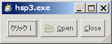
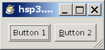
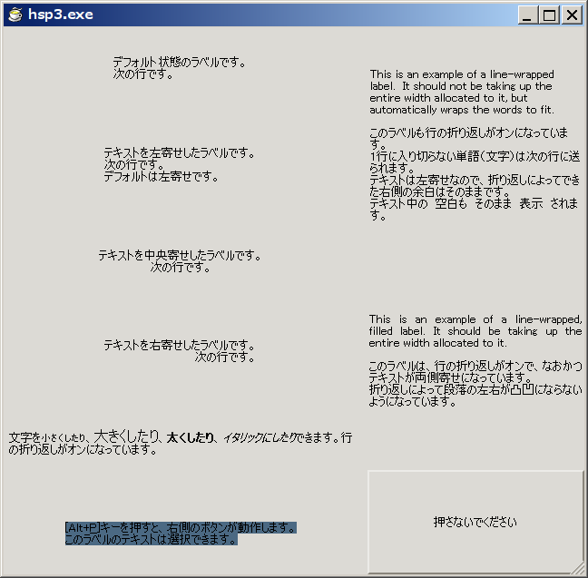
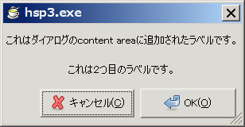
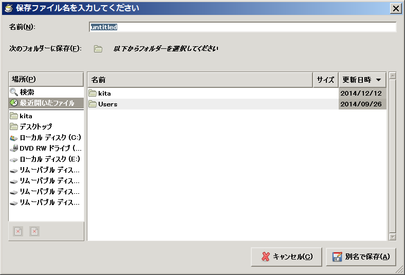

# この文書について

公開者:
: chrono (<https://github.com/kitachro>)

最終更新日:
: 2015年6月14日

ライセンス（Copyright）:
: GNU Free Documentation License 1.3 with no Invariant Sections, no Front-Cover Texts, and no Back-Cover Texts

　この文書は、HSP3でGTK+3アプリケーションを書く方法を学ぶためのチュートリアルです。既にHSPが使える人向けです。HSPからGTK+3を使う場合、一般的なDLLとして提供されているものをそのまま利用する形になりますので、そのために必要なC言語の知識もあった方が望ましいです。

　このチュートリアルは、[The Python GTK+ 3 Tutorial](http://python-gtk-3-tutorial.readthedocs.org/en/latest/index.html)のサイトをベースに、章構成やサンプルコードを参考にして作成しました。本文は、作成者の判断（好み）で、HSPユーザ向けに大幅に内容の追加や変更を行っています。

　オリジナルのPython版の著者は、Sebastian Polsterl氏、dharmatech氏、Tshepang Lekhonkhobe氏、Jim Zhang氏、vaporup氏、その他の方々です。正確な著者情報については、随時変化しているため、<https://github.com/sebp/PyGObject-Tutorial>のサイトにて確認して下さい。

　この文書の透過的複製物は<https://github.com/kitachro/hsp-gtk>にて公開しています。また、このチュートリアルで挙げている、サンプルプログラムのスクリプトファイルも、同じ場所で公開しています。

====================
# 1　開発環境の準備

====================
## 1.1　GTK+3の入手とインストール

　このチュートリアルでは、[The GTK+ Project](http://www.gtk.org/)で公開されているall-in-one bundleアーカイブのGTK+3を動作確認に利用しています。ダウンロードは、Downloadのページからリンクされている、32bit Windows用アーカイブのページで行えます。アーカイブはただのzipファイルなので、ダウンロード後、解凍してください。

　インストール方法は、添付のReadmeに載っていますが、こちらにも日本語で書いておきます。

　まず、アーカイブのフォルダを任意の場所に移動してから、アーカイブのbinフォルダのパスをPATH環境変数に追加します。念のために、フォルダの移動先は、パスに日本語や半角スペースを含まない場所にしてください。

　次にWindowsのコマンドプロンプト（cmd.exe）を起動し、cdコマンドでアーカイブのbinフォルダに移動し、以下のコマンドラインを順番に実行してください。コマンドライン中のアーカイブフォルダのパスは実際のインストール場所に合わせて修正してから実行してください。

********************
    pkg-config --cflags gtk+-3.0
********************
    pango-querymodules > C:\gtk+-bundle_3.6.4-20130921_win32\etc\pango\pango.modules
********************
    gdk-pixbuf-query-loaders > C:\gtk+-bundle_3.6.4-20130921_win32\lib\gdk-pixbuf-2.0\2.10.0\loaders.cache
********************
    gtk-query-immodules-3.0 > C:\gtk+-bundle_3.6.4-20130921_win32\lib\gtk-3.0\3.0.0\immodules.cache
********************

　インストールの手順は以上です。

　なお、アーカイブフォルダ以下の、"\share\gtk-doc\html"フォルダに英語のマニュアルが収録されていますので、プログラミングの参考にしてください。このマニュアルは、基本的に[GNOME 開発センター](https://developer.gnome.org/)のサイトにあるAPIリファレンスと同じものですが、アーカイブのバージョンに合った情報が載っており、なおかつ、定数のC言語での定義も載っています。

このチュートリアルを読むにあたっては、"\share\gtk-doc\html\gtk3\api-index-full.html"、"\share\gtk-doc\html\glib\api-index-full.html"、"\share\gtk-doc\html\gobject\api-index-full.html"などのページを開いておくと、DLLごとの関数の仕様などを簡単に調べることができます。英語ですが、引数や戻り値の型を見るだけでも役に立ちます。

　また、マニュアルを読む以外にも、アーカイブに含まれているC言語用のヘッダファイルを読むことでプログラミングが捗る場合もあるので、複数のファイル内のテキストを一気に全文検索できるソフトウェアを用意しておくと良いかもしれません。

　このチュートリアルで解説、および、サンプルスクリプトの動作確認に使用しているバージョンは、3.6.4です。将来のバージョン、あるいは、Windows以外のOSで利用できる最新版のGTK+では、仕様が変更されている場合があります。

====================
## 1.2　コールバック関数設定モジュールの入手

【このチュートリアルで利用する、コールバック関数実装のための外部ライブラリは、以下で説明するmodclbk3b2に変更することになりました。すべてのサンプルプログラムをmodclbk3b2対応に書き換え終えるまで、2つの1.2が併存することになります。modclbk3b2を使用した場合、2.4で説明するシグナルハンドラの引数が問題なく利用できそうなので、その前提でサンプルプログラムを更新する予定です。この段落は、modclbk3b2対応が終了した時点で削除されます。】

　HSPからGTK+を利用するには、HSPでコールバック関数という機能を使えるようにする必要があるのですが、これを実現してくれるのが、tds12さんによって公開されているコールバック関数設定モジュールです。以下の方法で入手してインストールしてください。

入手するには、このチュートリアルのサンプルプログラムのスクリプトファイルが公開されているのと同じ<https://github.com/kitachro/hsp-gtk>からプロジェクトのzipファイルをダウンロードして、modclbk.asを取り出すか、もしくは、オリジナルの公開場所である<http://hsp.tv/play/pforum.php?mode=all&num=62130>で下の方にある最新版を新規作成ファイルにコピペしてください。

今後このモジュールのファイル名は、"modclbk.as"と記述します。

====================
## 1.2　コールバック関数実装プラグインの入手

【この節は、すべてのサンプルプログラムをmodclbk3b2対応に書き換え終えた時点で削除されます。この節が残っている間も、サンプルプログラムは、随時modclbk3b2対応のものに書き換えられていきますので注意して下さい。】

　HSPからGTK+を利用するには、HSPでコールバック関数という機能を使えるようにする必要があるのですが、これを実現してくれるのが、ちょくとさんによって公開されているHSP拡張プラグインのhscallbk.dllです。

hscallbk.dllは、[ちょくとのページ](http://chokuto.ifdef.jp/index.html)内のダウンロードのページでダウンロードできます。非常に簡単に使えますので、Readmeを読んで把握しておいてください。

====================
## 1.3　サンプルプログラムの動作確認環境

* Windows 7 Home Premium SP1 (32-bit)
* Hot Soup Processor 3.4
* modclbk3b2
* GTK+ for Windows all-in-one bundle 3.6.4 (32-bit)

====================
# 2　GTK+の基礎

　この章では、GTK+を利用するにあたって意識しておくと良い、「ライブラリの基本的な構成と使い方」、「ウィジェット（オブジェクト）のプロパティ」、「ウィジェットの表示サイズ」、「メインループとシグナル」の4つの特徴や概念について説明します。

　この章で挙げているスクリプトの断片は、それだけで実行することはできません。プログラムとして動作するサンプルスクリプトは、3章および5章以降で挙げています。

====================
## 2.1　ライブラリの基本的な構成と使い方

　GTK+は、もともとC言語から使えるように作られたライブラリですが、オブジェクト指向の考え方に沿って利用することを前提としており、部品同士がツリー形の継承関係によって関連付けられたクラスライブラリのような構成になっています。

ただ、クラスライブラリと言っても、C言語用ですので、何らかの機能を利用する際のコードの見た目は、クラスに属するメソッドを呼び出すという感じではなく、関数を呼び出す際に、その関数が受け入れ可能なクラスのインスタンスを引数として指定する、という形になります。

　GTK+では、クラスライブラリにおけるクラスを、「ウィジェット」（widget）、または、「オブジェクト」（object）と呼びます。GTK+で作成したプログラムのユーザが、画面上で見たり操作したりできるGUI部品であるクラスを「ウィジェット」、その他のものを「オブジェクト」と呼びます。

オブジェクトという言葉は、プログラミング用語として、いろいろな意味で使われるので紛らわしいのですが、このチュートリアルでは、以後、主に上記の意味で用います。

また、インスタンスという言葉を、「プログラム上で生成済みのウィジェットやオブジェクト」という意味で用います。

　GTK+プログラムで、ウィジェットやオブジェクトを生成（インスタンスを取得）するには、ウィジェットやオブジェクトごとに専用の関数がありますので、それを呼び出します。

関数の名前は、決まったパターンでつけられており、具体的には、"(ライブラリ名)_(ウィジェット・オブジェクト名)_new"、となります。

ちなみに、生成後の機能を利用するための関数も、同じようなパターンで命名されており、基本的には、"(ライブラリ名)\_(ウィジェット・オブジェクト名)\_(機能名)"、という形で統一されています。

　以下、ライブラリのアーカイブに同梱されているドキュメントについての補足です。

　"\share\gtk-doc\html\gtk3\ch03.html"のページで、ウィジェットのスクリーンショット一覧を見ることができます。

　各ウィジェット、および、オブジェクトの継承関係を、"\share\gtk-doc\html\gtk3\ch02.html"のページで確認することができます。

このページからリンクされている、個々のウィジェットやオブジェクトのリファレンスのページには、それらのインスタンスを引数として受け入れ可能な関数の一覧、つまり、ウィジェットやオブジェクトの機能の一覧や、その他の関連情報が載っています。一覧には、インスタンス生成のための関数も含まれています。

GTK+における継承は、これらの関数を、子孫のウィジェットやオブジェクトのインスタンスに対しても使える、という形で実現されています。（インスタンス生成関数を除く）

====================
## 2.2　ウィジェット（オブジェクト）のプロパティ

　GTK+のウィジェットやオブジェクトは、インスタンスごとにプロパティ（property）というものを持っています。

プロパティは、インスタンスの内部情報や状態を表し、ウィジェット（オブジェクト）の種類ごとにどんなプロパティを持つかが決まっています。例えば、GtkButtonウィジェットであれば、ボタン上に表示される文字列を表すlabelプロパティを持っています。

　プロパティの値を設定・取得するには、プロパティごとに用意されている設定・取得用関数を実行します。例えば、GtkButtonウィジェットであれば、gtk_button_set_label、gtk_button_get_label関数によって、labelプロパティの値を設定・取得することができます。

====================
### 2.2.1　ウィジェット（オブジェクト）のプロパティを設定する

　ウィジェット（オブジェクト）のプロパティ設定関数には、通常、ウィジェット（オブジェクト）のインスタンス（ウィジェット生成関数の戻り値がその値です）と、プロパティに設定する値を引数として指定します。

********************
    #uselib "libgtk-3-0.dll"
    #func global gtk_button_set_label "gtk_button_set_label" sptr, str
    （中略）
    	gtk_button_new
    	button = stat
    	gtk_button_set_label button, "text"
********************

　上記のgtk_button_set_label関数の場合であれば、gtk_button_new関数の戻り値と、ラベルに設定する文字列（または文字列が入った変数）を指定します。

====================
### 2.2.2　ウィジェット（オブジェクト）のプロパティを取得する

　ウィジェット（オブジェクト）のプロパティ取得関数には、通常、ウィジェット（オブジェクト）のインスタンスを引数として指定します。

********************
    #uselib "libgtk-3-0.dll"
    #func global gtk_button_get_label "gtk_button_get_label" sptr
    （中略）
    	gtk_button_get_label button
    	ptr = stat
********************

　上記のgtk_button_get_label関数の場合、プロパティの値は、ラベル文字列へのポインタの形で返されます。これをそのまま他の処理に利用したり、HSPのdupptr命令で、HSPで利用できる文字列変数に変換したりすることができます。

====================
### 2.2.3　ウィジェット（オブジェクト）の生成時にプロパティを設定する

　ウィジェット（オブジェクト）のプロパティのうちのいくつかは、ウィジェット（オブジェクト）の生成時に値を設定することができます。例えば、GtkButtonウィジェットであれば、gtk_button_newの代わりにgtk_button_new_with_label関数を使うことによって、単にボタンを生成するだけでなく、関数の引数を介して、ボタン上のラベル文字列を設定することができます。

********************
    #uselib "libgtk-3-0.dll"
    #func global gtk_button_new_with_label "gtk_button_new_with_label" str
    （中略）
    gtk_button_new_with_label "Click!"
********************

　gtk_button_new_with_label関数を使う場合には、引数にボタンに表示したい文字列（または文字列が入った変数）を指定します。生成されたウィジェットが戻り値として返されるのは、gtk_button_new関数と同じです。

====================
## 2.3　ウィジェットの表示サイズ（未作成）

通常、ウィジェットの表示サイズは、その上に載せられているものによって、自動的に調整されます。例えば、ボタンであれば、ボタン上の画像や文字のサイズに合わせて大きさが決まります。

====================
## 2.4　メインループとシグナル

====================
### 2.4.1　GTK+アプリケーションの基本構造

　他の多くのGUIツールキットと同じく、GTK+はイベント駆動のプログラミングモデルを採用しています。プログラムのユーザが何もしていない時には、メインループ（ユーザの操作を待つための無限ループ）が繰り返され、GTK+はただ待機しているだけですが、ひとたびユーザによって何らかの操作が行われると、GTK+にイベント（event）が送られます。このイベントを待つという状態は、HSPのstop命令を実行した時と同じようなものです。

イベントはそれが起こったウィジェットに伝えられ、ウィジェットはイベントの種類に応じて1つ以上のシグナル（signal）を発生させます。プログラムはシグナルによって「何かが起こった」ことを知ることができ、そのシグナルに関連付けられた（connectされた）関数があればそれを実行します。この関数のことをコールバック（callback）関数といいます。

この「コールバック関数」という名前は、C言語（や同じ機能が使えるその他の言語）の言語機能に着目した場合の呼び方です。GTK+を利用したプログラム内での役割に着目した場合は、シグナルハンドラ（signal handler）と呼ばれます。

コールバック関数では、通常シグナルの種類（＝プログラムで何が起こったか）に応じた処理を行います。例えば、フォントを選択するためのボタン（GtkButton）が押された（clicked）のであれば、フォント選択ダイアログ（GtkFontChooserDialog）を表示して、そこでユーザが入力した内容で何らかのフォント設定を更新する、などといったことです。必要な処理を行った後、コールバック関数がreturnされると、再びメインループに戻り、GTK+は待機状態になります。

====================
### 2.4.2　シグナルとコールバック関数を関連付ける

　次に、コールバック関数のシグナルへの関連付け（connect）について、スクリプトの書式を挙げて説明します。

********************
    g_signal_connect widget, "signal", callback, 0
********************

　関連付けはg_signal_connect関数で行います。この関数を使うのに必要な#uselib命令と#func命令の行は、ここでは省略します。詳しくは、3章で説明します。

　g_signal_connect関数の、1つ目の引数の*widget*には、生成済みのウィジェット（インスタンス）を指定します。前節で説明したように、ウィジェットを生成する関数の戻り値（stat）がインスタンスを表す値になっていますので、それを利用します。

　次の"*signal*"には、関連付けしたいシグナルの名前を指定します。シグナル名は、その元となるイベントを表すものになっていることが多いです。起こるイベント（＝受け取れるシグナル）は、プロパティと同じようにウィジェットごとにあらかじめ決まっており、例えば、GtkButtonウィジェットであれば、clickedシグナルに関数をconnectする場合が圧倒的に多いでしょう。clickedシグナルは、ウィジェットがクリックされた時に発生するシグナルです。

　3番目の*callback*には、コールバック関数設定モジュールmodclbk3b2の、newclbk3命令の1つ目の引数に指定した変数を指定します。

modclbk3b2を使用した場合、コールバック関数はラベルで始まりreturn命令で終わることになりますが、既に説明した通り、このラベルとreturnの間に、イベントが起こった時に実行したい処理を記述します。

　そして、最後の4つ目の引数ですが、ここには、コールバック関数が呼び出される時に引数として受け取りたいデータが入った変数のポインタを指定できます。変数のポインタを取得するには、varptr関数を使い、*varptr( data )*のように記述します。特に受け渡したいデータがない場合には、無効なポインタを表す0を指定してください。

====================
### 2.4.3　シグナルとコールバック関数の関連付けを削除する

　つづいて、シグナルとコールバック関数の関連付けを削除する方法について説明します。ここでも、#uselib命令と#func命令の行は省略しますが、サンプルは3章で見ることができます。

********************
    g_signal_connect widget, "signal", callback, 0
    id = stat
    （中略）
    g_signal_handler_disconnect widget, id
********************

　先に説明したg_signal_connect関数の戻り値が関連付けの識別番号になっていますので、その値を引数としてg_signal_handler_disconnect関数を実行することによって、関連付けを削除することができます。g_signal_handler_disconnectを実行した時点で識別番号は無効になります。

====================
### 2.4.4　シグナルとコールバック関数の使用例

　最後に、GTK+におけるシグナルとコールバック関数（シグナルハンドラ）のよくある使用例について説明して、この節を終わります。

　たいていのGTK+アプリケーションは、トップレベルウィンドウ（＝デスクトップ画面に単独で存在できるウィンドウ。例えば、GtkWindowウィジェット）のdelete-eventシグナルに、gtk_main_quit関数を呼び出す処理を含むシグナルハンドラをconnectしています。delete-eventシグナルは、プログラムのユーザがウィンドウを閉じようとした時、例えばクローズボタンを押した時などに発生するシグナルです。

プログラマが上記のようなdelete-eventシグナルのハンドラをconnectするのには理由があり、原因はdelete-eventシグナルのデフォルトのハンドラの仕様にあります。デフォルトハンドラとは、プログラマが明示的にconnectするハンドラとは別に、文字通りデフォルトでconnectされているハンドラのことです。

このdelete-eventシグナルのデフォルトハンドラ内では、トップレベルウィンドウが破棄される（＝画面上・メモリ上から消滅して、プログラムのユーザはもちろんプログラマからも利用できなくなる）のですが、ハンドラを抜けた後もプログラムのメインループは回り続けます。このハンドラは、あくまで関連付けられたウィンドウを破棄する責任のみを負っているからです。

このことは、トップレベルウィンドウを1つしか使わないプログラムの場合、プログラムが動き続けるにもかかわらず、プログラムのユーザが、（通常の方法では）プログラムを終了する手段がなくなってしまうことを意味します。そして、この動作にどう対処するかは、プログラマが決める必要があります。具体的には、自分で適切な処理を記述したハンドラをdelete-eventシグナルにconnectします。

　ここで言う適切な処理には、おもに2種類あり、1つは、メインループを抜けてプログラムを終了させるもので、もう1つは、デフォルトハンドラの実行をキャンセルして、ユーザのウィンドウを閉じる操作をなかったことにするものです。プログラマがdelete-eventシグナルにconnectしたハンドラは、デフォルトハンドラよりも先に実行されるため、このような処理が可能になっています。

　メインループを抜けてプログラムを終了させる場合には、この項の冒頭に挙げたgtk_main_quit関数を呼び出します。この場合、すべてのシグナルハンドラからreturn後、プログラムの実行位置が、メインループに入るためのgtk_main関数の呼び出しの直後に戻りますので、その場所にend命令を書いておいて、実際にプログラムを終了させてください。

　デフォルトハンドラの実行をキャンセルしたい場合には、0以外の数値（C言語で真と評価される値）をreturnします。この場合、ウィンドウは破棄されずにそのまま表示され続け、引き続き操作が可能です。

　これら2つの処理のどちらを実行するかは、状況によってif文などで選択します。例えば、ユーザにウィンドウを閉じて良いか確認するダイアログを表示して、その結果を条件として判断するなどします。あるいは、もし状況判断が必要なく、常に終了させたいのであれば、gtk_main_quitの呼び出しだけを書いておけばOKです。

　以上で説明した、gtk_main_quit関数を呼び出すシグナルハンドラは、どんなGTK+アプリケーションでも必要なので、覚えておくようにしてください。

====================
# 3　はじめの一歩

　この章では、ごくシンプルなサンプルプログラムのスクリプトを挙げて、それについて解説します。

====================
## 3.1　最もシンプルなGTK+3プログラム

　まずは、できる限り短いGTK+3プログラムのスクリプトを示します。このスクリプトを実行すると、縦横200ピクセルの大きさの空のウィンドウが表示されます。ウィンドウを閉じると、プログラムは終了します。

====================
### 3.1.1　サンプルプログラムの全体

********************
    // コールバック関数を使うための準備
    #include "modclbk.as"
    	newclbk3 cb_win_delete_event, 3, *on_win_delete_event, CLBKMODE_CDECL@
    
    // GTK+の関数を使うための準備
    #uselib "libgtk-3-0.dll"
    #func global gtk_init "gtk_init" sptr, sptr
    #func global gtk_window_new "gtk_window_new" int
    #func global gtk_widget_show_all "gtk_widget_show_all" sptr
    #func global gtk_main "gtk_main"
    #func global gtk_main_quit "gtk_main_quit"
    
    #uselib "libgobject-2.0-0.dll"
    #define g_signal_connect(%1, %2, %3, %4) g_signal_connect_data %1, %2, %3, %4, 0, 0
    #func global g_signal_connect_data "g_signal_connect_data" sptr, str, sptr, sptr, int, int
    
    // ヌルポインタ定数
    #const NULL 0
    
    	// GTK+初期化
    	gtk_init NULL, NULL
    
    	// ウィンドウ生成
    #const GTK_WINDOW_TOPLEVEL 0 ; GtkWindowType
    	gtk_window_new GTK_WINDOW_TOPLEVEL
    	win = stat
    	g_signal_connect win, "delete-event", cb_win_delete_event, NULL
    
    	// ウィンドウの表示とメインループの開始
    	gtk_widget_show_all win
    	gtk_main
    	end
    
    /* シグナルハンドラ */
    *on_win_delete_event
    	gtk_main_quit
    	return
********************

　以後、パートごとにスクリプトの内容について説明していきます。

====================
### 3.1.2　コールバック関数を使うための準備

********************
    #include "modclbk.as"
    	newclbk3 cb_win_delete_event, 3, *on_win_delete_event, CLBKMODE_CDECL@
********************

　冒頭は、modclbk.asを利用してコールバック関数を使えるようにするためのスクリプトです。

　newclbk3命令は、3つ目の引数に指定されたラベルから始まるサブルーチンをコールバック関数として設定して、そのポインタを1つ目の引数に代入します。この変数は、2.4で説明した、シグナルとコールバック関数を関連付けるための処理に必要になります。

　2つ目の引数に指定するコールバック関数の引数の数は、GTK+添付マニュアルのウィジェットごとのリファレンスのページで、コールバック関数に関連付けするシグナルの項目で確認することができます。例えば、delete-eventシグナルは、今回使っているGtkWindowウィジェットの先祖クラスであるGtkWidgetに属しているので、"\share\gtk-doc\html\gtk3\GtkWidget.html"のページに載っています。

　4つ目の引数のCLBKMODE_CDECLはmodclbk.as内で定義されている定数で、サブルーチンでコールバック関数の引数を正常に使用するために必要です。

　今回のプログラムでは、winという名前の変数に代入されたGtkWindowウィジェットでdelete-eventシグナルが発生した時に実行する処理をコールバック関数として書く必要があるので、それに沿って変数やラベルの名前を決めています。

====================
### 3.1.3　GTK+3の関数を使うための準備

********************
    #uselib "libgtk-3-0.dll"
    #func global gtk_init "gtk_init" sptr, sptr
    #func global gtk_window_new "gtk_window_new" int
    #const GTK_WINDOW_TOPLEVEL 0
    #func global gtk_widget_show_all "gtk_widget_show_all" sptr
    #func global gtk_main "gtk_main"
    #func global gtk_main_quit "gtk_main_quit"
    
    #uselib "libgobject-2.0-0.dll"
    #define g_signal_connect(%1, %2, %3, %4) g_signal_connect_data %1, %2, %3, %4, 0, 0
    #func global g_signal_connect_data "g_signal_connect_data" sptr, str, sptr, sptr, int, int
********************

　この部分は、GTK+3のDLLの関数を使えるようにするためのスクリプトです。分量的に全体の半分近くを占める長さですが、他のプログラムでも再利用できる部分です。

　#uselib命令と#func命令の行は、HSPから一般的なDLLを利用するためのスクリプトとしてはありふれたものなので、その意味では難しいことはないと思います。関数の引数の型については、リファレンスで調べて指定しています。

　#const命令と#define命令の行は、GTK+3のアーカイブに添付されているC言語用ヘッダファイルの内容をHSP向けに書き直したものです。

GTK_WINDOW_TOPLEVEL定数は、添付マニュアルの"\share\gtk-doc\html\gtk3\gtk3-Standard-Enumerations.html"のページにC言語での定義が載っていますが、値は0です。値さえわかれば、マクロは絶対に必要なものではありませんが、毎度、調べたり思い出したりする手間を考えれば、（再利用することを前提に）書いておくのが得策です。

g_signal_connect関数は、添付マニュアルには載っていますが、DLLには実装されておらず、C言語用ヘッダファイル内のマクロで定義されているので、HSPで書き直してやる必要があります。このマクロについても、g_signal_connect_data関数を使うのが面倒でなければ、省略してしまってもかまいませんが、まあ書いておいた方が後々楽だと思います。

====================
### 3.1.4　ヌルポインタ定数

********************
    #const NULL 0
********************

　ここは、無効なポインタを表す定数を定義しています。この定数は、GTK+の関数を呼び出す時に、ポインタ型の引数を省略するためによく利用します。

====================
### 3.1.5　GTK+の初期化

********************
    gtk_init NULL, NULL
********************

　ここまでの下準備的なスクリプトの後でまず行わなければいけないことは、gtk_init関数でGTK+を初期化することです。この関数を実行しておかないと、他のGTK+の関数はまともに動きません。

gtk_init関数に渡す2つの引数は、C言語の場合であれば、main関数の引数として受け取ることができる、argcとargvのアドレスを渡してやればいいのですが、HSPの場合には、これらを簡単に取得する方法がないので、代わりに0（無効なポインタ）を渡してください。

====================
### 3.1.6　ウィンドウの生成

********************
    gtk_window_new GTK_WINDOW_TOPLEVEL
    win = stat
********************

　GTK+のgtk_window_new関数で空のウィンドウを生成して、それを表す値を変数に保存しています。

gtk_window_new関数の引数には、GTK_WINDOW_TOPLEVEL（既に説明したように、値は0です）、または、GTK_WINDOW_POPUP（こちらも添付マニュアルに載っていますが、値は1です）を指定します。

GTK_WINDOW_TOPLEVELを指定すると、いわゆるメインウィンドウ、トップレベルウィンドウを生成することができます。

GTK_WINDOW_POPUPは、ポップアップメニューやポップアップのツールチップを1から作りたいときに指定します。ですが、この定数を使うよりも簡単な方法があるので、使う機会はあまりないでしょう。この定数はダイアログを生成するためのものではありません。ダイアログを生成するには、別の専用の関数を実行する必要があります。ダイアログについては、10章で詳しく説明します。

====================
### 3.1.7　ウィンドウのシグナルとコールバック関数の関連付け

********************
    g_signal_connect win, "delete-event", cb_win_delete_event, NULL
********************

　3.1.2に挙げたように、modclbk.asのnewclbk3命令で、*on_window_delete_eventラベルで始まるサブルーチンをコールバック関数として呼び出せるようにした上で、g_signal_connect関数を実行すると、生成済みのウィジェットのシグナルにサブルーチンをconnectすることができます。

今回、シグナルハンドラに渡したいデータは特にないので、g_signal_connect関数の4つ目の引数にはNULL(0)を指定しています。

====================
### 3.1.8　ウィンドウの表示

********************
    gtk_widget_show_all win
********************

　gtk_widget_show_all関数は、生成済みのウィジェット（ここではウィンドウ）を中身ごと画面に表示します。

====================
### 3.1.9　メインループの開始

********************
    gtk_main
    end
********************

　ウィンドウの生成、シグナルとそれに対する処理のconnect、ウィンドウの表示、が終わったら、gtk_main関数でメインループに入ってユーザの操作を待ちます。GTK+では、gtk_mainを抜けたらプログラムを終了させるのが普通なので、そのすぐ後ろにend命令を書いておきます。

====================
### 3.1.10　コールバック関数（シグナルハンドラ）の定義

********************
    *on_window_delete_event
    	gtk_main_quit
    	return
********************

　最後は、g_signal_connect関数でdelete-eventシグナルにconnectしたサブルーチンです。gtk_main_quit関数を実行すると、メインループから抜けてgtk_main関数からreturnすることができます。

====================
## 3.2　ウィンドウにウィジェットを1つ配置する

　つづいて、もう1つ、トップレベルウィンドウにウィジェットを1つ置いてそれを動作させるプログラムを挙げます。

ウィンドウには、GtkButtonウィジェットを配置します。今回挙げるサンプルでは、clickedシグナルに短いサブルーチンをconnectして利用します。

　GtkButtonを初めとする、ボタン系ウィジェットについては、5章で詳しく説明します。

====================
### 3.2.1　サンプルプログラムの全体

********************
    // コールバック関数を使うための準備
    #include "modclbk.as"
    	newclbk3 cb_win_delete_event, 3, *on_win_delete_event, CLBKMODE_CDECL@
    	newclbk3 cb_btn_clicked, 2, *on_btn_clicked, CLBKMODE_CDECL@
    
    // GTK+の関数を使うための準備
    #uselib "libgtk-3-0.dll"
    #func global gtk_init "gtk_init" sptr, sptr
    #func global gtk_window_new "gtk_window_new" int
    #func global gtk_widget_show_all "gtk_widget_show_all" sptr
    #func global gtk_main "gtk_main"
    #func global gtk_main_quit "gtk_main_quit"
    #func global gtk_button_new_with_label "gtk_button_new_with_label" sptr
    #func global gtk_container_add "gtk_container_add" sptr, sptr
    
    #uselib "libgobject-2.0-0.dll"
    #define g_signal_connect(%1, %2, %3, %4) g_signal_connect_data %1, %2, %3, %4, 0, 0
    #func global g_signal_connect_data "g_signal_connect_data" sptr, str, sptr, sptr, int, int
    ;#func global g_signal_handler_disconnect "g_signal_handler_disconnect" sptr, int 
    
    // ヌルポインタ定数
    #const NULL 0
    
    	// GTK+初期化
    	gtk_init NULL, NULL
    
    	// ウィンドウ生成
    #const GTK_WINDOW_TOPLEVEL 0 ; GtkWindowType
    	gtk_window_new GTK_WINDOW_TOPLEVEL
    	win = stat
    	g_signal_connect win, "delete-event", cb_win_delete_event, NULL
    
    	// ボタン生成
    	gtk_button_new_with_label "Click Here"
    	btn = stat
    	g_signal_connect btn, "clicked", cb_btn_clicked, NULL
    ;	id = stat
    ;	g_signal_handler_disconnect btn, id
    
    	// ウィンドウの組み立て
    	gtk_container_add win, btn
    
    	// ウィンドウの表示とメインループの開始
    	gtk_widget_show_all win
    	gtk_main
    	end
    
    /* シグナルハンドラ */
    *on_win_delete_event
    	gtk_main_quit
    	return
    
    *on_btn_clicked
    	mes "Hello World"
    	return
********************

　以後、前節と同じように各パートの説明になりますが、前節と2章で既に説明した内容は省略します。

====================
### 3.2.2　コメントアウト部分

********************
    ;#func global g_signal_handler_disconnect "g_signal_handler_disconnect" sptr, int 
    （中略）
    ;	id = stat
    ;	g_signal_handler_disconnect btn, id
********************

　まず、スクリプトの中でコメントアウトされている部分ですが、これは、2.4.3で説明した、シグナルとコールバック関数の関連付けを削除するためのスクリプトです。動作を確認したい場合に適宜有効にして実行してください。

====================
### 3.2.3　ボタンの生成

********************
    gtk_button_new_with_label "Click Here"
    btn = stat
    g_signal_connect btn, "clicked", cb_btn_clicked, NULL
********************

　ここでは、ウィンドウに載せるためのGtkButtonウィジェットを生成しています。

GtkButtonを生成する関数は、いくつかあるのですが、ここでは、gtk_button_new_with_label関数を使っています。この関数は、ボタン上に表示する文字列を指定してウィジェットを生成することができます。

　GtkButtonについては、5.1で詳しく説明します。

====================
### 3.2.4　ウィンドウの組み立て

********************
    gtk_container_add win, btn
********************

　この部分では、ウィンドウにボタンを追加しています。

GtkWindowウィジェットに他のウィジェットを子として追加するには、gtk_container_add関数を使います。2つのウィジェットのインスタンスを引数として指定します。

　GtkWindow上に複数のウィジェットを配置する方法については、6章で説明します。

====================
# 4　HSPからGTK+を利用する際の、文字コードに関する注意点

====================
## 4.1　GTK+とやりとりする文字列の文字コードについて

　まず1つ目の注意点は、GTK+のウィジェットは基本的にUTF-8エンコーディングの文字列しか扱えない、ということです。これはつまり、GTK+のウィジェットに渡す文字列は、必ずUTF-8エンコードされていなければならず、また、GTK+のウィジェットから返される文字列は、UTF-8エンコードされたものとして扱う必要がある、ということです。

====================
## 4.2　HSPスクリプトの保存文字コードについて

　2つ目の注意点は、GTK+のウィジェットがUTF-8しか受け付けないからといって、HSPスクリプトファイルの保存文字コードをUTF-8にしてはいけない、ということです。標準エディタを使っている人は、そのような心配はないとは思いますが、いずれにしても、UTF-8エンコードされたマルチバイト文字（日本語の文字など）を含むHSPスクリプトは、エラーが出て実行できません。HSPスクリプトファイルは、シフトJISで保存されている必要があります。

====================
## 4.3　HSPプログラム内での対処方法

　そこでどうすれば良いかというと、必要に応じて、随時プログラム内で変換します。

1つの手段としては、HSPに標準で添付されている拡張プラグインのhspinet.dllにあるnkfcnv命令を使うといいでしょう。

例えば、""で囲まれる形で、HSPのスクリプト上に直接書かれている文字列は、そのままでは当然シフトJISエンコーディングなので、nkfcnv命令でUTF-8エンコーディングに変換した上でGTK+の関数に渡します。

********************
    #include "hspinet.as"
    
    sjis_text = "クリック！"
    nkfcnv utf8_text, sjis_text, "Sw"
    gtk_button_new_with_label utf8_text
********************

　ただし、このようなスクリプトを毎回書くのは面倒なので、モジュール内にごく短い名前のユーザ定義関数を作って、変換処理はその中に書いておき、変換が必要になる度にその関数を呼び出す形にすると、手間を減らすことができます。

********************
    #include "hspinet.as"
    #module
    	/* shift-jis文字列をutf-8に変換 */
    #defcfunc u str chars_
    	chars = chars_
    	nkfcnv@ chars, chars, "Sw"
    	return chars
    #global
    
    	gtk_button_new_with_label u( "クリック！" )
********************

　次の章からは、GTK+が提供するウィジェットやオブジェクト、その他機能について、詳しく説明していきます。

====================
# 5　ボタン系ウィジェット

　まずはじめに紹介するボタン系ウィジェットは、非常に使いでがあるウィジェット群です。ボタンは、通常、押されるアクションがあった時に何らかの処理が行われるように設定します。

　ボタンには、画像や文字列を表示することができます。これらのものもウィジェットで、最もよく利用されるのは、文字列を表示するためのGtkLabelウィジェットです。

単純に画像や文字列を表示するだけではない複雑なウィジェットを載せることもできなくはないですが、載せられた方のウィジェットをクリックできないなどの制限があるので、あまり意味がありません。

　この章では、用途や機能の異なる7つのボタン系ウィジェットを紹介します。

====================
## 5.1　ボタン（GtkButton）

　まずは、最もシンプルなボタンであるGtkButtonウィジェットです。

　GtkButtonを生成するには、gtk_button_new、gtk_button_new_with_label、gtk_button_new_with_mnemonic、gtk_button_new_from_stock、の4つの関数のうちのいずれかを実行します。

最も基本的な関数は、特にプロパティを設定せずにウィジェットを生成するためのgtk_button_new関数です。引数はありません。戻り値をインスタンスとして利用するのは、ウィンドウ生成関数と同じです。

その他3つの関数については、この節のサンプルプログラムの中で使って説明しています。

　GtkButtonには、文字列を表示することができますが、この機能はボタン上のGtkLabelウィジェットが担当しています。このGtkLabelを操作することによって、文字列の表示フォントや文字色を変更することができます。（GtkLabel単体としては、7章で詳しく説明しています）

　さらに、GtkButtonには、画像を表示することもできます。その最も簡単な方法は、ストックアイテム（GtkStockItem）オブジェクトを利用することです。

ストックアイテムとは、簡単に言うと、メニューやツールバー項目、その他ウィジェットに利用することができる、アイコンとキャプション文字列のセットです。

GTK+には、組み込みのストックアイテムが多数用意されており、プログラム上では、ストックID（stock ID）と呼ばれる名前（文字列）によって、個々のストックアイテムを参照します。

ストックアイテムの一覧は、添付マニュアルの"\share\gtk-doc\html\gtk3\gtk3-Stock-Items.html"のページに載っています。

　また、GtkButtonには、ニーモニックを設定することができます。

ニーモニックとは、キーボード操作によってウィジェットを動作させるための機能です。プログラム上では、アンダーライン付きの文字として表示され、Windowsでは、[Alt+(アルファベット)]キーを押すことによって作動します。

ニーモニックも、GtkButton上のGtkLabelが持つ機能の1つですが、設定のためにGtkLabelを直接操作する必要はなく、GtkButtonウィジェットに用意された関数を利用します。

　次のページから、GtkButtonの使用例として、サンプルプログラムを挙げて、そのスクリプトについて説明していきますが、スクリプト中で、ウィンドウに複数のウィジェットを並べるためのGtkHBoxというウィジェットを使っています。これについては、6.1で詳しく説明します。

====================
### 5.1.1　サンプルプログラムの全体

********************
    // コールバック関数を使うための準備
    #include "modclbk.as"
    	newclbk3 cb_win_delete_event, 3, *on_win_delete_event, CLBKMODE_CDECL@
    	newclbk3 cb_btn1_clicked, 2, *on_btn1_clicked, CLBKMODE_CDECL@
    	newclbk3 cb_btn2_clicked, 2, *on_btn2_clicked, CLBKMODE_CDECL@
    	newclbk3 cb_btn3_clicked, 2, *on_btn3_clicked, CLBKMODE_CDECL@
    
    // GTK+の関数を使うための準備
    #uselib "libgtk-3-0.dll"
    #func global gtk_init "gtk_init" sptr, sptr
    #func global gtk_window_new "gtk_window_new" int
    #func global gtk_container_set_border_width "gtk_container_set_border_width" sptr, int
    #func global gtk_container_add "gtk_container_add" sptr, sptr
    #func global gtk_widget_show_all "gtk_widget_show_all" sptr
    #func global gtk_main "gtk_main"
    #func global gtk_main_quit "gtk_main_quit"
    #func global gtk_hbox_new "gtk_hbox_new" int, int
    #func global gtk_box_pack_start "gtk_box_pack_start" sptr, sptr, int, int, int
    #func global gtk_button_new_with_label "gtk_button_new_with_label" sptr
    #func global gtk_button_new_from_stock "gtk_button_new_from_stock" sptr
    #func global gtk_button_new_with_mnemonic "gtk_button_new_with_mnemonic" sptr 
    #func global gtk_container_get_children "gtk_container_get_children" sptr
    #func gtk_widget_override_font "gtk_widget_override_font" sptr, sptr
    
    #uselib "libgobject-2.0-0.dll"
    #define g_signal_connect(%1, %2, %3, %4) g_signal_connect_data %1, %2, %3, %4, 0, 0
    #func global g_signal_connect_data "g_signal_connect_data" sptr, str, sptr, sptr, int, int
    
    #uselib "libpango-1.0-0.dll"
    #func pango_font_description_from_string "pango_font_description_from_string" str
    
    #uselib "libglib-2.0-0.dll"
    #func global g_list_nth_data "g_list_nth_data" sptr, int
    
    // よく使う関数
    #include "hspinet.as"
    #module
    #defcfunc u str chars_ ; shift-jis文字列をutf-8に変換
    	chars = chars_
    	nkfcnv@ chars, chars, "Sw"
    	return chars
    #global
    
    // よく使う定数
    ; ヌルポインタ
    #const NULL 0
    ; 真偽値
    #const FALSE 0
    #const TRUE 1
    
    	// GTK+初期化
    	gtk_init NULL, NULL
    
    	// ウィンドウ生成
    #const GTK_WINDOW_TOPLEVEL 0 ; GtkWindowType
    	gtk_window_new GTK_WINDOW_TOPLEVEL
    	win = stat
    	gtk_container_set_border_width win, 10
    	g_signal_connect win, "delete-event", cb_win_delete_event, NULL
    
    	// HBox生成
    	gtk_hbox_new FALSE, 6
    	hbox = stat
    
    	// ボタン群生成
    	; ボタン1
    	gtk_button_new_with_label u( "クリック！" )
    	btn1 = stat
    	g_signal_connect btn1, "clicked", cb_btn1_clicked, 0
    
    	; ボタン1のラベルのフォントを設定
    	gtk_container_get_children btn1
    	g_list_nth_data stat, 0
    	lbl = stat
    	pango_font_description_from_string "ms ui gothic, italic 12"
    	gtk_widget_override_font lbl, stat
    
    	; ボタン2
    #define GTK_STOCK_OPEN "gtk-open" ; GtkStockItem
    	gtk_button_new_from_stock GTK_STOCK_OPEN
    	btn2 = stat
    	g_signal_connect btn2, "clicked", cb_btn2_clicked, 0
    
    	; ボタン3
    	gtk_button_new_with_mnemonic "_Close"
    	btn3 = stat
    	g_signal_connect btn3, "clicked", cb_btn3_clicked, 0
    
    	// ウィンドウの組み立て
    	gtk_box_pack_start hbox, btn1, TRUE, TRUE, 0
    	gtk_box_pack_start hbox, btn2, TRUE, TRUE, 0
    	gtk_box_pack_start hbox, btn3, TRUE, TRUE, 0
    	gtk_container_add win, hbox
    
    	// ウィンドウの表示とメインループの開始
    	gtk_widget_show_all win
    	gtk_main
    	end
    
    /* シグナルハンドラ */
    *on_win_delete_event
    	gtk_main_quit
    	return
    
    *on_btn1_clicked
    	mes "\"クリック！\" ボタンがクリックされました。"
    	return
    
    *on_btn2_clicked
    	mes "\"Open\" ボタンがクリックされました。"
    	return
    
    *on_btn3_clicked
    	dialog "\"Close\" ボタンがクリックされました。"
    	gtk_main_quit
    	return
********************

　次のページから、各部分について説明します。今までの章で既出の事項は省略します。

====================
### 5.1.2　ストックアイテム（GtkStockItem）名の定義

********************
    #define GTK_STOCK_OPEN "gtk-open"
********************

　"gtk-open"は、5.1で説明した、組み込みのGtkStockItem名の1つです。

　GTK+ライブラリのC言語向けヘッダファイルにあるマクロを、そのまま引き写しました。

====================
### 5.1.3　真偽値の定数

********************
    #const FALSE 0
    #const TRUE 1
********************

　GTK+の関数に引数として渡す真偽値のマクロです。真偽値を渡す場合、0（偽）か0以外（真）を渡します。

====================
### 5.1.4　ウィンドウ枠の幅の設定

********************
    gtk_window_new GTK_WINDOW_TOPLEVEL
    win = stat
    gtk_container_set_border_width win, 10
********************

　gtk_container_set_border_width関数は、GtkWindowウィジェットなどの、クライアント領域の枠の幅を設定するために実行します。GtkWindowはGtkContainerを継承しているので、この関数の引数に指定することができます。

　よくあるプロパティ設定関数の例によって、1つ目の引数には、対象のウィジェットのインスタンスを指定します。2つ目の引数には、枠の幅をピクセル単位で指定します。

====================
### 5.1.5　GtkHBoxウィジェットの生成

********************
    gtk_hbox_new FALSE, 6
    hbox = stat
********************

　複数のウィジェットを横方向に一直線に並べるためのGtkHBoxウィジェットを生成して、それを表す値を変数に保存しています。詳しくは、6.1.2の説明を参照してください。

　GtkHBoxをはじめとする、他のウィジェットのレイアウト専門のウィジェットについては、6章で詳しく説明しています。

====================
### 5.1.6　ボタンの生成(1)

********************
    gtk_button_new_with_label u( "クリック！" )
    btn1 = stat
********************

　ウィンドウに表示される1つ目のボタンを、gtk_button_new_with_label関数で生成しています。この関数を使うと、ウィジェットの生成と同時に、ボタンに表示する文字列を指定することができます。

　ボタンに表示する文字列に対して実行している関数は、4.3で説明した、シフトJISエンコーディングの文字列をUTF-8エンコーディングに変換する関数です。関数の定義はスクリプト全体の冒頭にあります。

====================
### 5.1.7　ボタンのラベルのフォントを設定する

********************
    gtk_container_get_children btn1
    g_list_nth_data stat, 0
    lbl = stat
    pango_font_description_from_string "ms ui gothic, italic 12"
    gtk_widget_override_font lbl, stat
********************

　この部分のスクリプトは、特定のウィジェットを指定してGUIフォントを変更する処理のサンプルです。

　ここではまず、gtk_container_get_children関数で、直前で生成したボタンの上に載っているウィジェットのリストを取得しています。

この関数は、引数で指定したウィジェットに対して、プログラム上で明示的に追加したウィジェットのみを含むリストを返します。（今回操作したいのは、ボタン上のGtkLabelウィジェットなのですが、これは明示的に追加した扱いになっているようです）

　ここで返ってくるのは、GTK+独自のGListという型のデータのポインタです。ただし、リストされているウィジェットを取得するためにGListデータを直接いじる必要はありません。代わりに、GListのポインタと、インデックスを指定してg_list_nth_data関数を実行します。GTK+のマニュアルをよーく探すと、このような親切な関数がけっこう見つかったりします。

いま操作しているボタンには、生成時に表示文字列を指定したGtkLabelウィジェットしか載っていないので、インデックスに0（＝1番目）を指定してそれを取得しています。

　残り2行は、ウィジェットのGUIフォントを変更する処理です。pango_font_description_from_string関数を使い、PangoFontDescriptionオブジェクトの形でフォント情報を用意し、これとウィジェットのインスタンス値を引数としてgtk_widget_override_font関数を実行しています。

pango_font_description_from_string関数の引数には、フォント名・フォントスタイル・フォントサイズを列挙した文字列を指定してください。各要素は半角スペースで区切るだけでも大丈夫ですが、フォント名の後ろにカンマをつけておくと間違いがないでしょう。

フォントスタイルとフォントサイズは、いずれか、または両方を省略することができます。

フォントスタイルとして指定できる文字列は、有効なことが確認できているのは、"bold"、"heavy"、"italic"、"oblique"の4つです。ただし、Windows上で目視した限りでは、"bold"と"heavy"の違い、"italic"と"oblique"の違いはわかりませんでした。一度に複数のワードを半角スペースで区切って指定してもかまいません。

　以上は、特定のボタンに載っているラベルのフォントを変更するサンプルですが、もっとおおまかに、GTK+でのデフォルトのGUIフォントを変更する方法もあります。これについては、9章で説明します。

====================
### 5.1.8　ボタンの生成(2)

********************
    #define GTK_STOCK_OPEN "gtk-open"
    （中略）
    	gtk_button_new_from_stock GTK_STOCK_OPEN
********************

　ここでは、ウィンドウに表示される2つ目のボタンを、gtk_button_new_from_stock関数で生成しています。この関数を使うと、GtkStockItemを利用して、ウィジェットの生成と同時に、ボタンに表示する画像と文字列を指定することができます。

====================
### 5.1.9　ボタンの生成(3)

********************
    gtk_button_new_with_mnemonic "_Close"
********************

　ここでは、ウィンドウに表示される3つ目のボタンを、gtk_button_new_with_mnemonic関数で生成しています。この関数を使うと、ウィジェットの生成と同時に、ボタンに表示する文字列をニーモニック付きで指定することができます。

　ニーモニックについては、この節の冒頭で説明しました。

====================
### 5.1.10　ウィンドウの組み立て

********************
    gtk_box_pack_start hbox, btn1, TRUE, TRUE, 0
    gtk_box_pack_start hbox, btn2, TRUE, TRUE, 0
    gtk_box_pack_start hbox, btn3, TRUE, TRUE, 0
    gtk_container_add win, hbox
********************

　gtk_box_pack_start関数は、GtkHBoxの上に、他のウィジェットを追加するための関数の1つです。詳しくは、6.1.3の説明を参照してください。

　gtk_container_add関数については、3.2.4で説明しました。

====================
## 5.2　トグルボタン（GtkToggleButton）

　GtkToggleButtonウィジェットは、GtkButtonと非常によく似た形をしていますが、1つ違うのは、一度クリックされて押された（凹んだ）状態になると、もう一度クリックされるまでその状態が続くことです。GtkToggleButtonは、クリックされて状態が変わるごとに、toggledシグナルを発生させます。

　GtkToggleButtonを生成するには、gtk_toggle_button_new、gtk_toggle_button_new_with_label、gtk_toggle_button_new_with_mnemonic、の3つの関数のうちのいずれかを実行します。

　ボタンの状態を知りたい時には、gtk_toggle_button_get_active関数を実行します。戻り値として、TRUE(1)、またはFALSE(0)がstatに代入されます。押された（凹んだ）状態がTRUEです。

　ボタンの状態を変更したい時には、gtk_toggle_button_set_active関数を実行してください。この関数を実行すると、クリックされた時と同じようにtoggledシグナルが発生します。

　次のページから、サンプルプログラムのスクリプトと、その説明です。

====================
### 5.2.1　サンプルプログラムの全体

********************
    // コールバック関数を使うための準備
    #include "modclbk.as"
    	newclbk3 cb_win_delete_event, 3, *on_win_delete_event, CLBKMODE_CDECL@
    	newclbk3 cb_btn1_toggled, 2, *on_btn1_toggled, CLBKMODE_CDECL@
    	newclbk3 cb_btn2_toggled, 2, *on_btn2_toggled, CLBKMODE_CDECL@
    
    // GTK+の関数を使うための準備
    #uselib "libgtk-3-0.dll"
    #func global gtk_init "gtk_init" sptr, sptr
    #func global gtk_window_new "gtk_window_new" int
    #func global gtk_container_set_border_width "gtk_container_set_border_width" sptr, int
    #func global gtk_container_add "gtk_container_add" sptr, sptr
    #func global gtk_widget_show_all "gtk_widget_show_all" sptr
    #func global gtk_main "gtk_main"
    #func global gtk_main_quit "gtk_main_quit"
    #func global gtk_hbox_new "gtk_hbox_new" int, int
    #func global gtk_box_pack_start "gtk_box_pack_start" sptr, sptr, int, int, int
    #func global gtk_toggle_button_new_with_label "gtk_toggle_button_new_with_label" sptr
    #func global gtk_toggle_button_new_with_mnemonic "gtk_toggle_button_new_with_mnemonic" sptr
    #func global gtk_toggle_button_get_active "gtk_toggle_button_get_active" sptr
    
    #uselib "libgobject-2.0-0.dll"
    #define g_signal_connect(%1, %2, %3, %4) g_signal_connect_data %1, %2, %3, %4, 0, 0
    #func global g_signal_connect_data "g_signal_connect_data" sptr, str, sptr, sptr, int, int
    
    // よく使う定数
    ; ヌルポインタ
    #const NULL 0
    ; 真偽値
    #const FALSE 0
    #const TRUE 1
    
    	// GTK+初期化
    	gtk_init NULL, NULL
    
    	// ウィンドウ生成
    #const GTK_WINDOW_TOPLEVEL 0 ; GtkWindowType
    	gtk_window_new GTK_WINDOW_TOPLEVEL
    	win = stat
    	gtk_container_set_border_width win, 10
    	g_signal_connect win, "delete-event", cb_win_delete_event, 0
    
    	// HBox生成
    	gtk_hbox_new FALSE, 6
    	hbox = stat
    
    	// ボタン群生成
    	num_btn1 = 1
    	gtk_toggle_button_new_with_label "Button " + num_btn1
    	btn1 = stat
    	g_signal_connect btn1, "toggled", cb_btn1_toggled, varptr( num_btn1 )
    
    	num_btn2 = 2
    	gtk_toggle_button_new_with_mnemonic "_Button " + num_btn2
    	btn2 = stat
    	g_signal_connect btn2, "toggled", cb_btn2_toggled, varptr( num_btn2 )
    
    	// ウィンドウの組み立て
    	gtk_box_pack_start hbox, btn1, TRUE, TRUE, 0
    	gtk_box_pack_start hbox, btn2, TRUE, TRUE, 0
    	gtk_container_add win, hbox
    
    	// ウィンドウの表示とメインループの開始
    	gtk_widget_show_all win
    	gtk_main
    	end
    
    /* シグナルハンドラ */
    *on_win_delete_event
    	gtk_main_quit
    	return
    
    *on_btn1_toggled
    	gosub *show_message
    	return
    
    *on_btn2_toggled
    	gosub *show_message
    	return
    
    *show_message
    	clbkargprotect args_
    	btn = args_( 0 )
    	dupptr num_btn, args_( 1 ), 4
    
    	gtk_toggle_button_get_active btn
    	if stat {
    		text_state = "ON"
    	}
    	else {
    		text_state = "OFF"
    	}
    	mes "Button " + num_btn + "が" + text_state + "になりました。"
    	return
********************

====================
## 5.3　チェックボタン（GtkCheckButton）

　GtkCheckButtonウィジェットは、基本的にGtkToggleButtonと同じものです。違うのは、ウィジェットの見栄えと、ウィジェットを生成するための関数名だけです。new系の関数名の"toggle"を"check"に変えてください。

　サンプルスクリプトは省略します。

====================
## 5.4　ラジオボタン（GtkRadioButton）

　GtkRadioButtonウィジェットは、GtkCheckButtonとほぼ同じものですが、グループという概念が追加されています。

同じグループに登録されているGtkRadioButtonは、それらのうち、一度に1つしかアクティブ（オン）にすることができません。プログラムのユーザに、固定の選択肢の中から1つだけを選んでもらう機能を作るのに便利です。

　GtkRadioButtonを生成するには、gtk_radio_button_new_from_widget、gtk_radio_button_new_with_label_from_widget、gtk_radio_button_new_with_mnemonic_from_widget、およびその他3つの関数の、計6つの関数のうちのいずれかを実行します。

名前を示した3つの関数が比較的使いやすいので、これらのうちいずれかを使うことをおすすめします。

　3つの関数いずれも、1つ目の引数に、登録するグループの情報を指定します。

同じグループとして扱うボタンのうち、1つ目のものを生成する場合には、0を指定してください。

2つ目以降のものを生成する時には、同じグループの生成済みのウィジェットを指定してください。

　ボタンの生成直後は、同じグループ内で最初に作ったボタンがアクティブになっています。プログラムからアクティブなボタンを変更するには、gtk_toggle_button_set_active関数を実行します。

　ボタンのグループを後から変更したい時には、gtk_radio_button_join_group関数を実行してください。

　次のページから、サンプルプログラムのスクリプトとその説明になります。

====================
### 5.4.1　サンプルプログラムの全体

********************
    // コールバック関数を使うための準備
    #include "modclbk.as"
    	newclbk3 cb_win_delete_event, 3, *on_win_delete_event, CLBKMODE_CDECL@
    	newclbk3 cb_btn1_toggled, 2, *on_btn1_toggled, CLBKMODE_CDECL@
    	newclbk3 cb_btn2_toggled, 2, *on_btn2_toggled, CLBKMODE_CDECL@
    	newclbk3 cb_btn3_toggled, 2, *on_btn3_toggled, CLBKMODE_CDECL@
    
    // GTK+の関数を使うための準備
    #uselib "libgtk-3-0.dll"
    #func global gtk_init "gtk_init" sptr, sptr
    #func global gtk_window_new "gtk_window_new" int
    #func global gtk_container_set_border_width "gtk_container_set_border_width" sptr, int
    #func global gtk_container_add "gtk_container_add" sptr, sptr
    #func global gtk_widget_show_all "gtk_widget_show_all" sptr
    #func global gtk_main "gtk_main"
    #func global gtk_main_quit "gtk_main_quit"
    #func global gtk_hbox_new "gtk_hbox_new" int, int
    #func global gtk_box_pack_start "gtk_box_pack_start" sptr, sptr, int, int, int
    #func global gtk_radio_button_new_with_label_from_widget "gtk_radio_button_new_with_label_from_widget" sptr, sptr
    #func global gtk_radio_button_new_with_mnemonic_from_widget "gtk_radio_button_new_with_mnemonic_from_widget" sptr, sptr
    #func global gtk_toggle_button_get_active "gtk_toggle_button_get_active" sptr
    
    #uselib "libgobject-2.0-0.dll"
    #define g_signal_connect(%1, %2, %3, %4) g_signal_connect_data %1, %2, %3, %4, 0, 0
    #func global g_signal_connect_data "g_signal_connect_data" sptr, str, sptr, sptr, int, int
    
    // よく使う定数
    ; ヌルポインタ
    #const NULL 0
    ; 真偽値
    #const FALSE 0
    #const TRUE 1
    
    	// GTK+初期化
    	gtk_init NULL, NULL
    
    	// ウィンドウ生成
    #const GTK_WINDOW_TOPLEVEL 0; GtkWindowType
    	gtk_window_new GTK_WINDOW_TOPLEVEL
    	win = stat
    	gtk_container_set_border_width win, 10
    	g_signal_connect win, "delete-event", cb_win_delete_event, NULL
    
    	// HBox生成
    	gtk_hbox_new FALSE, 6
    	hbox = stat
    
    	// ボタン群生成
    	num_btn1 = 1
    	gtk_radio_button_new_with_label_from_widget 0, "Button " + num_btn1
    	btn1 = stat
    	g_signal_connect btn1, "toggled", cb_btn1_toggled , varptr( num_btn1 )
    
    	num_btn2 = 2
    	gtk_radio_button_new_with_label_from_widget btn1, "Button _" + num_btn2
    	btn2 = stat
    	g_signal_connect btn2, "toggled", cb_btn2_toggled, varptr( num_btn2 )
    
    	num_btn3 = 3
    	gtk_radio_button_new_with_mnemonic_from_widget btn1, "Button _" + num_btn3
    	btn3 = stat
    	g_signal_connect btn3, "toggled", cb_btn3_toggled, varptr( num_btn3 )
    
    	// ウィンドウの組み立て
    	gtk_box_pack_start hbox, btn1, TRUE, TRUE, 0
    	gtk_box_pack_start hbox, btn2, TRUE, TRUE, 0
    	gtk_box_pack_start hbox, btn3, TRUE, TRUE, 0
    	gtk_container_add win, hbox
    
    	// ウィンドウの表示とメインループの開始
    	gtk_widget_show_all win
    	gtk_main
    	end
    
    /* シグナルハンドラ */
    *on_win_delete_event
    	gtk_main_quit
    	return
    
    *on_btn1_toggled
    	gosub *show_message
    	return
    
    *on_btn2_toggled
    	gosub *show_message
    	return
    
    *on_btn3_toggled
    	gosub *show_message
    	return
    
    *show_message
    	clbkargprotect args_
    	btn = args_( 0 )
    	dupptr num_btn, args_( 1 ), 4
    
    	gtk_toggle_button_get_active btn
    	if stat {
    		text_state = "ON"
    	}
    	else {
    		text_state = "OFF"
    	}
    	mes "Button " + num_btn + "が" + text_state + "になりました。"
    	return
********************

====================
## 5.5　リンクボタン（GtkLinkButton）

　GtkLinkButtonウィジェットは、ウェブページにあるようなハイパーリンクを表示するためのボタンです。

リンクをクリックすると、リンクされているアドレスを扱うデフォルトのアプリケーションが起動します――と言いたいところなのですが、Windowsでは、アドレスのプロトコルに対する関連付けが設定されていても、GTK+がデフォルトのアプリケーションの設定を見つけられずに、何も反応がないことがあります（C言語からGTK+を利用している場合には、ウォーニングがコンソールに出力されます）。

というわけで、HSPからGtkLinkButtonを使う場合には、組み込みの機能には頼らずに、リンクがクリックされた時点で、HSPのexec命令でアドレスをオープンしてしまうやり方をおすすめします。

リンクがクリックされると、activate-linkシグナルが発生するので、このシグナルにハンドラをconnectしてください。

　GtkLinkButtonを生成するには、gtk_link_button_new、もしくは、gtk_link_button_new_with_label、いずれかの関数を実行します。

　gtk_link_button_get_uri関数を使うと、GtkLinkButtonのインスタンスにセットされているアドレスを取得することができます。

　次のページから、サンプルプログラムを挙げて、ポイントを説明します。

====================
### 5.5.1　サンプルプログラムの全体

********************
    // コールバック関数を使うための準備
    #include "modclbk.as"
    	newclbk3 cb_win_delete_event, 3, *on_win_delete_event, CLBKMODE_CDECL@
    	newclbk3 cb_btn_activate_link, 2, *on_btn_activate_link, CLBKMODE_CDECL@
    
    // GTK+の関数を使うための準備
    #uselib "libgtk-3-0.dll"
    #func global gtk_init "gtk_init" sptr, sptr
    #func global gtk_window_new "gtk_window_new" int
    #const GTK_WINDOW_TOPLEVEL 0
    #func global gtk_widget_show_all "gtk_widget_show_all" sptr
    #func global gtk_main "gtk_main"
    #func global gtk_main_quit "gtk_main_quit"
    #func global gtk_link_button_new_with_label "gtk_link_button_new_with_label" str, str
    #func global gtk_link_button_get_uri "gtk_link_button_get_uri" sptr
    #func global gtk_container_add "gtk_container_add" sptr, sptr
    
    #uselib "libgobject-2.0-0.dll"
    #define g_signal_connect(%1, %2, %3, %4) g_signal_connect_data %1, %2, %3, %4, 0, 0
    #func global g_signal_connect_data "g_signal_connect_data" sptr, str, sptr, sptr, int, int
    
    // よく使う定数
    ; ヌルポインタ
    #const NULL 0
    ; 真偽値
    #const TRUE 1
    
    	// GTK+初期化
    	gtk_init NULL, NULL
    
    	// ウィンドウ生成
    	gtk_window_new GTK_WINDOW_TOPLEVEL
    	win = stat
    	g_signal_connect win, "delete-event", cb_win_delete_event , NULL
    
    	// ボタン生成
    	gtk_link_button_new_with_label "http://www.gtk.org", "GTK+ Homepage"
    	btn = stat
    	g_signal_connect btn, "activate-link", cb_btn_activate_link, NULL
    
    	// ウィンドウの組み立て
    	gtk_container_add win, btn
    
    	// ウィンドウの表示とメインループの開始
    	gtk_widget_show_all win
    	gtk_main
    	end
    
    /* シグナルハンドラ */
    *on_win_delete_event
    	gtk_main_quit
    	return
    
    *on_btn_activate_link
    	clbkargprotect args_
    	widget = args_( 0 )
    
    	gtk_link_button_get_uri widget
    	ptr = stat
    	dupptr uri, ptr, 1024, 2
    	exec uri, 16
    	return TRUE
********************

====================
## 5.6　スピンボタン（GtkSpinButton）

　GtkSpinButtonウィジェットは、プログラムのユーザに、一定の範囲内の数値を入力してもらうのに都合がいいウィジェットです。数値の入力・表示エリアと、－/＋ボタンが横に並んだ形をしています。

値の入力・表示エリアに、値を直接タイプして入力することもできますし、－/＋ボタンで値を増減させることもできます。

－/＋ボタンで値を変更する場合には、あらかじめ設定した範囲を超えないようになっており、また、タイプで入力した場合でも、設定の範囲内かどうかチェックする機能がついています。

　GtkSpinButtonを生成するには、gtk_spin_button_new_with_range、または、gtk_spin_button_new、いずれかの関数を実行します。

gtk_spin_button_new_with_range関数は、「スピンボタンの挙動を細かく設定する必要はないから、手っ取り早く生成したい」という場合に使います。

指定する引数は、入力・表示可能な最小値と最大値、および、－/＋ボタンを1回押した時に値をどれだけ増減させるか、の3つです。

一方、gtk_spin_button_new関数は、引数に、GtkAdjustmentのインスタンス、－/＋ボタンを押し続けた時にどれくらい速く値を増減させるか、小数点以下の桁を何桁表示するか、の3つを指定します。

この時に使うGtkAdjustmentによって、初期値、最小値、最大値、－/＋ボタンを左クリックした時の増減値、－/＋ボタンをホイールクリックした時の増減値、の5つの値を設定できます。

ちなみに、－/＋ボタンを右クリックした時には、常に最小値または最大値に一気にジャンプします。

　生成後に使う機能としては、現在の値の取得・設定、数字以外入力禁止にするかどうかのオン・オフ、設定範囲外の値が入力された時の動作の設定、などがあります。

====================
### 5.6.1　サンプルプログラムの全体

********************
    // コールバック関数を使うための準備
    #include "modclbk.as"
    	newclbk3 cb_window_delete_event, 3, *on_window_delete_event, CLBKMODE_CDECL@
    	newclbk3 cb_cbtn1_toggled, 2, *on_cbtn1_toggled, CLBKMODE_CDECL@
    	newclbk3 cb_cbtn2_toggled, 2, *on_cbtn2_toggled, CLBKMODE_CDECL@
    
    // GTK+の関数を使うための準備
    #uselib "libgtk-3-0.dll"
    #func global gtk_init "gtk_init" sptr, sptr
    #func global gtk_window_new "gtk_window_new" int
    #const GTK_WINDOW_TOPLEVEL 0
    #func global gtk_container_set_border_width "gtk_container_set_border_width" sptr, int
    #func global gtk_container_add "gtk_container_add" sptr, sptr
    #func global gtk_widget_show_all "gtk_widget_show_all" sptr
    #func global gtk_main "gtk_main"
    #func global gtk_main_quit "gtk_main_quit"
    #func global gtk_hbox_new "gtk_hbox_new" int, int
    #func global gtk_box_pack_start "gtk_box_pack_start" sptr, sptr, int, int, int
    #func global gtk_adjustment_new "gtk_adjustment_new" double, double, double, double, double, double
    #func global gtk_spin_button_new "gtk_spin_button_new" sptr, double, int
    #func global gtk_spin_button_set_numeric "gtk_spin_button_set_numeric" sptr, int
    #func global gtk_spin_button_set_update_policy "gtk_spin_button_set_update_policy" sptr, int
    #enum GTK_UPDATE_ALWAYS = 0
    #enum GTK_UPDATE_IF_VALID
    #func global gtk_check_button_new_with_label "gtk_check_button_new_with_label" sptr
    #func global gtk_toggle_button_get_active "gtk_toggle_button_get_active" sptr
    
    #uselib "libgobject-2.0-0.dll"
    #define g_signal_connect(%1, %2, %3, %4) g_signal_connect_data %1, %2, %3, %4, 0, 0
    #func global g_signal_connect_data "g_signal_connect_data" sptr, str, sptr, sptr, int, int
    
    // よく使う定数
    ; ヌルポインタ
    #const NULL 0
    ; 真偽値
    #const FALSE 0
    #const TRUE 1
    
    	// GTK+初期化
    	gtk_init NULL, NULL
    
    	// ウィンドウ生成
    	gtk_window_new GTK_WINDOW_TOPLEVEL
    	win = stat
    	gtk_container_set_border_width win, 10
    	g_signal_connect win, "delete-event", cb_window_delete_event, NULL
    
    	// HBox生成
    	gtk_hbox_new FALSE, 6
    	hbox = stat
    
    	// ボタン群生成
    	gtk_adjustment_new 0, 0, 1000, 1, 10, 0
    	gtk_spin_button_new stat, 1, 0
    	sbtn = stat
    
    	gtk_check_button_new_with_label "Numeric"
    	cbtn1 = stat
    	g_signal_connect cbtn1, "toggled", cb_cbtn1_toggled, sbtn
    
    	gtk_check_button_new_with_label "If valid"
    	cbtn2 = stat
    	g_signal_connect cbtn2, "toggled", cb_cbtn2_toggled, sbtn
    
    	// ウィンドウの組み立て
    	gtk_box_pack_start hbox, sbtn, TRUE, TRUE, 0
    	gtk_box_pack_start hbox, cbtn1, TRUE, TRUE, 0
    	gtk_box_pack_start hbox, cbtn2, TRUE, TRUE, 0
    	gtk_container_add win, hbox
    
    	// ウィンドウの表示とメインループの開始
    	gtk_widget_show_all win
    	gtk_main
    	end
    
    /* シグナルハンドラ */
    *on_window_delete_event
    	gtk_main_quit
    	return
    
    *on_cbtn1_toggled
    	clbkargprotect args_
    
    	gtk_toggle_button_get_active args_( 0 )
    	gtk_spin_button_set_numeric args_( 1 ), stat
    	return
    
    *on_cbtn2_toggled
    	clbkargprotect args_
    
    	gtk_toggle_button_get_active args_( 0 )
    	if stat {
    		policy = GTK_UPDATE_IF_VALID
    	}
    	else {
    		policy = GTK_UPDATE_ALWAYS
    	}
    	gtk_spin_button_set_update_policy args_( 1 ), policy
    	return
********************

====================
## 5.7　スイッチ（GtkSwitch）

　GtkSwitchウィジェットは、GtkToggleButtonのように、オンとオフの2つの状態を持つボタンです。ボタンのどこかをクリックするか、ボタンのつまみをドラッグすると、状態を変えることができます。

　状態が変わった時に何か処理を行いたい場合は、notify::activeシグナルにコールバック関数をconnectしてください。

====================
### 5.7.1　サンプルプログラムの全体

********************
    // コールバック関数を使うための準備
    #include "modclbk.as"
    	newclbk3 cb_win_delete_event, 3, *on_win_delete_event, CLBKMODE_CDECL@
    	newclbk3 cb_btn1_notify_active, 3, *on_btn1_notifyactive, CLBKMODE_CDECL@
    	newclbk3 cb_btn2_notify_active, 3, *on_btn2_notifyactive, CLBKMODE_CDECL@
    
    // GTK+の関数を使うための準備
    #uselib "libgtk-3-0.dll"
    #func global gtk_init "gtk_init" sptr, sptr
    #func global gtk_window_new "gtk_window_new" int
    #const GTK_WINDOW_TOPLEVEL 0
    #func global gtk_container_set_border_width "gtk_container_set_border_width" sptr, int
    #func global gtk_container_add "gtk_container_add" sptr, sptr
    #func global gtk_widget_show_all "gtk_widget_show_all" sptr
    #func global gtk_main "gtk_main"
    #func global gtk_main_quit "gtk_main_quit"
    #func global gtk_hbox_new "gtk_hbox_new" int, int
    #func global gtk_box_pack_start "gtk_box_pack_start" sptr, sptr, int, int, int
    #func global gtk_switch_new "gtk_switch_new"
    #func global gtk_switch_set_active "gtk_switch_set_active" sptr, int
    #func global gtk_switch_get_active "gtk_switch_get_active" sptr
    
    #uselib "libgobject-2.0-0.dll"
    #define g_signal_connect(%1, %2, %3, %4) g_signal_connect_data %1, %2, %3, %4, 0, 0
    #func global g_signal_connect_data "g_signal_connect_data" sptr, str, sptr, sptr, int, int
    
    // よく使う定数
    ; ヌルポインタ
    #const NULL 0
    ; 真偽値
    #const FALSE 0
    #const TRUE 1
    
    	// GTK+初期化
    	gtk_init NULL, NULL
    
    	// ウィンドウ生成
    	gtk_window_new GTK_WINDOW_TOPLEVEL
    	win = stat
    	gtk_container_set_border_width win, 10
    	g_signal_connect win, "delete-event", cb_win_delete_event, NULL
    
    	// HBox生成
    	gtk_hbox_new FALSE, 6
    	hbox = stat
    
    	// ボタン群生成
    	num_btn1 = 1
    	gtk_switch_new
    	btn1 = stat
    	gtk_switch_set_active btn1, FALSE
    	g_signal_connect btn1, "notify::active", cb_btn1_notify_active, varptr( num_btn1 )
    
    	num_btn2 = 2
    	gtk_switch_new
    	btn2 = stat
    	gtk_switch_set_active btn2, TRUE
    	g_signal_connect btn2, "notify::active", cb_btn2_notify_active, varptr( num_btn2 )
    
    	// ウィンドウの組み立て
    	gtk_box_pack_start hbox, btn1, TRUE, TRUE, 0
    	gtk_box_pack_start hbox, btn2, TRUE, TRUE, 0
    	gtk_container_add win, hbox
    
    	// ウィンドウの表示とメインループの開始
    	gtk_widget_show_all win
    	gtk_main
    	end
    
    /* シグナルハンドラ */
    *on_win_delete_event
    	gtk_main_quit
    	return
    
    *on_btn1_notifyactive
    	gosub *show_message
    	return
    
    *on_btn2_notifyactive
    	gosub *show_message
    	return
    
    *show_message
    	clbkargprotect args_
    	btn = args_( 0 )
    	dupptr num_btn, args_( 2 ), 4
    
    	gtk_switch_get_active btn
    	if stat {
    		text_state = "ON"
    	}
    	else {
    		text_state = "OFF"
    	}
    	mes "Button " + num_btn + "が" + text_state + "になりました。"
    	return
********************

====================
# 6　レイアウトコンテナ

　この章では、GtkWindowに複数のウィジェットを配置する方法を説明します。

　ご存じの通り、HSP本来の機能では、ある程度実用的なプログラムを作ろうとする場合、オブジェクト（GUI部品）は、配置する数にかかわらず、プログラマが1つ1つ固定した座標を指定してウィンドウに配置しなければなりません。

一方GTK+では、複数のウィジェットをウィンドウに配置する場合、一定のパターンに沿って半自動的に配置する機能を持った、レイアウト専用のウィジェットを使います。この種のウィジェットをレイアウトコンテナ（Layout Container）と呼びます。

手順としては、まず、このレイアウトコンテナをウィンドウに載せ、さらにその上に、プログラムのユーザが操作するウィジェットを並べる、という形になります。レイアウトコンテナを利用すると、ピクセル単位の座標で指定するよりも、非常に簡便に配置をコントロールできます。

　GTK+には、様々な種類のレイアウトコンテナが用意されており、それぞれ、「縦または横方向に一直線に配置する」、「タイル形に配置する」、「すべて同じ位置に配置し、1度に1つだけ表示する」など、様々な配置パターンを持っています。さらに、レイアウトコンテナ同士を入れ子にして組み合わせることもできます。

　この章では、それらのうち、ボックス（GtkHBoxおよびGtkVBox）とテーブル（GtkTable）を取り上げます。

====================
## 6.1　ボックス（GtkHBoxおよびGtkVBox）

　GtkHBoxおよびGtkVBoxウィジェットは、複数のウィジェットを横または縦方向に一直線に配置するための、目に見えないレイアウトコンテナです。GtkHBoxは横方向（horizontal）、GtkVBoxは縦方向（vertical）に配置することができます。

　ウィジェットの配置には、両ボックス共に、gtk_box_pack_startまたはgtk_box_pack_end関数を用います。gtk_box_pack_startを実行すると、引数に指定したウィジェットが、配置済みウィジェットの右側もしくは下側に追加され、gtk_box_pack_endを実行すると、左側もしくは上側に追加されます。

　次のページから、サンプルプログラムを挙げて、各部分について説明します。

====================
### 6.1.1　サンプルプログラムの全体

********************
    // コールバック関数を使うための準備
    #include "modclbk.as"
    	newclbk3 cb_win_delete_event, 3, *on_win_delete_event, CLBKMODE_CDECL@
    	newclbk3 cb_btn1_clicked, 2, *on_btn1_clicked, CLBKMODE_CDECL@
    	newclbk3 cb_btn2_clicked, 2, *on_btn2_clicked, CLBKMODE_CDECL@
    	newclbk3 cb_btn3_clicked, 2, *on_btn3_clicked, CLBKMODE_CDECL@
    
    // GTK+の関数を使うための準備
    #uselib "libgtk-3-0.dll"
    #func global gtk_init "gtk_init" sptr, sptr
    #func global gtk_window_new "gtk_window_new" int
    #func global gtk_widget_show_all "gtk_widget_show_all" sptr
    #func global gtk_main "gtk_main"
    #func global gtk_main_quit "gtk_main_quit"
    #func global gtk_button_new_with_label "gtk_button_new_with_label" sptr
    #func global gtk_button_new_from_stock "gtk_button_new_from_stock" sptr
    #func global gtk_box_new "gtk_box_new" int, int
    #func global gtk_box_pack_start "gtk_box_pack_start" sptr, sptr, int, int, int
    #func global gtk_container_add "gtk_container_add" sptr, sptr
    
    #uselib "libgobject-2.0-0.dll"
    #define g_signal_connect(%1, %2, %3, %4) g_signal_connect_data %1, %2, %3, %4, 0, 0
    #func global g_signal_connect_data "g_signal_connect_data" sptr, str, sptr, sptr, int, int
    
    // よく使う定数
    ; ヌルポインタ
    #const NULL 0
    ; 真偽値
    #const FALSE 0
    #const TRUE 1
    
    	// GTK+初期化
    	gtk_init NULL, NULL
    
    	// ウィンドウ生成
    #const GTK_WINDOW_TOPLEVEL 0 ; GtkWindowType
    	gtk_window_new GTK_WINDOW_TOPLEVEL
    	win = stat
    	g_signal_connect win, "delete-event", cb_win_delete_event, NULL
    
    #enum GTK_ORIENTATION_HORIZONTAL = 0 ; GtkOrientation
    #enum GTK_ORIENTATION_VERTICAL
    	// HBox生成
    	gtk_box_new GTK_ORIENTATION_HORIZONTAL, 5
    	hbox = stat
    
    	// VBox生成
    	gtk_box_new GTK_ORIENTATION_VERTICAL, 5
    	vbox = stat
    
    	// ボタン群生成
    	gtk_button_new_with_label "HBox1"
    	btn1 = stat
    	g_signal_connect btn1, "clicked", cb_btn1_clicked, NULL
    
    	gtk_button_new_with_label "VBox1"
    	btn2 = stat
    	g_signal_connect btn2, "clicked", cb_btn2_clicked, NULL
    
    #define GTK_STOCK_CLOSE "gtk-close" ; GtkStockItem
    	gtk_button_new_from_stock GTK_STOCK_CLOSE
    	btn3 = stat
    	g_signal_connect btn3, "clicked", cb_btn3_clicked, NULL
    
    	// ウィンドウの組み立て
    	gtk_box_pack_start vbox, btn2, TRUE, TRUE, 0
    	gtk_box_pack_start vbox, btn3, TRUE, TRUE, 0
    	gtk_box_pack_start hbox, btn1, TRUE, TRUE, 0
    	gtk_box_pack_start hbox, vbox, TRUE, TRUE, 0
    	gtk_container_add win, hbox
    
    	// ウィンドウの表示とメインループの開始
    	gtk_widget_show_all win
    	gtk_main
    	end
    
    /* シグナルハンドラ */
    *on_win_delete_event
    	gtk_main_quit
    	return
    
    *on_btn1_clicked
    	mes "HBoxの1マス目のボタンがクリックされました。"
    	return
    
    *on_btn2_clicked
    	mes "VBoxの1マス目のボタンがクリックされました。"
    	return
    
    *on_btn3_clicked
    	gtk_main_quit
    	return
********************

　次のページから、各部分について説明します。今までの章で既出の事は省略します。

====================
### 6.1.2　GtkHBoxウィジェットの生成

********************
    gtk_hbox_new FALSE, 5
    hbox = stat
********************

　ここでは、gtk_hbox_new関数を実行して、GtkHBoxウィジェットを生成しています。

　1つ目の引数には、GtkHBoxの上に並べるウィジェットをすべて同じ大きさで表示するかどうかを、真偽値（1か0）で指定します。TRUE(1)を指定するとサイズが統一されます。FALSE(0)を指定すると個々のウィジェットが必要最低限のサイズで表示されます。

元々、GTK+のウィジェットは、明示的にサイズを指定しなくても、自動で必要最低限のサイズに調整されるのがデフォルトなので、特に必要がない限り、FALSE(0)にしておいて問題はないでしょう。

　2つ目の引数には、GtkHBoxの上に並べるウィジェット同士の間にどれくらいの間隔をあけるかを、ピクセル単位で指定します。

　gtk_hbox_new関数の戻り値は、ウィジェットのインスタンスを表す値になっているので、後で利用できるように、変数に保存しています。

====================
### 6.1.3　ウィンドウの組み立て

********************
    gtk_container_add win, hbox
    gtk_box_pack_start hbox, btn1, TRUE, TRUE, 0
    gtk_box_pack_start hbox, btn2, TRUE, TRUE, 0
********************

　メインウィンドウ（トップレベルウィンドウ）に、その他ウィジェットを配置する処理です。

　gtk_container_add関数については、3.2.4で説明しました。

　gtk_box_pack_start関数は、GtkHBoxまたはGtkVBoxの上に、他のウィジェットを1つ追加するための関数の1つです。ここでは、GtkHBoxに対して実行しているので、追加済みのウィジェットの右側に追加されます。

引数には、まず、「GtkHBoxまたはGtkVBox」、「それに載せるウィジェット」、の順でインスタンスを指定します。

その次の2つの引数については、言葉で説明するのは難しいので、まず、下の画像を見てください。

　この画像は、gtk_hbox_new関数の1つ目の引数、およびgtk_box_pack_start関数の3つ目、4つ目の引数に指定する真偽値のバリエーションによって、配置したウィジェットの表示パターンがどのように変化するかを、実際にボタンウィジェットを使って示すデモプログラムのウィンドウキャプチャです。

前節（6.1.2）で、gtk_hbox_new関数の1つ目の引数は、ボックスの上に並べるウィジェットをすべて同じ大きさで表示するかどうかを表す、と書きましたが、正確には、すべてのウィジェットの配置スペースを同じ大きさで確保するかどうかを表します。従って、2つ目の引数も、正確には、ウィジェットの配置スペース同士の間隔を表します。

　gtk_box_pack_start関数の3つ目の引数は、追加するウィジェットの配置スペースを、可能な限り大きく確保するかどうかを表します。

4つ目の引数は、追加するウィジェットを、確保した配置スペースいっぱいに表示するかどうかを表します。

5つ目の引数は、確保した配置スペースの中で、ウィジェットの周りに作る余白の幅を表します。ただし「周り」というのは、GtkHBoxの場合、左右を意味し、GtkVBoxの場合、上下を意味します。

　上で示した画像のデモプログラムでは、同じHBoxに追加するウィジェットについては、同じ引数でgtk_box_pack_start関数を実行していますので、この部分のバリエーションに変化をつけると、さらに細かい変化のついた表示パターンになります。

いずれにせよ、このチュートリアルの説明だけでは、なかなか完璧に把握することは難しいと思いますので、実際にスクリプトを書く時には、シンプルな引数のバリエーションから試していき、それで実現できる表示パターンに満足できなければ、少しずつ複雑なものを試していく、というやり方がいいのではないでしょうか。

なお、今回画像を使用したデモプログラムのソースは、<https://github.com/kitachro/hsp-gtk/tree/master/demo>で、hbox_pack.hspという名前で公開しています。

====================
## 6.2　テーブル（GtkTable）

　GtkTableウィジェットは、複数のウィジェットをタイル形に配置するための、目に見えないレイアウトコンテナです。

　GtkTableに配置するウィジェット同士の間隔を設定するために、gtk_table_set_col_spacing、gtk_table_set_col_spacings、gtk_table_set_row_spacing、gtk_table_set_row_spacings、の4つの関数が用意されています。

逆に値を取得するには、gtk_table_get_col_spacing関数、または、gtk_table_get_row_spacing関数を実行します。

　ウィジェットをGtkTableに配置するには、gtk_table_attach_defaults関数を実行してください。

　次のページから、サンプルプログラムのスクリプトを挙げて、GtkTableの関数について詳しく説明します。

====================
### 6.2.1 サンプルプログラムの全体

********************
    // コールバック関数を使うための準備
    #include "modclbk.as"
    	newclbk3 cb_win_delete_event, 3, *on_win_delete_event, CLBKMODE_CDECL@
    
    // GTK+の関数を使うための準備
    #uselib "libgtk-3-0.dll"
    #func global gtk_init "gtk_init" sptr, sptr
    #func global gtk_window_new "gtk_window_new" int
    #func global gtk_table_new "gtk_table_new" int, int, int
    #func global gtk_table_set_col_spacings "gtk_table_set_col_spacings" sptr, int
    #func global gtk_table_set_row_spacings "gtk_table_set_row_spacings" sptr, int
    #func global gtk_table_attach_defaults "gtk_table_attach_defaults" sptr, sptr, int, int, int, int
    #func global gtk_button_new_with_label "gtk_button_new_with_label" sptr
    #func global gtk_container_add "gtk_container_add" sptr, sptr
    #func global gtk_widget_show_all "gtk_widget_show_all" sptr
    #func global gtk_main "gtk_main"
    #func global gtk_main_quit "gtk_main_quit"
    
    #uselib "libgobject-2.0-0.dll"
    #define g_signal_connect(%1, %2, %3, %4) g_signal_connect_data %1, %2, %3, %4, 0, 0
    #func global g_signal_connect_data "g_signal_connect_data" sptr, str, sptr, sptr, int, int
    
    // よく使う定数
    ; ヌルポインタ
    #const NULL 0
    ; 真偽値
    #const TRUE 1
    
    	// GTK+初期化
    	gtk_init NULL, NULL
    
    	// ウィンドウ生成
    #const GTK_WINDOW_TOPLEVEL 0 ; GtkWindowType
    	gtk_window_new GTK_WINDOW_TOPLEVEL
    	win = stat
    	g_signal_connect win, "delete-event", cb_win_delete_event, NULL
    
    	// テーブル生成
    	gtk_table_new 3, 3, TRUE
    	tbl = stat
    	gtk_table_set_col_spacings tbl, 10
    	gtk_table_set_row_spacings tbl, 10
    
    	// ボタン群生成
    	gtk_button_new_with_label "Button 1"
    	btn1 = stat
    	gtk_button_new_with_label "Button 2"
    	btn2 = stat
    	gtk_button_new_with_label "Button 3"
    	btn3 = stat
    	gtk_button_new_with_label "Button 4"
    	btn4 = stat
    	gtk_button_new_with_label "Button 5"
    	btn5 = stat
    	gtk_button_new_with_label "Button 6"
    	btn6 = stat
    
    	// ウィンドウの組み立て
    	gtk_table_attach_defaults tbl, btn1, 0, 1, 0, 1
    	gtk_table_attach_defaults tbl, btn2, 1, 3, 0, 1
    	gtk_table_attach_defaults tbl, btn3, 0, 1, 1, 3
    	gtk_table_attach_defaults tbl, btn4, 1, 3, 1, 2
    	gtk_table_attach_defaults tbl, btn5, 1, 2, 2, 3
    	gtk_table_attach_defaults tbl, btn6, 2, 3, 2, 3
    	gtk_container_add win, tbl
    
    	// ウィンドウの表示とメインループの開始
    	gtk_widget_show_all win
    	gtk_main
    	end
    
    /* シグナルハンドラ */
    *on_win_delete_event
    	gtk_main_quit
    	return
********************

====================
### 6.2.2 GtkTableの生成とウィジェット間隔の設定

********************
    ; Table生成
    gtk_table_new 3, 3, TRUE
    tbl = stat
    gtk_table_set_col_spacings tbl, 10
    gtk_table_set_row_spacings tbl, 10
********************

　GtkTableを生成するには、gtk_table_new関数を実行します。引数には、縦方向のマスの数（＝行数、number of rows）と横方向のマスの数（＝列数、number of columns）、および、すべてのマスを同じサイズに統一するかどうかを表す真偽値（1 or 0）を指定します。

1つ目の引数と2つ目の引数の順番は、逆の方が直感的でわかりやすい気がしますが、こうなってしまっているので、仕方ありません。

3つ目の引数の同じサイズとは、GtkTableに配置するウィジェットのうち、一番大きなウィジェットのサイズを意味します。

　gtk_table_set_col_spacing関数を使うと、指定した列とその右の列との間に、指定したピクセル分の隙間を作ることができます。列の位置は、左から何番目かを表す整数で指定します。最初の列は0です。

すべての列の左右の隙間を一度で設定したい場合は、gtk_table_set_col_spacings関数を使います。

　gtk_table_set_row_spacing関数を使うと、指定した行とその下の行との間に、指定したピクセル分の隙間を作ることができます。行の位置は、上から何番目かを表す整数で指定します。最初の行は0です。

すべての行の上下の隙間を一度で設定したい場合は、gtk_table_set_row_spacings関数を使います。

====================
### 6.2.3 GtkTableへのウィジェットの配置

********************
    ; ウィンドウの組み立て
    gtk_table_attach_defaults tbl, btn1, 0, 1, 0, 1
    gtk_table_attach_defaults tbl, btn2, 1, 3, 0, 1
    gtk_table_attach_defaults tbl, btn3, 0, 1, 1, 3
    gtk_table_attach_defaults tbl, btn4, 1, 3, 1, 2
    gtk_table_attach_defaults tbl, btn5, 1, 2, 2, 3
    gtk_table_attach_defaults tbl, btn6, 2, 3, 2, 3
    gtk_container_add win, tbl
********************

　任意のウィジェットをGtkTableに配置するには、gtk_table_attach_defaults関数を実行します。引数には、GtkTableのインスタンス、配置するウィジェットのインスタンス、配置開始X座標、配置終了X座標、配置開始Y座標、配置終了Y座標、の6つの値を指定します。

ここでの座標とは、GtkTableのマスを構成する辺が交差する点を指します。X座標、Y座標とも、GtkTableの左上が0となり、そこから離れるに従って、1ずつ増えていき、右下の座標はgtk_table_new関数に指定した、2つ目と1つ目の引数と一致します。

　この節の冒頭のキャプチャ画像を見るとわかりますが、GtkTableには、1つのウィジェットを複数のマスを占有するように配置することができます。

配置座標の指定方法については、キャプチャ画像とスクリプトを見比べることで理解できるのではないかと思います。

====================
# 7　ラベル（GtkLabel）

　GtkLabelウィジェットは、GTK+のウィンドウ内に編集の必要がない文字列を配置するのに、最も簡便な手段です。例えば、GtkEntryウィジェットのとなりに名前や説明を表示したりするのに使います。

　文字列は、ウィジェット生成時に設定することもできますし、後で、gtk_label_set_text関数やgtk_label_set_markup関数を使って設定することもできます。

　GtkLabelのサイズは、表示する文字列の長さやフォントの設定によって、自動で調整されます。改行（\n）を含む複数行からなる文字列を表示することもできます。

　gtk_label_set_selectable関数を使うと、プログラムのユーザが、文字列を選択したり、選択した文字列をクリップボードにコピーしたりできるようになります。gtk_label_set_selectable関数は、そういったことが必要になる場合にのみ使うようにしてください。例えば、エラーメッセージを表示する場合です。その方が、プログラムが使いやすくなります。

　文字列の行表示の、左寄せ・右寄せ・中央寄せ・両側寄せの設定や、折り返しのオン・オフを変更するには、それぞれ、gtk_label_set_justify関数、gtk_label_set_line_wrap関数を実行します。

　GtkLabelは、文字列の簡単な装飾もサポートしています。1つのラベルの中で、一部の文字を太字にしたり、一部の文字の色やサイズを変えたりといったことができます。

例えば、`<b>bold text</b> and <s>strikethrough text</s>`のように、[Pango Markupフォーマット](http://developer.gnome.org/pango/stable/PangoMarkupFormat.html)に従って記述した文字列を、gtk_label_set_markup関数に渡してください。

　また、ラベル文字列には、ニーモニックが設定できます。ニーモニックとは、ウィジェットにキーボードショートカットを実装する仕組みの1つで、プログラム上では、アンダーライン付きの文字として表示されます。Windowsでは、[Alt+(アルファベット)]キーで実行するアレです。

ニーモニックを設定するには、例えば"\_File"のように、文字列中の対象キーのアルファベットの前にアンダースコア（\_）を付加した上で、gtk_label_new_with_mnemonic関数、もしくはgtk_label_set_text_with_mnemonic関数によってラベル文字列を設定してください。

ニーモニックによるキー操作の動作対象は、基本的に、ニーモニックを設定したGtkLabelを載せたウィジェットです。例えば、ボタンのラベルに設定した場合は、そのボタンになります。ただし、gtk_label_set_mnemonic_widget関数を使うことで、動作対象を他のウィジェットに変更することもできます。

　次のページから、サンプルプログラムのスクリプトを挙げて、それについて説明します。

====================
## 7.1　サンプルプログラムの全体

********************
    // コールバック関数を使うための準備
    #include "modclbk.as"
    	newclbk3 cb_win_delete_event, 3, *on_win_delete_event, CLBKMODE_CDECL@
    
    // GTK+の関数を使うための準備
    #uselib "libgtk-3-0.dll"
    #func global gtk_init "gtk_init" sptr, sptr
    #func global gtk_window_new "gtk_window_new" int
    #func global gtk_container_add "gtk_container_add" sptr, sptr
    #func global gtk_widget_show_all "gtk_widget_show_all" sptr
    #func global gtk_main "gtk_main"
    #func global gtk_main_quit "gtk_main_quit"
    #func global gtk_button_new_with_label "gtk_button_new_with_label" sptr
    #func global gtk_hbox_new "gtk_hbox_new" int, int
    #func global gtk_vbox_new "gtk_vbox_new" int, int
    #func global gtk_box_pack_start "gtk_box_pack_start" sptr, sptr, int, int, int
    #func global gtk_label_new "gtk_label_new" sptr
    #func global gtk_label_new_with_mnemonic "gtk_label_new_with_mnemonic" sptr
    #func global gtk_label_set_justify "gtk_label_set_justify" sptr, int
    #func global gtk_label_set_selectable "gtk_label_set_selectable" sptr, int
    #func global gtk_label_set_markup "gtk_label_set_markup" sptr, sptr
    #func global gtk_label_set_line_wrap "gtk_label_set_line_wrap" sptr, int
    #func global gtk_label_set_mnemonic_widget "gtk_label_set_mnemonic_widget" sptr, sptr
    #func global gtk_container_get_children "gtk_container_get_children" sptr
    #func gtk_widget_override_font "gtk_widget_override_font" sptr, sptr
    
    #uselib "libgobject-2.0-0.dll"
    #define g_signal_connect(%1, %2, %3, %4) g_signal_connect_data %1, %2, %3, %4, 0, 0
    #func global g_signal_connect_data "g_signal_connect_data" sptr, str, sptr, sptr, int, int
    
    #uselib "libpango-1.0-0.dll"
    #func pango_font_description_from_string "pango_font_description_from_string" str
    
    #uselib "libglib-2.0-0.dll"
    #func global g_list_nth_data "g_list_nth_data" sptr, int
    
    // よく使う関数
    #include "hspinet.as"
    #module
    #defcfunc u str chars_ ; shift-jis文字列をutf-8に変換
    	chars = chars_
    	nkfcnv@ chars, chars, "Sw"
    	return chars
    #global
    
    // よく使う定数
    ; ヌルポインタ
    #const NULL 0
    ; 真偽値
    #const FALSE 0
    #const TRUE 1
    
    	// GTK+初期化
    	gtk_init NULL, NULL
    
    	// ウィンドウ生成
    #const GTK_WINDOW_TOPLEVEL 0 ; GtkWindowType
    	gtk_window_new GTK_WINDOW_TOPLEVEL
    	win = stat
    	g_signal_connect win, "delete-event", cb_win_delete_event, NULL
    
    	// ボックス群生成
    	gtk_hbox_new FALSE, 10
    	hbox = stat
    
    	gtk_vbox_new FALSE, 10
    	vbox_left = stat
    	gtk_vbox_new FALSE, 10
    	vbox_right = stat
    
    	// ラベル群生成
    	pango_font_description_from_string "ms ui gothic 10" ; フォント設定生成
    	fnt = stat
    
    	gtk_label_new u( "デフォルト状態のラベルです。\n次の行です。" )
    	lbl1 = stat
    	gtk_widget_override_font lbl1, fnt
    
    #const GTK_JUSTIFY_LEFT 0 ; GtkJustification
    	gtk_label_new u( "テキストを左寄せしたラベルです。\n次の行です。\nデフォルトは左寄せです。" )
    	lbl2 = stat
    	gtk_label_set_justify lbl2, GTK_JUSTIFY_LEFT
    	gtk_widget_override_font lbl2, fnt
    
    #const GTK_JUSTIFY_CENTER 2 ; GtkJustification
    	gtk_label_new u( "テキストを中央寄せしたラベルです。\n次の行です。" )
    	lbl3 = stat
    	gtk_label_set_justify lbl3, GTK_JUSTIFY_CENTER
    	gtk_widget_override_font lbl3, fnt
    
    #const GTK_JUSTIFY_RIGHT 1 ; GtkJustification
    	gtk_label_new u( "テキストを右寄せしたラベルです。\n次の行です。" )
    	lbl4 = stat
    	gtk_label_set_justify lbl4, GTK_JUSTIFY_RIGHT
    	gtk_widget_override_font lbl4, fnt
    
    	text = "文字を<small>小さくしたり</small>、<big>大きくしたり</big>、"
    	text += "<b>太くしたり</b>、<i>イタリックにしたり</i>できます。"
    	text += "行の折り返しがオンになっています。"
    	gtk_label_new 0
    	lbl5 = stat
    	gtk_label_set_markup lbl5, u( text )
    	gtk_label_set_line_wrap lbl5, TRUE
    	gtk_widget_override_font lbl5, fnt
    
    	text = "[Alt+_P]キーを押すと、右側のボタンが動作します。\n"
    	text += "このラベルのテキストは選択できます。"
    	gtk_label_new_with_mnemonic u( text )
    	lbl6 = stat
    	gtk_label_set_selectable lbl6, TRUE
    	gtk_widget_override_font lbl6, fnt
    
    	text = "This is an example of a line-wrapped label.  It "
    	text += "should not be taking up the entire "
    	text += "width allocated to it, but automatically "
    	text += "wraps the words to fit.\n\n"
    	text += "このラベルも行の折り返しがオンになっています。\n"
    	text += "1行に入り切らない単語（文字）は次の行に送られます。\n"
    	text += "テキストは左寄せなので、折り返しによってできた"
    	text += "右側の余白はそのままです。\n"
    	text += "テキスト中の  空白も  そのまま  表示  されます。"
    	gtk_label_new u( text )
    	lbl7 = stat
    	gtk_label_set_line_wrap lbl7, TRUE
    	gtk_widget_override_font lbl7, fnt
    
    #const GTK_JUSTIFY_FILL 3 ; GtkJustification
    	text = "This is an example of a line-wrapped, filled label. "
    	text += "It should be taking "
    	text += "up the entire width allocated to it.\n\n"
    	text += "このラベルは、行の折り返しがオンで、なおかつテキストが"
    	text += "両側寄せになっています。\n"
    	text += "折り返しによって段落の左右が凸凹にならないようになっています。\n"
    	gtk_label_new u( text )
    	lbl8 = stat
    	gtk_label_set_justify lbl8, GTK_JUSTIFY_FILL
    	gtk_label_set_line_wrap lbl8, TRUE
    	gtk_widget_override_font lbl8, fnt
    
    	gtk_button_new_with_label u( "押さないでください" )
    	btn = stat
    	gtk_label_set_mnemonic_widget lbl6, btn
    
    	; ボタンのラベルのフォントを設定
    	gtk_container_get_children btn
    	g_list_nth_data stat, 0
    	blbl = stat
    	gtk_widget_override_font blbl, fnt
    
    	// ウィンドウの組み立て
    	gtk_box_pack_start vbox_left, lbl1, TRUE, TRUE, 0
    	gtk_box_pack_start vbox_left, lbl2, TRUE, TRUE, 0
    	gtk_box_pack_start vbox_left, lbl3, TRUE, TRUE, 0
    	gtk_box_pack_start vbox_left, lbl4, TRUE, TRUE, 0
    	gtk_box_pack_start vbox_left, lbl5, TRUE, TRUE, 0
    	gtk_box_pack_start vbox_left, lbl6, TRUE, TRUE, 0
    
    	gtk_box_pack_start vbox_right, lbl7, TRUE, TRUE, 0
    	gtk_box_pack_start vbox_right, lbl8, TRUE, TRUE, 0
    	gtk_box_pack_start vbox_right, btn, TRUE, TRUE, 0
    
    	gtk_box_pack_start hbox, vbox_left, TRUE, TRUE, 0
    	gtk_box_pack_start hbox, vbox_right, TRUE, TRUE, 0
    
    	gtk_container_add win, hbox
    
    	// ウィンドウの表示とメインループの開始
    	gtk_widget_show_all win
    	gtk_main
    	end
    
    /* シグナルハンドラ */
    *on_win_delete_event
    	gtk_main_quit
    	return
********************

====================
# 8　エントリ（GtkEntry）

　GtkEntryウィジェットは、プログラムのユーザに短めの文字列を入力してもらうためのウィジェットです。

　プログラムからGtkEntry内の文字列を変更したり、GtkEntry内の文字列を取得したりするには、それぞれ、gtk_entry_set_text関数、gtk_entry_get_text関数を実行します。

　gtk_entry_set_max_length関数を用いると、GtkEntryに入力できる文字数をコントロールできます。

　用途によっては、GtkEntry内の文字列を編集できないようにしたい時もあるでしょう。そのような場合には、引数に0を渡してgtk_entry_set_editable関数を実行してください。

　GtkEntryは、プログラムのユーザからパスワードのようなものを受け取るためにも使えます。パスワードなどを入力させるインターフェースでは、第三者に盗み見られないように、伏せ字にするのが普通ですが、gtk_entry_set_visibility関数によって、そのようなモードのオン・オフを切り替えることができます。引数に0を渡すと、伏せ字になります。

　また、他にも変わったモードを持っています。gtk_entry_set_progress_fraction、gtk_entry_set_progress_pulse_step、gtk_entry_progress_pulseなどの関数を使うと、GtkEntry内の文字列の背後に、何らかの作業の進行度や作業が進行中であることを表すアニメーションを表示させて、プログレスバー（GtkProgressBar）のように振る舞わせることもできます。

　さらに、ウィジェットの役割などをわかりやすくするために、ウィジェット内にアイコンを表示する機能もあります。このアイコンは、クリックされたことを検知したり、ドラッグ可能にしたり、ツールチップを設定したりすることができます。

アイコンをGtkEntry内に表示するには、例えば、gtk_entry_set_icon_from_stock関数を実行します。この関数は、アイコンのソースとしてストックアイテム（GtkStockItem）名を指定しますが、他にも、ファイル、pixbuf形式データ、アイコンテーマをソースとして指定できる関数が用意されています。

アイコンにツールチップを設定するには、gtk_entry_set_icon_tooltip_text関数を使ってください。マークアップされた文字列を表示するために、gtk_entry_set_icon_tooltip_markup関数を使うこともできます。

　次のページからは、例によって、サンプルプログラムのスクリプトとその解説です。

====================
## 8.1　サンプルプログラムの全体

********************
    // コールバック関数を使うための準備
    #include "modclbk.as"
    	newclbk3 cb_win_delete_event, 3, *on_win_delete_event, CLBKMODE_CDECL@
    	newclbk3 cb_cbtn1_toggled, 2, *on_cbtn1_toggled, CLBKMODE_CDECL@
    	newclbk3 cb_cbtn2_toggled, 2, *on_cbtn2_toggled, CLBKMODE_CDECL@
    	newclbk3 cb_cbtn3_toggled, 2, *on_cbtn3_toggled, CLBKMODE_CDECL@
    	newclbk3 cb_cbtn4_toggled, 2, *on_cbtn4_toggled, CLBKMODE_CDECL@
    	newclbk3 cb_do_pulse, 0, *do_pulse, CLBKMODE_CDECL@
    
    // GTK+の関数を使うための準備
    #uselib "libgtk-3-0.dll"
    #func global gtk_init "gtk_init" sptr, sptr
    #func global gtk_window_new "gtk_window_new" int
    #func global gtk_container_add "gtk_container_add" sptr, sptr
    #func global gtk_widget_set_size_request "gtk_widget_set_size_request" sptr, int, int
    #func global gtk_widget_show_all "gtk_widget_show_all" sptr
    #func global gtk_main "gtk_main"
    #func global gtk_main_quit "gtk_main_quit"
    #func global gtk_vbox_new "gtk_vbox_new" int, int
    #func global gtk_hbox_new "gtk_hbox_new" int, int
    #func global gtk_box_pack_start "gtk_box_pack_start" sptr, sptr, int, int, int
    #func global gtk_entry_new "gtk_entry_new" 
    #func global gtk_entry_set_text "gtk_entry_set_text" sptr, sptr
    #func global gtk_entry_set_visibility "gtk_entry_set_visibility" sptr, int
    #func global gtk_entry_set_icon_from_stock "gtk_entry_set_icon_from_stock" sptr, int, sptr
    #func global gtk_entry_set_progress_pulse_step "gtk_entry_set_progress_pulse_step" sptr, double
    #func global gtk_entry_progress_pulse "gtk_entry_progress_pulse" sptr
    #func global gtk_editable_set_editable "gtk_editable_set_editable" sptr, int
    #func global gtk_check_button_new_with_label "gtk_check_button_new_with_label" sptr
    #func global gtk_toggle_button_set_active "gtk_toggle_button_set_active" sptr, int
    #func global gtk_toggle_button_get_active "gtk_toggle_button_get_active" sptr
    
    #uselib "libgobject-2.0-0.dll"
    #define g_signal_connect(%1, %2, %3, %4) g_signal_connect_data %1, %2, %3, %4, 0, 0
    #func global g_signal_connect_data "g_signal_connect_data" sptr, str, sptr, sptr, int, int
    
    #uselib "libglib-2.0-0.dll"
    #func global g_timeout_add "g_timeout_add" int, sptr, sptr
    #func global g_source_remove "g_source_remove" int
    
    // よく使う関数
    #include "hspinet.as"
    #module
    #defcfunc u str chars_ ; shift-jis文字列をutf-8に変換
    	chars = chars_
    	nkfcnv@ chars, chars, "Sw"
    	return chars
    #global
    
    // よく使う定数
    ; ヌルポインタ
    #const NULL 0
    ; 真偽値
    #const FALSE 0
    #const TRUE 1
    
    	// GTK+初期化
    	gtk_init NULL, NULL
    
    	// ウィンドウ生成
    #const GTK_WINDOW_TOPLEVEL 0 ; GtkWindowType
    	gtk_window_new GTK_WINDOW_TOPLEVEL
    	win = stat
    	gtk_widget_set_size_request win, 200, 100
    	g_signal_connect win, "delete-event", cb_win_delete_event, NULL
    
    	// VBox生成
    	gtk_vbox_new FALSE, 6
    	vbox = stat
    
    	// エントリ生成
    	gtk_entry_new
    	ety = stat
    	gtk_entry_set_text ety, "Hello, World"
    
    	// HBox生成
    	gtk_hbox_new FALSE, 6
    	hbox = stat
    
    	// ボタン群生成
    	gtk_check_button_new_with_label "Editable"
    	cbtn1 = stat
    	gtk_toggle_button_set_active cbtn1, TRUE
    	g_signal_connect cbtn1, "toggled", cb_cbtn1_toggled, ety
    
    	gtk_check_button_new_with_label "Visible"
    	cbtn2 = stat
    	gtk_toggle_button_set_active cbtn2, TRUE
    	g_signal_connect cbtn2, "toggled", cb_cbtn2_toggled, ety
    
    	gtk_check_button_new_with_label "Pulse"
    	cbtn3 = stat
    	gtk_toggle_button_set_active cbtn3, FALSE
    	g_signal_connect cbtn3, "toggled", cb_cbtn3_toggled, ety
    
    	gtk_check_button_new_with_label "Icon"
    	cbtn4 = stat
    	gtk_toggle_button_set_active cbtn4, FALSE
    	g_signal_connect cbtn4, "toggled", cb_cbtn4_toggled, ety
    
    	// ウィンドウの組み立て
    	gtk_box_pack_start hbox, cbtn1, TRUE, TRUE, 0
    	gtk_box_pack_start hbox, cbtn2, TRUE, TRUE, 0
    	gtk_box_pack_start hbox, cbtn3, TRUE, TRUE, 0
    	gtk_box_pack_start hbox, cbtn4, TRUE, TRUE, 0
    	gtk_box_pack_start vbox, ety, TRUE, TRUE, 0
    	gtk_box_pack_start vbox, hbox, TRUE, TRUE, 0
    	gtk_container_add win, vbox
    
    	// ウィンドウの表示とメインループの開始
    	gtk_widget_show_all win
    	gtk_main
    	end
    
    /* シグナルハンドラ */
    *on_win_delete_event
    	gtk_main_quit
    	return
    
    *on_cbtn1_toggled
    	clbkargprotect args_
    
    	gtk_toggle_button_get_active args_( 0 )
    	gtk_editable_set_editable args_( 1 ), stat
    	return
    
    *on_cbtn2_toggled
    	clbkargprotect args_
    
    	gtk_toggle_button_get_active args_( 0 )
    	gtk_entry_set_visibility args_( 1 ), stat
    	return
    
    *on_cbtn3_toggled
    	clbkargprotect args_
    	e = args_( 1 )
    
    	gtk_toggle_button_get_active args_( 0 )
    	if stat {
    		gtk_entry_set_progress_pulse_step e, 0.2
    		g_timeout_add 100, cb_do_pulse, NULL
    		timeout_id = stat
    	}
    	else {
    		g_source_remove timeout_id
    		timeout_id = 0
    		gtk_entry_set_progress_pulse_step e, 0
    	}
    	return
    
    *do_pulse
    	gtk_entry_progress_pulse e
    	return
    
    *on_cbtn4_toggled
    	clbkargprotect args_
    
    #define GTK_STOCK_FIND "gtk-find" ; GtkStockItem
    #const GTK_ENTRY_ICON_PRIMARY 0 ; GtkEntryIconPosition
    	gtk_toggle_button_get_active args_( 0 )
    	if stat {
    		stock_id = GTK_STOCK_FIND
    	}
    	else {
    		stock_id = ""
    	}
    	gtk_entry_set_icon_from_stock args_( 1 ), GTK_ENTRY_ICON_PRIMARY, stock_id
    	return
********************

====================
# 9　メニューバー（GtkMenuBar）とツールバー（GtkToolbar）

　この章では、GtkMenuBarやGtkToolbarといったコマンド系ウィジェットを取り上げます。

　これらの作成方法には、スクリプトのみで作成するものと、XML風フォーマットで書かれた構造定義を読み込んで作成するものの2つがありますが、ここでは、後者の方法について説明します。

この方法では、GtkAction、GtkActionGroup、GtkUIManager、の3つのオブジェクトを使う必要があります。

GtkActionは、プログラムのインターフェース上でメニュー項目やツールバー項目として表示される、ユーザが利用できるコマンドや機能を表します。場合によって、派生オブジェクトのGtkRadioActionやGtkToggleActionを使う必要があります。

GtkActionGroupは、生成したGtkActionのインスタンスを分類するためのフォルダのようなものです。ただ、分類する必要がなくても、必ず1つはインスタンスを作って、そこに生成したGtkActionを登録する必要があります。

GtkUIManagerは、構造定義文字列と、GtkActionを登録済みのGtkActionGroupを元に、各ウィジェットを生成してくれます。

　これらのオブジェクトを使って、コマンド系ウィジェットをウィンドウに組み込むまでの流れは、以下のようになります。

1. 　UIManager、ActionGroup、および必要な数のActionを生成

2. 　生成したAction群をActionGroupに登録

3. 　UIManagerに、ActionGroupとUI構造を定義した文字列を渡して、ウィジェットを生成

4. 　UIManagerがAction群から集めたキーボードショートカット情報をウィンドウに登録

5. 　UIManagerからウィジェットを受け取って、他のウィジェットと同様に、ウィンドウ（上のレイアウトコンテナ）に組み込む

　次のページから、サンプルプログラムのスクリプトとその説明になります。

プログラム全体としては長めですが、各種プリプロセッサ命令、似た作業の繰り返し、シグナルハンドラがかなりの割合を占めているので、構成としては、今までのサンプルとあまり変わりません。

====================
## 9.1　サンプルプログラムの全体

********************
    // コールバック関数を使うための準備
    #include "modclbk.as"
    	newclbk3 cb_win_delete_event, 3, *on_win_delete_event, CLBKMODE_CDECL@
    	newclbk3 cb_act_new_hoge, 2, *on_act_new_hoge, CLBKMODE_CDECL@
    	newclbk3 cb_act_new_fuga, 2, *on_act_new_fuga, CLBKMODE_CDECL@
    	newclbk3 cb_act_quit, 2, *on_act_quit, CLBKMODE_CDECL@
    	newclbk3 cb_act_copy, 2, *on_act_copy, CLBKMODE_CDECL@
    	newclbk3 cb_act_paste, 2, *on_act_paste, CLBKMODE_CDECL@
    	newclbk3 cb_act_one, 2, *on_act_one, CLBKMODE_CDECL@
    	newclbk3 cb_act_two, 2, *on_act_two, CLBKMODE_CDECL@
    	newclbk3 cb_act_three, 2, *on_act_three, CLBKMODE_CDECL@
    	newclbk3 cb_ebox_button_release_event, 3, *on_ebox_button_release_event, CLBKMODE_CDECL@
    
    // GTK+の関数を使うための準備
    #uselib "libgtk-3-0.dll"
    #func global gtk_init "gtk_init" sptr, sptr
    #func global gtk_settings_get_default "gtk_settings_get_default"
    #func global gtk_settings_set_string_property "gtk_settings_set_string_property" sptr, sptr, sptr, sptr
    #func global gtk_window_new "gtk_window_new" int
    #func global gtk_window_add_accel_group "gtk_window_add_accel_group" sptr, sptr
    #func global gtk_container_add "gtk_container_add" sptr, sptr
    #func global gtk_widget_set_size_request "gtk_widget_set_size_request" sptr, int, int
    #func global gtk_widget_show_all "gtk_widget_show_all" sptr
    #func global gtk_main "gtk_main"
    #func global gtk_main_quit "gtk_main_quit"
    #func global gtk_vbox_new "gtk_vbox_new" int, int
    #func global gtk_box_pack_start "gtk_box_pack_start" sptr, sptr, int, int, int
    #func global gtk_action_group_new "gtk_action_group_new" sptr
    #func global gtk_action_group_add_action "gtk_action_group_add_action" sptr, sptr
    #func global gtk_action_group_add_action_with_accel "gtk_action_group_add_action_with_accel" sptr, sptr, sptr
    #func global gtk_action_new "gtk_action_new" sptr, sptr, sptr, sptr
    #func global gtk_radio_action_new "gtk_radio_action_new" sptr, sptr, sptr, sptr, int
    #func global gtk_radio_action_set_current_value "gtk_radio_action_set_current_value" sptr, int
    #func global gtk_radio_action_join_group "gtk_radio_action_join_group" sptr, sptr
    #func global gtk_radio_action_get_current_value "gtk_radio_action_get_current_value" sptr
    #func global gtk_toggle_action_new "gtk_toggle_action_new" sptr, sptr, sptr, sptr
    #func global gtk_toggle_action_get_active "gtk_toggle_action_get_active" sptr
    #func global gtk_ui_manager_new "gtk_ui_manager_new"
    #func global gtk_ui_manager_get_widget "gtk_ui_manager_get_widget" sptr, str
    #func global gtk_ui_manager_insert_action_group "gtk_ui_manager_insert_action_group" sptr, sptr, int
    #func global gtk_ui_manager_add_ui_from_string "gtk_ui_manager_add_ui_from_string" sptr, sptr, int, sptr
    #func global gtk_ui_manager_get_accel_group "gtk_ui_manager_get_accel_group" sptr
    #func global gtk_event_box_new "gtk_event_box_new"
    #func global gtk_menu_popup "gtk_menu_popup" sptr, sptr, sptr, sptr, sptr, int, int
    
    #uselib "libgobject-2.0-0.dll"
    #define g_signal_connect(%1, %2, %3, %4) g_signal_connect_data %1, %2, %3, %4, 0, 0
    #func global g_signal_connect_data "g_signal_connect_data" sptr, str, sptr, sptr, int, int
    
    #uselib "libgdk-3-0.dll"
    #func global gdk_event_get_button "gdk_event_get_button" sptr, sptr
    #func global gdk_event_get_time "gdk_event_get_time" sptr
    
    // よく使う関数
    #include "hspinet.as"
    #module
    #defcfunc u str chars_ // shift-jis文字列をutf-8に変換
    	chars = chars_
    	nkfcnv@ chars, chars, "Sw"
    	return chars
    #global
    
    // よく使う定数
    ; 真偽値
    #const TRUE 1
    #const FALSE 0
    ; ヌルポインタ
    #const NULL 0
    
    	// GTK+初期化
    	gtk_init NULL, NULL
    
    	// GTK+のデフォルトGUIフォントを変更
    	gtk_settings_get_default
    	gtk_settings_set_string_property stat, "gtk-font-name", "meiryo, bold 11", NULL
    
    	// Window生成
    #const GTK_WINDOW_TOPLEVEL 0 ; GtkWindowType
    	gtk_window_new GTK_WINDOW_TOPLEVEL
    	win = stat
    	gtk_widget_set_size_request win, 300, 200
    	g_signal_connect win, "delete-event", cb_win_delete_event, NULL
    
    	// VBox生成
    	gtk_vbox_new FALSE, 2
    	vbox = stat
    
    	// コマンド系UI生成
    #define NAME_MENUBAR "MenuBar"
    #define NAME_FILEMENU "FileMenu"
    #define NAME_NEWMENU "NewMenu"
    #define NAME_NEWHOGE "NewHoge"
    #define NAME_NEWFUGA "NewFuga"
    #define NAME_QUIT "Quit"
    #define NAME_EDITMENU "EditMenu"
    #define NAME_COPY "Copy"
    #define NAME_PASTE "Paste"
    #define NAME_CHOICESMENU "ChoicesMenu"
    #define NAME_CHOICEONE "ChoiceOne"
    #define NAME_CHOICETWO "ChoiceTwo"
    #define NAME_CHOICETHREE "ChoiceThree"
    #define NAME_TOOLBAR "ToolBar"
    #define NAME_POPUPMENU "PopupMenu"
    
    	; UI構造定義
    	ui_info = "<ui>"
    	ui_info += "  <menubar name='" + NAME_MENUBAR + "'>"
    	ui_info += "    <menu action='" + NAME_FILEMENU + "'>"
    	ui_info += "      <menu action='" + NAME_NEWMENU + "'>"
    	ui_info += "        <menuitem action='" + NAME_NEWHOGE + "' />"
    	ui_info += "        <menuitem action='" + NAME_NEWFUGA + "' />"
    	ui_info += "      </menu>"
    	ui_info += "      <separator />"
    	ui_info += "      <menuitem action='" + NAME_QUIT + "' />"
    	ui_info += "    </menu>"
    	ui_info += "    <menu action='" + NAME_EDITMENU + "'>"
    	ui_info += "      <menuitem action='" + NAME_COPY + "' />"
    	ui_info += "      <menuitem action='" + NAME_PASTE + "' />"
    	ui_info += "    </menu>"
    	ui_info += "    <menu action='" + NAME_CHOICESMENU + "'>"
    	ui_info += "      <menuitem action='" + NAME_CHOICEONE + "'/>"
    	ui_info += "      <menuitem action='" + NAME_CHOICETWO + "'/>"
    	ui_info += "      <separator />"
    	ui_info += "      <menuitem action='" + NAME_CHOICETHREE + "'/>"
    	ui_info += "    </menu>"
    	ui_info += "  </menubar>"
    	ui_info += "  <toolbar name='" + NAME_TOOLBAR + "'>"
    	ui_info += "    <toolitem action='" + NAME_NEWHOGE + "' />"
    	ui_info += "    <toolitem action='" + NAME_NEWFUGA + "' />"
    	ui_info += "    <toolitem action='" + NAME_QUIT + "' />"
    	ui_info += "  </toolbar>"
    	ui_info += "  <popup name='" + NAME_POPUPMENU + "'>"
    	ui_info += "    <menuitem action='" + NAME_COPY + "' />"
    	ui_info += "    <menuitem action='" + NAME_PASTE + "' />"
    	ui_info += "  </popup>"
    	ui_info += "</ui>"
    
    	; UIManager生成
    	gtk_ui_manager_new
    	uim = stat
    
    	; ActionGroup生成
    	gtk_action_group_new "cmds"
    	acts = stat
    
    	; FileメニューAction生成
    	gtk_action_new NAME_FILEMENU, u( "ファイル(_F)" ), NULL, NULL
    	act_file = stat
    
    	; NewメニューAction生成
    	gtk_action_new NAME_NEWMENU, u( "新規作成(_N)" ), NULL, NULL
    	act_new = stat
    
    #define GTK_STOCK_NEW "gtk-new" ; GtkStockItem
    	; NewHogeコマンドAction生成
    	gtk_action_new NAME_NEWHOGE, u( "_Hoge作成" ), u( "新しいHogeを作成します。" ), GTK_STOCK_NEW
    	act_new_hoge = stat
    	g_signal_connect act_new_hoge, "activate", cb_act_new_hoge, NULL
    
    	; NewFugaコマンドAction生成
    	gtk_action_new NAME_NEWFUGA, u( "_Fuga作成" ), u( "新しいfugaを作成します。" ), GTK_STOCK_NEW
    	act_new_fuga = stat
    	g_signal_connect act_new_fuga, "activate", cb_act_new_fuga, NULL
    
    	; QuitコマンドAction生成
    #define GTK_STOCK_QUIT "gtk-quit" ; GtkStockItem
    	gtk_action_new NAME_QUIT, u( "終了(_Q)" ), NULL, GTK_STOCK_QUIT
    	act_quit = stat
    	g_signal_connect act_quit, "activate", cb_act_quit, NULL
    
    	; EditメニューAction生成
    	gtk_action_new NAME_EDITMENU, u( "編集(_E)" ), NULL, NULL
    	act_edit = stat
    
    	; CopyコマンドAction生成
    #define GTK_STOCK_COPY "gtk-copy" ; GtkStockItem
    	gtk_action_new NAME_COPY, u( "コピー(_C)" ), NULL, GTK_STOCK_COPY
    	act_copy = stat
    	g_signal_connect act_copy, "activate", cb_act_copy, NULL
    
    	; PasteコマンドAction生成
    #define GTK_STOCK_PASTE "gtk-paste" ; GtkStockItem
    	gtk_action_new NAME_PASTE, u( "貼り付け(_P)" ), NULL, GTK_STOCK_PASTE
    	act_paste = stat
    	g_signal_connect act_paste, "activate", cb_act_paste, NULL
    
    	; ChoicesメニューAction生成
    	gtk_action_new NAME_CHOICESMENU, u( "選択(_C)" ), NULL, NULL
    	act_choices = stat
    
    	; ChoiceOneコマンドAction生成
    #const VALUE_CHOICE_ONE 1
    	gtk_radio_action_new NAME_CHOICEONE, u( "選択肢1(_1)" ), NULL, NULL, VALUE_CHOICE_ONE
    	act_choice_one = stat
    	gtk_radio_action_set_current_value act_choice_one, VALUE_CHOICE_ONE
    	g_signal_connect act_choice_one, "changed", cb_act_one, NULL
    
    	; ChoiceTwoコマンドAction生成
    #const VALUE_CHOICE_TWO 2
    	gtk_radio_action_new NAME_CHOICETWO, u( "選択肢2(_2)" ), NULL, NULL, VALUE_CHOICE_TWO
    	act_choice_two = stat
    	g_signal_connect act_choice_two, "changed", cb_act_two, NULL
    	gtk_radio_action_join_group act_choice_two, act_choice_one
    
    	; ChoiceThreeコマンドAction生成
    	gtk_toggle_action_new NAME_CHOICETHREE, u( "オプション(_3)" ), NULL, NULL
    	act_choice_three = stat
    	g_signal_connect act_choice_three, "toggled", cb_act_three, NULL
    
    	; Action群をActionGroupに登録
    	gtk_action_group_add_action acts, act_file
    	gtk_action_group_add_action acts, act_new
    	gtk_action_group_add_action_with_accel acts, act_new_hoge, "<control>N"
    	gtk_action_group_add_action_with_accel acts, act_new_fuga, "<control><Shift>N"
    	gtk_action_group_add_action_with_accel acts, act_quit, "<control>Q"
    	gtk_action_group_add_action acts, act_edit
    	gtk_action_group_add_action_with_accel acts, act_copy, "<control>C"
    	gtk_action_group_add_action_with_accel acts, act_paste, "<control>V"
    	gtk_action_group_add_action acts, act_choices
    	gtk_action_group_add_action acts, act_choice_one
    	gtk_action_group_add_action acts, act_choice_two
    	gtk_action_group_add_action acts, act_choice_three
    
    	; UI生成
    	gtk_ui_manager_insert_action_group uim, acts, 0
    	gtk_ui_manager_add_ui_from_string uim, varptr( ui_info ), -1, NULL
    
    	; キーボードショートカットをウィンドウに登録
    	gtk_ui_manager_get_accel_group uim
    	gtk_window_add_accel_group win, stat
    
    	; メニューバーウィジェット取得
    	path = "/" + NAME_MENUBAR
    	gtk_ui_manager_get_widget uim, path
    	mbar = stat
    
    	; ツールバーウィジェット取得
    	path = "/" + NAME_TOOLBAR
    	gtk_ui_manager_get_widget uim, path
    	tbar = stat
    
    	; ポップアップメニューウィジェット取得
    	path = "/" + NAME_POPUPMENU
    	gtk_ui_manager_get_widget uim, path
    	pum = stat
    
    	// GtkEventBox生成
    	gtk_event_box_new
    	ebox = stat
    	g_signal_connect ebox, "button-release-event", cb_ebox_button_release_event, NULL
    
    	// ウィンドウ組み立て
    	gtk_container_add win, vbox
    	gtk_box_pack_start vbox, mbar, FALSE, FALSE, 0
    	gtk_box_pack_start vbox, tbar, FALSE, FALSE, 0
    	gtk_box_pack_start vbox, ebox, TRUE, TRUE, 0
    
    	// ウィンドウの表示とメインループの開始
    	gtk_widget_show_all win
    	gtk_main
    	end
    
    /* シグナルハンドラ */
    *on_win_delete_event
    	gtk_main_quit
    	return
    
    *on_act_new_hoge
    	mes "Hoge作成 コマンドが実行されました。"
    	return
    
    *on_act_new_fuga
    	mes "Fuga作成 コマンドが実行されました。"
    	return
    
    *on_act_quit
    	gtk_main_quit
    	return
    
    *on_act_copy
    	mes "コピー コマンドが実行されました。"
    	return
    
    *on_act_paste
    	mes "貼り付け コマンドが実行されました。"
    	return
    
    *on_act_one
    	gtk_radio_action_get_current_value act_choice_one
    	if ( stat = VALUE_CHOICE_ONE ) {
    		mes "選択肢1 メニューが選択されました。"
    	}
    	return
    
    *on_act_two
    	gtk_radio_action_get_current_value act_choice_one
    	if ( stat = VALUE_CHOICE_TWO ) {
    		mes "選択肢2 メニューが選択されました。"
    	}
    	return
    
    *on_act_three
    	gtk_toggle_action_get_active act_choice_three
    	if stat {
    		mes "オプション メニューがオンになりました。"
    	}
    	else {
    		mes "オプション メニューがオフになりました。"
    	}
    	return
    
    *on_ebox_button_release_event
    	clbkargprotect args_
    	evt = args_( 1 )
    
    #define GDK_BUTTON_SECONDARY 3 ; GDK - Events
    	gdk_event_get_button evt, varptr( num )
    	if ( num = GDK_BUTTON_SECONDARY ) {
    		mes "GtkEventBoxが右クリックされました。"
    		gdk_event_get_time evt
    		gtk_menu_popup pum, NULL, NULL, NULL, NULL, 0, stat
    	}
    	return
********************

====================
# 10　ダイアログ系ウィジェット

　ダイアログは、ウィンドウの一種ですが、プログラムを実行している間つねに表示するのではなく、特定の状況でユーザと情報やデータをやりとりするために使います。

例えば、プログラム中で何らかの処理が正常に終了した時、あるいは逆にうまくいかなかった時、特にそれを文章でユーザに伝えたい場合に、ダイアログに表示する形で示すことがよくあります。

また、プログラムの設定変更画面や、その他各種情報入力用のインターフェースとしても、ダイアログはよく使われます。

　GTK+のダイアログは、あらかじめレイアウトコンテナウィジェットによって上下2つのエリアに区切られており、通常のウィンドウよりも簡単にサッと組み立てて使うことができるようになっています。

ダイアログの上側のエリアには、ユーザに提示する情報を含むウィジェットや、ユーザに何らかの情報を入力してもらうためのウィジェットを配置します。

一方、下側のエリアには、ダイアログに表示された情報に対する返答や、ダイアログに入力した情報をどう扱ってほしいか、などをユーザがプログラムに伝えるためのボタンを配置します。

上下どちらのエリアも、GtkDialogウィジェットに用意された関数を利用することで、簡単にウィジェットを追加することができます。

　次のページから、GtkDialogウィジェットを使って独自のダイアログを作る方法、および、GtkDialogを継承して作られた、限定された用途向けのダイアログである、GtkMessageDialog、GtkColorChooserDialog、GtkFontChooserDialog、GtkFileChooserDialog、の各ウィジェットについて説明します。

====================
## 10.1　GtkDialogウィジェットで独自のダイアログを作る

　生成直後のGtkDialogウィジェットには、プログラムのユーザが操作できるウィジェットは何も載せられていません。ですので、章の冒頭で説明した2つのエリアに、必要なウィジェットを1つ1つ追加していきます。

　まず、content areaと呼ばれる上側のエリアですが、GtkDialogウィジェットのgtk_dialog_get_content_area関数を呼び出すと、content areaを表すGtkVBoxインスタンスが取得できますので、ここにウィジェットを追加します。

　一方、action areaと呼ばれる下側のエリアには、gtk_dialog_add_button関数でボタンを直接追加することができます。

　ダイアログの組み立てが終わったら、gtk_dialog_run関数を実行してダイアログを表示し、ダイアログ用のイベントループに入ります。この関数を使うと、ダイアログはモーダルで動作します。モーダルとは、ダイアログが表示されている間は同じプログラムの他のウィンドウを操作できない、という意味です。

イベントループ中にaction areaのいずれかのボタンが押されると、ループから抜け、どのボタンが押されたかを表す値を戻り値としてgtk_dialog_run関数からreturnします。

　その後、戻り値に応じた処理を行い、ダイアログを非表示状態にします。

ダイアログを非表示状態にするには、gtk_widget_destroy、gtk_widget_hideいずれかの関数を使いますが、gtk_widget_destroy関数を実行した場合、ダイアログがメモリ上から破棄されますので、再び必要になった時には、新たに作り直す必要があります。

逆にgtk_widget_hide関数の場合は、ダイアログは画面上で見えなくなるだけなので、最初に作ったものを再利用します。プログラムによって都合の良い方のやり方を選んでください。

　次のページから、サンプルプログラムとその説明です。

====================
### 10.1.1　サンプルプログラムの全体

********************
    // コールバック関数を使うための準備
    #include "modclbk.as"
    	newclbk3 cb_win_delete_event, 3, *on_win_delete_event, CLBKMODE_CDECL@
    	newclbk3 cb_btn_clicked, 2, *on_btn_clicked, CLBKMODE_CDECL@
    
    // GTK+の関数を使うための準備
    #uselib "libgtk-3-0.dll"
    #func global gtk_init "gtk_init" sptr, sptr
    #func global gtk_settings_get_default "gtk_settings_get_default"
    #func global gtk_settings_set_string_property "gtk_settings_set_string_property" sptr, sptr, sptr, sptr
    #func global gtk_window_new "gtk_window_new" int
    #func global gtk_container_add "gtk_container_add" sptr, sptr
    #func global gtk_widget_show_all "gtk_widget_show_all" sptr
    #func global gtk_widget_show "gtk_widget_show" sptr
    #func global gtk_main "gtk_main"
    #func global gtk_main_quit "gtk_main_quit"
    #func global gtk_button_new_with_label "gtk_button_new_with_label" sptr
    #func global gtk_label_new "gtk_label_new" sptr
    #func global gtk_box_pack_start "gtk_box_pack_start" sptr, sptr, int, int, int
    #func global gtk_dialog_new "gtk_dialog_new"
    #func global gtk_dialog_get_content_area "gtk_dialog_get_content_area" sptr
    #func global gtk_dialog_add_button "gtk_dialog_add_button" sptr, sptr, int
    #func global gtk_dialog_run "gtk_dialog_run" sptr
    #func global gtk_widget_destroy "gtk_widget_destroy" sptr
    
    #uselib "libgobject-2.0-0.dll"
    #define g_signal_connect(%1, %2, %3, %4) g_signal_connect_data %1, %2, %3, %4, 0, 0
    #func global g_signal_connect_data "g_signal_connect_data" sptr, str, sptr, sptr, int, int
    
    // よく使う関数
    #include "hspinet.as"
    #module
    #defcfunc u str chars_ ; shift-jis文字列をutf-8に変換
    	chars = chars_
    	nkfcnv@ chars, chars, "Sw"
    	return chars
    #global
    
    // よく使う定数
    ; ヌルポインタ
    #const NULL 0
    ; 真偽値
    #const FALSE 0
    #const TRUE 1
    
    	// GTK+初期化
    	gtk_init NULL, NULL
    
    	// GTK+のデフォルトGUIフォントを変更
    	gtk_settings_get_default
    	gtk_settings_set_string_property stat, "gtk-font-name", "ms ui gothic, 10", NULL
    
    	// ウィンドウ生成
    #const GTK_WINDOW_TOPLEVEL 0 ; GtkWindowType
    	gtk_window_new GTK_WINDOW_TOPLEVEL
    	win = stat
    	g_signal_connect win, "delete-event", cb_win_delete_event, NULL
    
    	// ボタン生成
    	gtk_button_new_with_label "Open Dialog"
    	btn = stat
    	g_signal_connect btn, "clicked", cb_btn_clicked, 0
    
    	// ウィンドウの組み立て
    	gtk_container_add win, btn
    
    	// ウィンドウの表示とメインループの開始
    	gtk_widget_show_all win
    	gtk_main
    	end
    
    /* シグナルハンドラ */
    *on_win_delete_event
    	gtk_main_quit
    	return
    
    *on_btn_clicked
    	// ダイアログ生成
    	gtk_dialog_new
    	dlg = stat
    
    	// content area用のラベルを生成
    	gtk_label_new u("これはダイアログのcontent areaに追加されたラベルです。")
    	lbl = stat
    	gtk_widget_show lbl
    	gtk_label_new u("これは2つ目のラベルです。")
    	lbl2 = stat
    	gtk_widget_show lbl2
    
    	// content areaにラベルを追加
    	gtk_dialog_get_content_area dlg
    	carea = stat
    	gtk_box_pack_start carea, lbl, FALSE, FALSE, 10
    	gtk_box_pack_start carea, lbl2, FALSE, FALSE, 10
    
    
    #define GTK_STOCK_CANCEL "gtk-cancel" ; GtkStockItem
    #define GTK_STOCK_OK "gtk-ok"
    #const GTK_RESPONSE_DELETE_EVENT -4  ; GtkResponseType
    #const GTK_RESPONSE_OK -5
    #const GTK_RESPONSE_CANCEL -6
    	// action areaにボタンを追加
    	gtk_dialog_add_button dlg, GTK_STOCK_CANCEL, GTK_RESPONSE_CANCEL
    	gtk_dialog_add_button dlg, GTK_STOCK_OK, GTK_RESPONSE_OK
    
    	// ダイアログを表示して、ダイアログ用のイベントループに入る
    	gtk_dialog_run dlg
    	switch stat
    	case GTK_RESPONSE_OK
    		mes "ダイアログのOKボタンが押されました。"
    		swbreak
    	case GTK_RESPONSE_CANCEL
    		mes "ダイアログのCancelボタンが押されました。"
    		swbreak
    	case GTK_RESPONSE_DELETE_EVENT
    		mes "ダイアログのクローズボタンが押されました。"
    		swbreak
    	swend
    
    	// ダイアログを破棄
    	gtk_widget_destroy dlg
    	return
********************

====================
## 10.2　メッセージダイアログ（GtkMessageDialog）

　GtkMessageDialogウィジェットは、文字列情報を提示することに特化したシンプルなダイアログです。

　GtkMessageDialogのcontent areaには、2種類の文字列と、ダイアログの目的を表すアイコンを表示することができます。

2つの文字列のうち、一番伝えたい重要な情報を、大きめの太字のフォントで表示されるメインテキストとして設定し、補足として付け加えたい補助的な情報を、メインテキストの下に小さめのフォントで表示されるセカンダリテキストとして設定します。

また、ダイアログに表示するアイコンは、「情報（お知らせ）」、「警告」、「質問」、「エラー」を意味するもののいずれか、もしくは、非表示を選択できます。

　action areaに追加するボタンは、GtkDialogのように1つずつ指定するのではなく、ボタンの組み合わせ全体を、あらかじめ用意された数パターンの中から選んで指定します。

　次のページから始まるサンプルプログラムでは、モーダルなダイアログとモーダルでないダイアログの両方を作成しています。

モーダルなダイアログは、前節の10.1で説明・例示したのと同じやり方で作ります。

モーダルでないダイアログは、通常のウィンドウと同じやり方で、ウィジェットの表示とイベント（シグナル）への対応を行います。

====================
### 10.2.1　サンプルプログラムの全体

********************
    // コールバック関数を使うための準備
    #include "modclbk.as"
    	newclbk3 cb_win_delete_event, 3, *on_win_delete_event, CLBKMODE_CDECL@
    	newclbk3 cb_btn1_clicked, 2, *on_btn1_clicked, CLBKMODE_CDECL@
    	newclbk3 cb_btn2_clicked, 2, *on_btn2_clicked, CLBKMODE_CDECL@
    	newclbk3 cb_dlg2_delete_event, 3, *on_dlg2_delete_event, CLBKMODE_CDECL@
    	newclbk3 cb_btn_close_clicked, 2, *on_btn_close_clicked, CLBKMODE_CDECL@
    
    // GTK+の関数を使うための準備
    #uselib "libgtk-3-0.dll"
    #func global gtk_init "gtk_init" sptr, sptr
    #func global gtk_settings_get_default "gtk_settings_get_default"
    #func global gtk_settings_set_string_property "gtk_settings_set_string_property" sptr, sptr, sptr, sptr
    #func global gtk_window_new "gtk_window_new" int
    #func global gtk_container_add "gtk_container_add" sptr, sptr
    #func global gtk_widget_show_all "gtk_widget_show_all" sptr
    #func global gtk_main "gtk_main"
    #func global gtk_main_quit "gtk_main_quit"
    #func global gtk_vbox_new "gtk_vbox_new" int, int
    #func global gtk_box_pack_start "gtk_box_pack_start" sptr, sptr, int, int, int
    #func global gtk_button_new_with_label "gtk_button_new_with_label" sptr
    #func global gtk_window_set_title "gtk_window_set_title" sptr, sptr
    #func global gtk_dialog_run "gtk_dialog_run" sptr
    #func global gtk_widget_hide "gtk_widget_hide" sptr
    #func global gtk_message_dialog_new0 "gtk_message_dialog_new" sptr, int, int, int, str
    #func global gtk_message_dialog_format_secondary_text0 "gtk_message_dialog_format_secondary_text" sptr, str
    #func global gtk_dialog_get_widget_for_response "gtk_dialog_get_widget_for_response" sptr, int
    
    #uselib "libgobject-2.0-0.dll"
    #func global g_signal_connect_data "g_signal_connect_data" sptr, str, sptr, sptr, int, int
    #define g_signal_connect(%1, %2, %3, %4) g_signal_connect_data %1, %2, %3, %4, 0, 0
    
    // よく使う関数
    #include "hspinet.as"
    #module
    #defcfunc u str chars_ ; shift-jis文字列をutf-8に変換
    	chars = chars_
    	nkfcnv@ chars, chars, "Sw"
    	return chars
    #global
    
    // よく使う定数
    ; ヌルポインタ
    #const NULL 0
    ; 真偽値
    #const FALSE 0
    #const TRUE 1
    
    	// GTK+初期化
    	gtk_init NULL, NULL
    
    	// GTK+のデフォルトGUIフォントを変更
    	gtk_settings_get_default
    	gtk_settings_set_string_property stat, "gtk-font-name", "ms ui gothic, 10", NULL
    
    	// ウィンドウ生成
    #const GTK_WINDOW_TOPLEVEL 0 ; GtkWindowType
    	gtk_window_new GTK_WINDOW_TOPLEVEL
    	win = stat
    	g_signal_connect win, "delete-event", cb_win_delete_event, NULL
    
    	// HBox生成
    	gtk_vbox_new FALSE, 3
    	vbox = stat
    
    	// ボタン群生成
    	; ボタン1
    	gtk_button_new_with_label "MessageDialog (modal)"
    	btn1 = stat
    	g_signal_connect btn1, "clicked", cb_btn1_clicked, 0
    
    	; ボタン2
    	gtk_button_new_with_label "MessageDialog (non-modal)"
    	btn2 = stat
    	g_signal_connect btn2, "clicked", cb_btn2_clicked, 0
    
    	// ウィンドウの組み立て
    	gtk_box_pack_start vbox, btn1, TRUE, TRUE, 0
    	gtk_box_pack_start vbox, btn2, TRUE, TRUE, 0
    	gtk_container_add win, vbox
    
    	// ウィンドウの表示とメインループの開始
    	gtk_widget_show_all win
    	gtk_main
    	end
    
    /* シグナルハンドラ */
    *on_win_delete_event
    	gtk_main_quit
    	return
    
    #const GTK_MESSAGE_INFO 0 ; GtkMessageType
    #const GTK_BUTTONS_OK 1 ; GtkButtonsType
    *on_btn1_clicked
    	if dlg1 = NULL {
    		msg = u( "これは、モーダルなINFO MessageDialogのメインテキストです。" )
    		gtk_message_dialog_new0 win, 0, GTK_MESSAGE_INFO, GTK_BUTTONS_OK, msg
    		dlg1 = stat
    		gtk_window_set_title dlg1, "Modal MessageDialog"
    		gtk_message_dialog_format_secondary_text0 dlg1, u( "これはサブテキストです。" )
    	}
    	gtk_dialog_run dlg1
    	response = stat
    	mes "response id: " + response
    	gtk_widget_hide dlg1
    	return
    
    #const GTK_MESSAGE_WARNING 1 ; GtkMessageType
    #const GTK_BUTTONS_CLOSE 2 ; GtkButtonsType
    #const GTK_RESPONSE_CLOSE -7 ; GtkResponseType
    *on_btn2_clicked
    	if dlg2 = NULL {
    		msg = u( "これは、ノンモーダルなWARNING MessageDialogのメインテキストです。" )
    		gtk_message_dialog_new0 win, 0, GTK_MESSAGE_WARNING, GTK_BUTTONS_CLOSE, msg
    		dlg2 = stat
    		gtk_window_set_title dlg2, "Non-modal MessageDialog"
    		gtk_message_dialog_format_secondary_text0 dlg2, u( "これはサブテキストです。" )
    
    		g_signal_connect dlg2, "delete-event", cb_dlg2_delete_event, NULL
    		gtk_dialog_get_widget_for_response dlg2, GTK_RESPONSE_CLOSE
    		btn_close = stat
    		g_signal_connect btn_close, "clicked", cb_btn_close_clicked, NULL
    	}
    	gtk_widget_show_all dlg2
    	return
    
    *on_dlg2_delete_event
    	gtk_widget_hide dlg2
    	return TRUE
    
    *on_btn_close_clicked
    	gtk_widget_hide dlg2
    	return
********************

====================
## 10.3　色選択ダイアログ（GtkColorChooserDialog）

　GtkColorChooserDialogウィジェットは、実際の色を目で見て確認できるサンプルを並べたパレットを提示して、それを操作しながら色情報を入力してもらう機能に特化したダイアログです。

====================
### 10.3.1　サンプルプログラムの全体

********************
    // コールバック関数を使うための準備
    #include "modclbk.as"
    	newclbk3 cb_win_delete_event, 3, *on_win_delete_event, CLBKMODE_CDECL@
    	newclbk3 cb_btn_clicked, 2, *on_btn_clicked, CLBKMODE_CDECL@
    
    // GTK+の関数を使うための準備
    #uselib "libgtk-3-0.dll"
    #func global gtk_init "gtk_init" sptr, sptr
    #func global gtk_settings_get_default "gtk_settings_get_default"
    #func global gtk_settings_set_string_property "gtk_settings_set_string_property" sptr, sptr, sptr, sptr
    #func global gtk_window_new "gtk_window_new" int
    #func global gtk_container_add "gtk_container_add" sptr, sptr
    #func global gtk_widget_show_all "gtk_widget_show_all" sptr
    #func global gtk_main "gtk_main"
    #func global gtk_main_quit "gtk_main_quit"
    #func global gtk_button_new_with_label "gtk_button_new_with_label" sptr
    #func global gtk_color_chooser_dialog_new "gtk_color_chooser_dialog_new" sptr, sptr
    #func global gtk_color_chooser_get_rgba "gtk_color_chooser_get_rgba" sptr, sptr
    #func global gtk_dialog_run "gtk_dialog_run" sptr
    #func global gtk_widget_hide "gtk_widget_hide" sptr
    
    #uselib "libgdk-3-0.dll"
    #func global gdk_rgba_to_string "gdk_rgba_to_string" sptr
    
    #uselib "libgobject-2.0-0.dll"
    #func global g_signal_connect_data "g_signal_connect_data" sptr, str, sptr, sptr, int, int
    #define g_signal_connect(%1, %2, %3, %4) g_signal_connect_data %1, %2, %3, %4, 0, 0
    
    // よく使う定数
    ; ヌルポインタ
    #const NULL 0
    ; 真偽値
    #const FALSE 0
    #const TRUE 1
    
    	// GTK+初期化
    	gtk_init NULL, NULL
    
    	// GTK+のデフォルトGUIフォントを変更
    	gtk_settings_get_default
    	gtk_settings_set_string_property stat, "gtk-font-name", "ms ui gothic, 10", NULL
    
    	// ウィンドウ生成
    #const GTK_WINDOW_TOPLEVEL 0 ; GtkWindowType
    	gtk_window_new GTK_WINDOW_TOPLEVEL
    	win = stat
    	g_signal_connect win, "delete-event", cb_win_delete_event, NULL
    
    	// ボタン生成
    	gtk_button_new_with_label "Show Dialog"
    	btn = stat
    	g_signal_connect btn, "clicked", cb_btn_clicked, 0
    
    	// ウィンドウの組み立て
    	gtk_container_add win, btn
    
    	// ウィンドウの表示とメインループの開始
    	gtk_widget_show_all win
    	gtk_main
    	end
    
    /* シグナルハンドラ */
    *on_win_delete_event
    	gtk_main_quit
    	return
    
    #const GTK_RESPONSE_OK -5 ; GtkResponseType
    *on_btn_clicked
    	if dlg = NULL {
    		gtk_color_chooser_dialog_new "ColorChooserDialog", win
    		dlg = stat
    	}
    	gtk_dialog_run dlg
    	response = stat
    	mes "response id: " + response
    	gtk_widget_hide dlg
    	if response = GTK_RESPONSE_OK {
    		sdim rgba, 32
    		gtk_color_chooser_get_rgba dlg, rgba
    		gdk_rgba_to_string rgba
    		dupptr str_rgba, stat, 100, 2
    		mes "color: " + str_rgba
    	}
    	return
********************

====================
## 10.4　フォント選択ダイアログ（GtkFontChooserDialog）

　GtkFontChooserDialogウィジェットは、コンピュータにインストールされているフォントの、目で見て確認できるサンプルを提示して、その中から特定のフォントを選択してもらう機能に特化したダイアログです。

====================
### 10.4.1　サンプルプログラムの全体

********************
    // コールバック関数を使うための準備
    #include "modclbk.as"
    	newclbk3 cb_win_delete_event, 3, *on_win_delete_event, CLBKMODE_CDECL@
    	newclbk3 cb_btn_clicked, 2, *on_btn_clicked, CLBKMODE_CDECL@
    
    // GTK+の関数を使うための準備
    #uselib "libgtk-3-0.dll"
    #func global gtk_init "gtk_init" sptr, sptr
    #func global gtk_settings_get_default "gtk_settings_get_default"
    #func global gtk_settings_set_string_property "gtk_settings_set_string_property" sptr, sptr, sptr, sptr
    #func global gtk_window_new "gtk_window_new" int
    #func global gtk_container_add "gtk_container_add" sptr, sptr
    #func global gtk_widget_show_all "gtk_widget_show_all" sptr
    #func global gtk_main "gtk_main"
    #func global gtk_main_quit "gtk_main_quit"
    #func global gtk_button_new_with_label "gtk_button_new_with_label" sptr
    #func global gtk_dialog_run "gtk_dialog_run" sptr
    #func global gtk_widget_hide "gtk_widget_hide" sptr
    #func global gtk_font_chooser_dialog_new "gtk_font_chooser_dialog_new" sptr, sptr
    #func global gtk_font_chooser_set_preview_text "gtk_font_chooser_set_preview_text" sptr, sptr
    #func global gtk_font_chooser_get_font "gtk_font_chooser_get_font" sptr
    #func global gtk_font_chooser_get_font_desc "gtk_font_chooser_get_font_desc" sptr
    #func global gtk_container_get_children "gtk_container_get_children" sptr
    #func gtk_widget_override_font "gtk_widget_override_font" sptr, sptr
    
    #uselib "libglib-2.0-0.dll"
    #func global g_list_nth_data "g_list_nth_data" sptr, int
    
    #uselib "libgobject-2.0-0.dll"
    #func global g_signal_connect_data "g_signal_connect_data" sptr, str, sptr, sptr, int, int
    #define g_signal_connect(%1, %2, %3, %4) g_signal_connect_data %1, %2, %3, %4, 0, 0
    
    // よく使う関数
    #include "hspinet.as"
    #module
    #defcfunc u str chars_ ; shift-jis文字列をutf-8に変換
    	chars = chars_
    	nkfcnv@ chars, chars, "Sw"
    	return chars
    #global
    
    // よく使う定数
    ; ヌルポインタ
    #const NULL 0
    ; 真偽値
    #const FALSE 0
    #const TRUE 1
    
    	// GTK+初期化
    	gtk_init NULL, NULL
    
    	// GTK+のデフォルトGUIフォントを変更
    	gtk_settings_get_default
    	gtk_settings_set_string_property stat, "gtk-font-name", "ms ui gothic, 10", NULL
    
    	// ウィンドウ生成
    #const GTK_WINDOW_TOPLEVEL 0 ; GtkWindowType
    	gtk_window_new GTK_WINDOW_TOPLEVEL
    	win = stat
    	g_signal_connect win, "delete-event", cb_win_delete_event, NULL
    
    	// ボタン生成
    	gtk_button_new_with_label "Show Dialog"
    	btn = stat
    	g_signal_connect btn, "clicked", cb_btn_clicked, 0
    
    	// ウィンドウの組み立て
    	gtk_container_add win, btn
    
    	// ウィンドウの表示とメインループの開始
    	gtk_widget_show_all win
    	gtk_main
    	end
    
    /* シグナルハンドラ */
    *on_win_delete_event
    	gtk_main_quit
    	return
    
    *on_btn_clicked
    	if dlg = NULL {
    		gtk_font_chooser_dialog_new "FontChooserDialog", win
    		dlg = stat
    		gtk_font_chooser_set_preview_text dlg, u( "HSPからGTK+を使うためのチュートリアル" )
    	}
    
    	gtk_dialog_run dlg
    	response = stat
    	mes "response id: " + response
    	gtk_widget_hide dlg
    
    #const GTK_RESPONSE_OK -5 ; GtkResponseType
    	if response = GTK_RESPONSE_OK {
    		gtk_font_chooser_get_font dlg
    		dupptr fontname, stat, 100, 2
    		mes fontname
    
    		; ボタンのラベルのフォントを設定
    		gtk_font_chooser_get_font_desc dlg
    		fd = stat
    		gtk_container_get_children btn
    		g_list_nth_data stat, 0
    		gtk_widget_override_font stat, fd
    	}
    	return
********************

====================
## 10.5　ファイル選択ダイアログ（GtkFileChooserDialog）

　GtkFileChooserDialogウィジェットは、プログラムにファイルオープンやファイルセーブの機能を実装する時に利用します。プログラムのユーザに、既存のファイルを選択したり、新たにセーブする場所や名前を入力したりしてもらう機能に特化したダイアログです。

====================
### 10.5.1　サンプルプログラムの全体

********************
    // コールバック関数を使うための準備
    #include "modclbk.as"
    	newclbk3 cb_win_delete_event, 3, *on_win_delete_event, CLBKMODE_CDECL@
    	newclbk3 cb_btn1_clicked, 2, *on_btn1_clicked, CLBKMODE_CDECL@
    	newclbk3 cb_btn2_clicked, 2, *on_btn2_clicked, CLBKMODE_CDECL@
    	newclbk3 cb_btn3_clicked, 2, *on_btn3_clicked, CLBKMODE_CDECL@
    
    // GTK+の関数を使うための準備
    #uselib "libgtk-3-0.dll"
    #func global gtk_init "gtk_init" sptr, sptr
    #func global gtk_settings_get_default "gtk_settings_get_default"
    #func global gtk_settings_set_string_property "gtk_settings_set_string_property" sptr, sptr, sptr, sptr
    #func global gtk_window_new "gtk_window_new" int
    #func global gtk_container_add "gtk_container_add" sptr, sptr
    #func global gtk_widget_show_all "gtk_widget_show_all" sptr
    #func global gtk_main "gtk_main"
    #func global gtk_main_quit "gtk_main_quit"
    #func global gtk_hbox_new "gtk_hbox_new" int, int
    #func global gtk_box_pack_start "gtk_box_pack_start" sptr, sptr, int, int, int
    #func global gtk_button_new_with_label "gtk_button_new_with_label" sptr
    #func global gtk_file_chooser_dialog_new2 "gtk_file_chooser_dialog_new" sptr, sptr, int, str, int, str, int, int
    #func global gtk_window_set_modal "gtk_window_set_modal" sptr, int
    #func global gtk_file_chooser_set_current_name "gtk_file_chooser_set_current_name" sptr, sptr
    #func global gtk_file_chooser_set_do_overwrite_confirmation "gtk_file_chooser_set_do_overwrite_confirmation" sptr, int
    #func global gtk_dialog_run "gtk_dialog_run" sptr
    #func global gtk_widget_hide "gtk_widget_hide" sptr
    #func global gtk_file_chooser_get_filename "gtk_file_chooser_get_filename" sptr
    
    #uselib "libgobject-2.0-0.dll"
    #func global g_signal_connect_data "g_signal_connect_data" sptr, str, sptr, sptr, int, int
    #define g_signal_connect(%1, %2, %3, %4) g_signal_connect_data %1, %2, %3, %4, 0, 0
    
    // よく使う関数
    #include "hspinet.as"
    #module
    #defcfunc u str chars_ ; shift-jis文字列をutf-8に変換
    	chars = chars_
    	nkfcnv@ chars, chars, "Sw"
    	return chars
    #defcfunc s str chars_ ; utf-8文字列をshift-jisに変換
    	chars = chars_
    	nkfcnv@ chars, chars, "Ws"
    	return chars
    #global
    
    // よく使う定数
    ; ヌルポインタ
    #const NULL 0
    ; 真偽値
    #const FALSE 0
    #const TRUE 1
    
    	// GTK+初期化
    	gtk_init NULL, NULL
    
    	// GTK+のデフォルトGUIフォントを変更
    	gtk_settings_get_default
    	gtk_settings_set_string_property stat, "gtk-font-name", "ms ui gothic, 10 bold", NULL
    
    	// ウィンドウ生成
    #const GTK_WINDOW_TOPLEVEL 0 ; GtkWindowType
    	gtk_window_new GTK_WINDOW_TOPLEVEL
    	win = stat
    	g_signal_connect win, "delete-event", cb_win_delete_event, NULL
    
    	// HBox生成
    	gtk_hbox_new FALSE, 10
    	hbox = stat
    
    	// ボタン群生成
    	gtk_button_new_with_label "Select File"
    	btn1 = stat
    	g_signal_connect btn1, "clicked", cb_btn1_clicked, 0
    
    	gtk_button_new_with_label "Select Folder"
    	btn2 = stat
    	g_signal_connect btn2, "clicked", cb_btn2_clicked, 0
    
    	gtk_button_new_with_label "Save File As"
    	btn3 = stat
    	g_signal_connect btn3, "clicked", cb_btn3_clicked, 0
    
    	// ウィンドウの組み立て
    	gtk_box_pack_start hbox, btn1, FALSE, FALSE, 0
    	gtk_box_pack_start hbox, btn2, FALSE, FALSE, 0
    	gtk_box_pack_start hbox, btn3, FALSE, FALSE, 0
    	gtk_container_add win, hbox
    
    	// ウィンドウの表示とメインループの開始
    	gtk_widget_show_all win
    	gtk_main
    	end
    
    /* シグナルハンドラ */
    *on_win_delete_event
    	gtk_main_quit
    	return
    
    #const GTK_FILE_CHOOSER_ACTION_OPEN 0 ; GtkFileChooserAction
    #define GTK_STOCK_OPEN "gtk-open" ; GtkStockItem
    *on_btn1_clicked
    	// ファイルオープンダイアログ
    	dlg = dlg1
    	caption = u( "ファイルを選択してください" )
    	action = GTK_FILE_CHOOSER_ACTION_OPEN
    	btn_apply = GTK_STOCK_OPEN
    
    	gosub *create_dialog
    	dlg1 = dlg
    	gosub *run_dialog
    	return
    
    #const GTK_FILE_CHOOSER_ACTION_SELECT_FOLDER 2 ; GtkFileChooserAction
    *on_btn2_clicked
    	// フォルダオープンダイアログ
    	dlg = dlg2
    	caption = u( "フォルダを選択してください" )
    	action = GTK_FILE_CHOOSER_ACTION_SELECT_FOLDER
    	btn_apply = GTK_STOCK_OPEN
    
    	gosub *create_dialog
    	dlg2 = dlg
    	gosub *run_dialog
    	return
    
    #const GTK_FILE_CHOOSER_ACTION_SAVE 1 ; GtkFileChooserAction
    #define GTK_STOCK_SAVE_AS "gtk-save-as" ; GtkStockItem
    *on_btn3_clicked
    	// ファイルセーブダイアログ
    	dlg = dlg3
    	caption = u( "保存ファイル名を入力してください" )
    	action = GTK_FILE_CHOOSER_ACTION_SAVE
    	btn_apply = GTK_STOCK_SAVE_AS
    
    	gosub *create_dialog
    	dlg3 = dlg
    	gosub *run_dialog
    	return
    
    /* サブルーチン */
    #define GTK_STOCK_CANCEL "gtk-cancel" ; GtkStockItem
    #const GTK_RESPONSE_CANCEL -6 ; GtkResponseType
    #const GTK_RESPONSE_APPLY -10 ; GtkResponseType
    *create_dialog
    	if dlg = NULL {
    		gtk_file_chooser_dialog_new2 caption, win, action, GTK_STOCK_CANCEL, GTK_RESPONSE_CANCEL, btn_apply, GTK_RESPONSE_APPLY, NULL
    		dlg = stat
    		gtk_window_set_modal dlg, TRUE
    		gtk_file_chooser_set_current_name dlg, "untitled"
    		gtk_file_chooser_set_do_overwrite_confirmation dlg, TRUE
    	}
    	return
    
    *run_dialog
    	gtk_dialog_run dlg
    	if stat = GTK_RESPONSE_APPLY {
    		gtk_file_chooser_get_filename dlg
    		ptr = stat
    		dupptr filename, ptr, 1024, 2
    		mes s( filename ) + " selected"
    	}
    	gtk_widget_hide dlg
    	return
********************

====================
# 11　クリップボード（GtkClipboard）

　GtkClipboardは、複数のプログラムで共有することができる、テキストや画像などの様々なデータを一時的に保存するための場所、いわゆるクリップボードを操作するためのオブジェクトです。

　Windows以外の環境では、複数の種類のクリップボードを使うことができる場合もあるようですが、Windowsでは1つのみです。

====================
## 11.1　サンプルプログラムの全体

********************
    // コールバック関数を使うための準備
    #include "modclbk.as"
    	newclbk3 cb_win_delete_event, 3, *on_win_delete_event, CLBKMODE_CDECL@
    	newclbk3 cb_btn_copy_text_clicked, 2, *on_btn_copy_text_clicked, CLBKMODE_CDECL@
    	newclbk3 cb_btn_paste_text_clicked, 2, *on_btn_paste_text_clicked, CLBKMODE_CDECL@
    	newclbk3 cb_btn_copy_image_clicked, 2, *on_btn_copy_image_clicked, CLBKMODE_CDECL@
    	newclbk3 cb_btn_paste_image_clicked, 2, *on_btn_paste_image_clicked, CLBKMODE_CDECL@
    
    // GTK+の関数を使うための準備
    #uselib "libgtk-3-0.dll"
    #func global gtk_init "gtk_init" sptr, sptr
    #func global gtk_window_new "gtk_window_new" int
    #func global gtk_widget_show_all "gtk_widget_show_all" sptr
    #func global gtk_main "gtk_main"
    #func global gtk_main_quit "gtk_main_quit"
    #func global gtk_container_add "gtk_container_add" sptr, sptr
    #func global gtk_table_new "gtk_table_new" int, int, int
    #func global gtk_table_attach_defaults "gtk_table_attach_defaults" sptr, sptr, int, int, int, int
    #func global gtk_entry_new "gtk_entry_new" 
    #func global gtk_entry_get_text "gtk_entry_get_text" sptr
    #func global gtk_entry_set_text "gtk_entry_set_text" sptr, sptr
    #func global gtk_entry_get_text_length "gtk_entry_get_text_length" sptr
    #func global gtk_entry_get_buffer "gtk_entry_get_buffer" sptr
    #func global gtk_entry_buffer_get_text "gtk_entry_buffer_get_text" sptr
    #func global gtk_image_new_from_stock "gtk_image_new_from_stock" str, int
    #func global gtk_image_get_storage_type "gtk_image_get_storage_type" sptr
    #func global gtk_image_get_pixbuf "gtk_image_get_pixbuf" sptr
    #func global gtk_image_set_from_pixbuf "gtk_image_set_from_pixbuf" sptr, sptr
    #func global gtk_button_new_with_label "gtk_button_new_with_label" sptr
    #func global gtk_clipboard_get "gtk_clipboard_get" int
    #func global gtk_clipboard_set_text "gtk_clipboard_set_text" sptr, sptr, int
    #func global gtk_clipboard_wait_for_text "gtk_clipboard_wait_for_text" sptr
    #func global gtk_clipboard_set_image "gtk_clipboard_set_image" sptr, sptr
    #func global gtk_clipboard_wait_for_image "gtk_clipboard_wait_for_image" sptr
    
    #uselib "libgobject-2.0-0.dll"
    #define g_signal_connect(%1, %2, %3, %4) g_signal_connect_data %1, %2, %3, %4, 0, 0
    #func global g_signal_connect_data "g_signal_connect_data" sptr, str, sptr, sptr, int, int
    
    // よく使う定数
    ; ヌルポインタ
    #const NULL 0
    ; 真偽値
    #const FALSE 0
    #const TRUE 1
    
    	// GTK+初期化
    	gtk_init NULL, NULL
    
    	// ウィンドウ生成
    #const GTK_WINDOW_TOPLEVEL 0 ; GtkWindowType
    	gtk_window_new GTK_WINDOW_TOPLEVEL
    	win = stat
    	g_signal_connect win, "delete-event", cb_win_delete_event, NULL
    
    	// テーブル生成
    	gtk_table_new 2, 3, FALSE
    	tbl = stat
    
    	// エントリ生成
    	gtk_entry_new
    	ent = stat
    
    	// イメージ生成
    #define GTK_STOCK_STOP "gtk-stop" ; GtkStockItem
    #const GTK_ICON_SIZE_MENU 1 ; GtkIconSize
    	gtk_image_new_from_stock GTK_STOCK_STOP, GTK_ICON_SIZE_MENU
    	img = stat
    
    	// ボタン群生成
    	gtk_button_new_with_label "Copy Text"
    	btn_copy_text = stat
    	g_signal_connect btn_copy_text, "clicked", cb_btn_copy_text_clicked, NULL
    
    	gtk_button_new_with_label "Paste Text"
    	btn_paste_text = stat
    	g_signal_connect btn_paste_text, "clicked", cb_btn_paste_text_clicked, NULL
    
    	gtk_button_new_with_label "Copy Image"
    	btn_copy_image = stat
    	g_signal_connect btn_copy_image, "clicked", cb_btn_copy_image_clicked, NULL
    
    	gtk_button_new_with_label "Paste Image"
    	btn_paste_image = stat
    	g_signal_connect btn_paste_image, "clicked", cb_btn_paste_image_clicked, NULL
    
    	// クリップボード生成
    #const GDK_SELECTION_CLIPBOARD  69 ; GDK - Selection
    	gtk_clipboard_get GDK_SELECTION_CLIPBOARD
    	clp = stat
    
    	// ウィンドウの組み立て
    	gtk_table_attach_defaults tbl, ent, 0, 1, 0, 1
    	gtk_table_attach_defaults tbl, img, 0, 1, 1, 2
    	gtk_table_attach_defaults tbl, btn_copy_text, 1, 2, 0, 1
    	gtk_table_attach_defaults tbl, btn_paste_text, 2, 3, 0, 1
    	gtk_table_attach_defaults tbl, btn_copy_image, 1, 2, 1, 2
    	gtk_table_attach_defaults tbl, btn_paste_image, 2, 3, 1, 2
    	gtk_container_add win, tbl
    
    	// ウィンドウの表示とメインループの開始
    	gtk_widget_show_all win
    	gtk_main
    	end
    
    /* シグナルハンドラ */
    *on_win_delete_event
    	gtk_main_quit
    	return
    
    *on_btn_copy_text_clicked
    	gtk_entry_get_text ent
    	gtk_clipboard_set_text clp, stat, -1
    	return
    
    *on_btn_paste_text_clicked
    	gtk_clipboard_wait_for_text clp
    	ptr = stat
    	if ptr {
    		gtk_entry_set_text ent, ptr
    	}
    	else {
    		mes "No text on the clipboard."
    	}
    	return
    
    #const GTK_IMAGE_PIXBUF 1 ; GtkImageType
    *on_btn_copy_image_clicked
    	gtk_image_get_storage_type img
    	type = stat
    	if ( type = GTK_IMAGE_PIXBUF ) {
    		gtk_image_get_pixbuf img
    		gtk_clipboard_set_image clp, stat
    	}
    	else {
    		mes "No Pixbuf has been pasted yet."
    	}
    	return
    
    *on_btn_paste_image_clicked
    	gtk_clipboard_wait_for_image clp
    	pixbuf = stat
    	if pixbuf {
    		gtk_image_set_from_pixbuf img, pixbuf
    	}
    	else {
    		mes "No Pixbuf on the clipboard."
    	}
    	return
********************

====================
# 12　プログレスバー（GtkProgressBar）

　GtkProgressBarウィジェットは、通常、長い時間がかかる作業の進行状況を表示するのに使われます。GtkProgressBarがあると、作業がどれくらい進んだか、あるいは、作業が正常に進んでいること、を視覚的に示すことができます。

　GtkProgressBarには、2種類の動作モードがあり、プログラムが行う作業の質によって、それらを使い分けられるようになっています。

　1つは、作業の詳細な進行度を表示することができる、パーセンテージ（percentage）モードです。

このモードは、プログラムが行う作業の量と進行度が計算可能な場合に利用します。このとき、バーは、進行度のパーセンテージを表す値を与えると、アナログの温度計のように目盛りが伸び縮みします。

　そして、もう1つのモードは、上記の計算が難しい場合に利用する、アクティビティ（activity）モードです。

このモードでは、バーの表示エリア内を、一定の大きさのブロックが、左右に移動することによって、作業が進行中であることをユーザに伝えます。

　GtkProgressBarは、この他に、ウィジェット自体の縦向き横向きを変更する、パーセンテージモードの目盛りが伸びる方向を変更する、文字列をバーに重ねて表示する、などの機能を持っています。

====================
## 12.1　サンプルプログラムの全体

********************
    // コールバック関数を使うための準備
    #include "modclbk.as"
    	newclbk3 cb_win_delete_event, 3, *on_win_delete_event, CLBKMODE_CDECL@
    	newclbk3 cb_btn_text_toggled, 2, *on_btn_text_toggled, CLBKMODE_CDECL@
    	newclbk3 cb_btn_mode_toggled, 2, *on_btn_mode_toggled, CLBKMODE_CDECL@
    	newclbk3 cb_btn_direction_toggled, 2, *on_btn_direction_toggled, CLBKMODE_CDECL@
    	newclbk3 cb_timeout, 1, *on_timeout, CLBKMODE_CDECL@
    
    // GTK+の関数を使うための準備
    #uselib "libgtk-3-0.dll"
    #func global gtk_init "gtk_init" sptr, sptr
    #func global gtk_window_new "gtk_window_new" int
    #func global gtk_widget_show_all "gtk_widget_show_all" sptr
    #func global gtk_main "gtk_main"
    #func global gtk_main_quit "gtk_main_quit"
    #func global gtk_container_set_border_width "gtk_container_set_border_width" sptr, int
    #func global gtk_container_add "gtk_container_add" sptr, sptr
    #func global gtk_vbox_new "gtk_vbox_new" int, int
    #func global gtk_box_pack_start "gtk_box_pack_start" sptr, sptr, int, int, int
    #func global gtk_progress_bar_new "gtk_progress_bar_new"
    #func global gtk_progress_bar_set_text "gtk_progress_bar_set_text" sptr, sptr
    #func global gtk_progress_bar_set_show_text "gtk_progress_bar_set_show_text" sptr, int
    #func global gtk_progress_bar_set_inverted "gtk_progress_bar_set_inverted" sptr, int
    #func global gtk_progress_bar_pulse "gtk_progress_bar_pulse" sptr
    #cfunc global gtk_progress_bar_get_fraction "gtk_progress_bar_get_fraction" sptr
    #func global gtk_progress_bar_set_fraction "gtk_progress_bar_set_fraction" sptr, double
    #func global gtk_check_button_new_with_label "gtk_check_button_new_with_label" sptr
    #func global gtk_toggle_button_get_active "gtk_toggle_button_get_active" sptr
    #func global gtk_toggle_button_set_active "gtk_toggle_button_set_active" sptr, int
    #func global gtk_widget_set_sensitive "gtk_widget_set_sensitive" sptr, int
    
    #uselib "libgobject-2.0-0.dll"
    #define g_signal_connect(%1, %2, %3, %4) g_signal_connect_data %1, %2, %3, %4, 0, 0
    #func global g_signal_connect_data "g_signal_connect_data" sptr, str, sptr, sptr, int, int
    
    #uselib "libglib-2.0-0.dll"
    #func global g_timeout_add "g_timeout_add" int, sptr, sptr
    
    // よく使う定数
    ; ヌルポインタ
    #const NULL 0
    ; 真偽値
    #const FALSE 0
    #const TRUE 1
    
    	// GTK+初期化
    	gtk_init NULL, NULL
    
    	// ウィンドウ生成
    #const GTK_WINDOW_TOPLEVEL 0 ; GtkwindowType
    	gtk_window_new GTK_WINDOW_TOPLEVEL
    	win = stat
    	gtk_container_set_border_width win, 10
    	g_signal_connect win, "delete-event", cb_win_delete_event, NULL
    
    	// VBox生成
    	gtk_vbox_new FALSE, 6
    	vbox = stat
    
    	// プログレスバー生成
    	gtk_progress_bar_new
    	pbar = stat
    	percent = 0
    	gosub *update_fraction
    	gtk_progress_bar_set_show_text pbar, TRUE
    
    	// チェックボタン群生成
    	gtk_check_button_new_with_label "Show text"
    	btn_text = stat
    	gtk_toggle_button_set_active btn_text, TRUE
    	g_signal_connect btn_text, "toggled", cb_btn_text_toggled, NULL
    
    	gtk_check_button_new_with_label "Activity mode"
    	btn_mode = stat
    	g_signal_connect btn_mode, "toggled", cb_btn_mode_toggled, NULL
    
    	gtk_check_button_new_with_label "Right to Left"
    	btn_direction = stat
    	g_signal_connect btn_direction, "toggled", cb_btn_direction_toggled, NULL
    
    	// ウィンドウの組み立て
    	gtk_box_pack_start vbox, pbar, TRUE, TRUE, 0
    	gtk_box_pack_start vbox, btn_text, TRUE, TRUE, 0
    	gtk_box_pack_start vbox, btn_mode, TRUE, TRUE, 0
    	gtk_box_pack_start vbox, btn_direction, TRUE, TRUE, 0
    	gtk_container_add win, vbox
    
    	// プログレスバー更新関数の登録
    	g_timeout_add 200, cb_timeout, NULL
    
    	// ウィンドウの表示とメインループの開始
    	gtk_widget_show_all win
    	gtk_main
    	end
    
    /* シグナルハンドラ */
    *on_win_delete_event
    	gtk_main_quit
    	return
    
    *on_btn_text_toggled
    	gtk_toggle_button_get_active btn_text
    	gtk_progress_bar_set_show_text pbar, stat
    	return
    
    *on_btn_mode_toggled
    	gtk_toggle_button_get_active btn_mode
    	if stat {
    		gtk_progress_bar_set_show_text pbar, FALSE
    		gtk_progress_bar_pulse pbar
    		gtk_widget_set_sensitive btn_text, FALSE
    	}
    	else {
    		percent = 0
    		gosub *update_fraction
    		gtk_widget_set_sensitive btn_text, TRUE
    		gosub *on_btn_text_toggled
    	}
    	return
    
    *on_btn_direction_toggled
    	gtk_toggle_button_get_active btn_direction
    	gtk_progress_bar_set_inverted pbar, stat
    	return
    
    /* その他のコールバック関数 */
    *on_timeout
    	gtk_toggle_button_get_active btn_mode
    	if stat {
    		gtk_progress_bar_pulse pbar
    	}
    	else {
    		percent += 1
    		if percent > 100 {
    			percent = 0
    		}
    		gosub *update_fraction
    	}
    	return
    
    /* サブルーチン */
    *update_fraction
    	gtk_progress_bar_set_fraction pbar, ( double( percent ) / 100 )
    	gtk_progress_bar_set_text pbar, "" + percent + "%"
    	return
********************

====================
# 13　スピナー（GtkSpinner）

　GtkSpinnerウィジェットは、アイコンサイズのイメージがアニメーションするだけのウィジェットです。作業量や作業の進行度が計りにくい処理を行うときなどに、しばしば、GtkProgressBarウィジェットの代わりに使われます。

　機能はとてもシンプルで、アニメーションの開始と停止のみです。

====================
## 13.1　サンプルプログラムの全体

********************
    // コールバック関数を使うための準備
    #include "modclbk.as"
    	newclbk3 cb_win_delete_event, 3, *on_win_delete_event, CLBKMODE_CDECL@
    	newclbk3 cb_btn_toggled, 2, *on_btn_toggled, CLBKMODE_CDECL@
    
    // GTK+の関数を使うための準備
    #uselib "libgtk-3-0.dll"
    #func global gtk_init "gtk_init" sptr, sptr
    #func global gtk_window_new "gtk_window_new" int
    #func global gtk_widget_show_all "gtk_widget_show_all" sptr
    #func global gtk_main "gtk_main"
    #func global gtk_main_quit "gtk_main_quit"
    #func global gtk_container_set_border_width "gtk_container_set_border_width" sptr, int
    #func global gtk_container_add "gtk_container_add" sptr, sptr
    #func global gtk_vbox_new "gtk_vbox_new" int, int
    #func global gtk_box_pack_start "gtk_box_pack_start" sptr, sptr, int, int, int
    #func global gtk_toggle_button_new_with_label "gtk_toggle_button_new_with_label" sptr
    #func global gtk_toggle_button_set_active "gtk_toggle_button_get_active" sptr, int
    #func global gtk_toggle_button_get_active "gtk_toggle_button_get_active" sptr
    #func global gtk_button_set_label "gtk_button_set_label" sptr, sptr
    #func global gtk_spinner_new "gtk_spinner_new"
    #func global gtk_spinner_start "gtk_spinner_start" sptr
    #func global gtk_spinner_stop "gtk_spinner_stop" sptr
    
    #uselib "libgobject-2.0-0.dll"
    #define g_signal_connect(%1, %2, %3, %4) g_signal_connect_data %1, %2, %3, %4, 0, 0
    #func global g_signal_connect_data "g_signal_connect_data" sptr, str, sptr, sptr, int, int
    
    // よく使う定数
    ; ヌルポインタ
    #const NULL 0
    ; 真偽値
    #const FALSE 0
    #const TRUE 1
    
    	// GTK+初期化
    	gtk_init NULL, NULL
    
    	// ウィンドウ生成
    #const GTK_WINDOW_TOPLEVEL 0 ; GtkWindowType
    	gtk_window_new GTK_WINDOW_TOPLEVEL
    	win = stat
    	gtk_container_set_border_width win, 5
    	g_signal_connect win, "delete-event", cb_win_delete_event, NULL
    
    	// VBox生成
    	gtk_vbox_new FALSE, 6
    	vbox = stat
    
    	// トグルボタン生成
    	gtk_toggle_button_new_with_label "Start Spinning"
    	btn = stat
    	gtk_toggle_button_set_active btn, FALSE
    	g_signal_connect btn, "toggled", cb_btn_toggled, NULL
    
    	// スピナー生成
    	gtk_spinner_new
    	spn = stat
    
    	// ウィンドウの組み立て
    	gtk_box_pack_start vbox, btn, TRUE, TRUE, 0
    	gtk_box_pack_start vbox, spn, TRUE, TRUE, 10
    	gtk_container_add win, vbox
    
    	// ウィンドウの表示とメインループの開始
    	gtk_widget_show_all win
    	gtk_main
    	end
    
    /* シグナルハンドラ */
    *on_win_delete_event
    	gtk_main_quit
    	return
    
    *on_btn_toggled
    	gtk_toggle_button_get_active btn
    	if stat {
    		gtk_spinner_start spn
    		gtk_button_set_label btn, "Stop Spinning"
    	}
    	else {
    		gtk_spinner_stop spn
    		gtk_button_set_label btn, "Start Spinning"
    	}
    	return
********************

====================
# 14　テキストビュー（GtkTextView）

　GtkTextViewウィジェットは、いわゆるテキストエディタの機能をプログラムに実装するための部品です。単にテキストを表示するだけでなく、一部分を装飾したり、途中に画像を挿入したりもできます。（このチュートリアルでは、テキストデータを操作する機能のみ取り上げます）

　GtkTextViewは「モデル／ビュー」パターンに則って設計されており、文字通りビューにあたるGtkTextViewが、表示・編集されるテキストを表すGtkTextBufferというオブジェクトをモデルとして利用する構造になっています。

GtkTextViewとGtkTextBufferが分離されていることで、1つのGtkTextBufferインスタンスを複数のGtkTextViewで共有したり、複数のGtkTextBufferを1つのGtkTextView上で簡単に入れ替えながら表示したりすることができます。

　次のページから、GtkTextViewとGtkTextBufferの使い方の概要を説明し、その後、サンブルプログラムを挙げて、各パートについて解説します。

====================
## 14.1　GtkTextViewウィジェット

　GtkTextViewは、プログラムのユーザが、テキストデータを操作するためのインターフェースとして機能するウィジェットです。

　プログラム上でGtkTextViewウィジェットを生成すると、自動でデフォルトのGtkTextBufferが設定されます。gtk_text_view_get_buffer関数によって、設定されたGtkTextBufferを取得することができます。

　GtkTextViewは、デフォルトでは編集機能が有効になっていますが、これのオン・オフ、および、関連した機能であるカーソル表示のオン・オフは、それぞれ、gtk_text_view_set_editable関数、gtk_text_view_set_cursor_visible関数で行います。

　行単位のテキストのレイアウト（justification）を指定するには、gtk_text_view_set_justification関数を利用します。左寄せ・右寄せ・中央寄せ・両側寄せ、のいずれかから選択できます。

　また、テキストエディタによくある、行の折り返し機能にも対応しています。gtk_text_view_set_wrap_mode関数を介して、折り返しなし・文字単位の折り返し・単語単位の折り返し、などから選んで設定します。

====================
## 14.2　GtkTextBufferオブジェクト、および関連オブジェクト

　GtkTextBufferは、GtkTextViewに表示するデータを管理する役割を担っているオブジェクトです。GtkTextBufferを通してデータ操作を行うには、いくつかの関連オブジェクトを合わせて利用する必要があります。

GtkTextBufferから既存のテキストを取得するためのgtk_text_buffer_get_text関数を始めとして、GtkTextBufferが保持するデータに対して何らかの操作を行う処理には、たいていGtkTextIterオブジェクトが必要です。

また、GtkTextBufferに深く関連したその他のオブジェクトとして、GtkTextMark、および、GtkTextTagがあります。

　以後、GtkTextIter、GtkTextMark、GtkTextTagについて説明しつつ、各オブジェクトに関連したGtkTextBufferの関数を紹介します。

====================
### 14.2.1　GtkTextIterオブジェクト

　GtkTextIterは、GtkTextBufferが保持するテキストの文字と文字の間の位置を表すオブジェクトです。一度生成したGtkTextIterは、何らかの操作によってGtkTextBuffer内のデータが変更された時点で値が破棄され、その後使用することはできなくなります。

====================
### 14.2.2　GtkTextMarkオブジェクト

　一方、GtkTextBuffer内のデータの変更をまたいで位置情報を管理するには、GtkTextMarkオブジェクトを利用します。GtkTextMarkは、例えるとすれば画面上に表示されないテキストカーソルのようなものです。GtkTextMarkインスタンスに影響を与える位置でテキストの追加や削除が行われると、位置情報が自動で更新されます。

　GtkTextBufferが生成されると、デフォルトで2つのGtkTextMarkも生成されます。これらは、"insert"、および、"selection_bound"という名前で呼ばれ、それぞれ、通常のテキストカーソルの位置と、そこまで続くテキスト選択範囲のスタート位置を表します。画面上でテキストが選択されていない時には、2つのGtkTextMarkが持つ位置情報の値は同じになります。

gtk_text_buffer_get_insert関数、あるいは、gtk_text_buffer_get_selection_bound関数を実行することで、それぞれのインスタンスを取得できます。

====================
### 14.2.3　GtkTextTagオブジェクト

　GtkTextBufferで管理するテキストには、GtkTextTagオブジェクトを貼り付けることがてきます。GtkTextTagは、テキストの特定の範囲を指定して設定することができる属性を表します。

例えば、文字の太さを表す`weight`プロパティにデフォルトよりも大きな値をセットしたGtkTextTagを貼り付けると、その部分のテキストを太字で表示することができます。

GtkTextTagのプロパティは、テキストの見栄えを操作するためのものが多いですが、テキストを編集可能にするかどうかを切り替えるための`editable`などといったものもあります。

　GtkTextTagオブジェクトの一番簡単な使い方は、gtk_text_buffer_create_tag関数で生成し、gtk_text_buffer_apply_tag関数でテキストに貼り付けるやり方です。一度生成したGtkTextTagは、同じ属性を設定したい複数の箇所に貼り付けることができます。

gtk_text_buffer_create_tag関数で生成したGtkTextTagは、GtkTextBufferが持つGtkTextTagTableオブジェクトに自動で登録されますので、後からアクセスしたいと思った時には、そちら経由でも取得できます。

　以下は、GtkTextTagで操作できるテキスト表示スタイルの例です。

* 文字色（`foreground`プロパティ）
* 背景色（`background`プロパティ）
* 下線（`underline`プロパティ）
* 太字体（`weight`プロパティ）
* イタリック体（`style`プロパティ）
* 打ち消し線（`strikethrough`プロパティ）
* 文字サイズ（`size`、`size-points`プロパティ）
* 折り返し（`wrap-mode`プロパティ）

====================
# 15　コンボボックス（GtkComboBox）

　コンボボックスは、プログラムのユーザに複数の選択肢から1つを選んでもらう機能を作れる、という点では、ラジオボタンと似ていますが、選択肢をドロップダウンメニューとして表示するので、ウィンドウ上のスペースを節約したい時には、コンボボックスの方が向いています。

　GTK+のコンボボックスには、ドロップダウンメニューに文字列しか表示できない代わりに、より簡単に使うことができるGtkComboBoxTextウィジェットと、メニュー項目内に色々なものを表示できる一方、使い方が少々複雑なGtkComboBoxウィジェットの2種類があります。

これらのうち、高機能な方のGtkComboBoxウィジェットをうまく使いこなすには、全体の器としてのGtkComboBoxウィジェット、メニューに表示するためのデータを表すGtkListStoreオブジェクト、データの表示方法の詳細をコントロールするためのGtkCellRenderer系オブジェクト、の3つを適切に連携させる必要があります。

====================
## 15.1　サンプルプログラムの全体

********************
    // コールバック関数を使うための準備
    #include "modclbk.as"
    	newclbk3 cb_win_delete_event, 3, *on_win_delete_event, CLBKMODE_CDECL@
    	newclbk3 cb_cmb1_changed, 2, *on_cmb1_changed, CLBKMODE_CDECL@
    	newclbk3 cb_cmb2_changed, 2, *on_cmb2_changed, CLBKMODE_CDECL@
    	newclbk3 cb_cmb3_changed, 2, *on_cmb3_changed, CLBKMODE_CDECL@
    	newclbk3 cb_cmb4_changed, 2, *on_cmb4_changed, CLBKMODE_CDECL@
    	newclbk3 cb_cmb5_changed, 2, *on_cmb5_changed, CLBKMODE_CDECL@
    
    // GTK+の関数を使うための準備
    #uselib "libgtk-3-0.dll"
    #func global gtk_init "gtk_init" sptr, sptr
    #func global gtk_window_new "gtk_window_new" int
    #func global gtk_widget_show_all "gtk_widget_show_all" sptr
    #func global gtk_main "gtk_main"
    #func global gtk_main_quit "gtk_main_quit"
    #func global gtk_container_add "gtk_container_add" sptr, sptr
    
    #func global gtk_vbox_new "gtk_vbox_new" int, int
    #func global gtk_box_pack_start "gtk_box_pack_start" sptr, sptr, int, int, int
    
    #func global gtk_list_store_new1 "gtk_list_store_new" int, int
    #func global gtk_list_store_new2 "gtk_list_store_new" int, int, int
    #func global gtk_list_store_append "gtk_list_store_append" sptr, sptr
    #func global gtk_list_store_set1 "gtk_list_store_set" sptr, sptr, int, sptr, int
    #func global gtk_list_store_set2 "gtk_list_store_set" sptr, sptr, int, sptr, int, sptr, int
    #func global gtk_tree_model_get1 "gtk_tree_model_get" sptr, sptr, int, sptr, int
    
    #func global gtk_combo_box_text_new "gtk_combo_box_text_new"
    #func global gtk_combo_box_text_new_with_entry "gtk_combo_box_text_new_with_entry"
    #func global gtk_combo_box_text_append "gtk_combo_box_text_append" sptr, str, str
    #func global gtk_combo_box_text_append_text "gtk_combo_box_text_append_text" sptr, str
    #func global gtk_combo_box_text_get_active_text "gtk_combo_box_text_get_active_text" sptr
    #func global gtk_combo_box_new_with_model "gtk_combo_box_new_with_model" sptr
    #func global gtk_combo_box_new_with_model_and_entry "gtk_combo_box_new_with_model_and_entry" sptr
    #func global gtk_combo_box_set_active "gtk_combo_box_set_active" sptr, int
    #func global gtk_combo_box_set_entry_text_column "gtk_combo_box_set_entry_text_column" sptr, int
    #func global gtk_combo_box_get_active "gtk_combo_box_get_active" sptr
    #func global gtk_combo_box_get_active_id "gtk_combo_box_get_active_id" sptr
    #func global gtk_combo_box_get_active_iter "gtk_combo_box_get_active_iter" sptr, sptr
    #func global gtk_combo_box_get_model "gtk_combo_box_get_model" sptr
    #func global gtk_combo_box_set_wrap_width "gtk_combo_box_set_wrap_width" sptr, int
    #func global gtk_combo_box_get_wrap_width "gtk_combo_box_get_wrap_width" sptr
    #func global gtk_cell_layout_pack_start "gtk_cell_layout_pack_start" sptr, sptr, int
    #func global gtk_cell_renderer_text_new "gtk_cell_renderer_text_new"
    #func global gtk_cell_renderer_pixbuf_new "gtk_cell_renderer_pixbuf_new"
    #func global gtk_cell_layout_add_attribute "gtk_cell_layout_add_attribute" sptr, sptr, str, int
    
    #uselib "libgobject-2.0-0.dll"
    #define g_signal_connect(%1, %2, %3, %4) g_signal_connect_data %1, %2, %3, %4, 0, 0
    #func global g_signal_connect_data "g_signal_connect_data" sptr, str, sptr, sptr, int, int
    
    #uselib "libgdk_pixbuf-2.0-0.dll"
    #func global gdk_pixbuf_get_type "gdk_pixbuf_get_type"
    #func global gdk_pixbuf_new_from_file "gdk_pixbuf_new_from_file" str, sptr
    
    #uselib "libglib-2.0-0.dll"
    #func global g_free "g_free" sptr
    
    // よく使う定数
    ; ヌルポインタ
    #const NULL 0
    ; 真偽値
    #const FALSE 0
    #const TRUE 1
    
    	// GTK+初期化
    	gtk_init NULL, NULL
    
    	// ウィンドウ生成
    #const GTK_WINDOW_TOPLEVEL 0 ; GtkWindowType
    	gtk_window_new GTK_WINDOW_TOPLEVEL
    	win = stat
    	g_signal_connect win, "delete-event", cb_win_delete_event, NULL
    
    	// VBox生成
    	gtk_vbox_new FALSE, 5
    	vbx = stat
    
    	// コンボボックス1（テキスト専用）生成
    	gtk_combo_box_text_new
    	cmb1 = stat
    	gtk_combo_box_text_append cmb1, "1", "item1(1)"
    	gtk_combo_box_text_append cmb1, "2", "item2(1)"
    	gtk_combo_box_set_active cmb1, 0
    	g_signal_connect cmb1, "changed", cb_cmb1_changed, NULL
    
    	// コンボボックス2（テキスト専用、エントリ付き）生成
    	gtk_combo_box_text_new_with_entry
    	cmb2 = stat
    	gtk_combo_box_text_append_text cmb2, "item1(2)"
    	gtk_combo_box_text_append_text cmb2, "item2(2)"
    	gtk_combo_box_set_active cmb2, 0
    	g_signal_connect cmb2, "changed", cb_cmb2_changed, NULL
    
    	// TreeIter格納用変数作成
    	sdim struct_itr, ( 4 * 4 ) ; 4*4 = GtkTreeIter構造体サイズ
    	itr = varptr( struct_itr )
    
    	// コンボボックス用セルレンダラ群生成
    	gtk_cell_renderer_text_new
    	ren3 = stat
    	gtk_cell_renderer_pixbuf_new
    	ren5_p = stat
    	gtk_cell_renderer_text_new
    	ren5_t = stat
    
    	// コンボボックス3用モデル（データ）生成
    #define G_TYPE_STRING G_TYPE_MAKE_FUNDAMENTAL(16) ; GObject - Type Information
    #define ctype G_TYPE_MAKE_FUNDAMENTAL(%1) (%1 << 2)
    #const COL_MODEL3_TEXT 0
    	gtk_list_store_new1 1, G_TYPE_STRING
    	mdl3 = stat
    	gtk_list_store_append mdl3, itr
    	gtk_list_store_set1 mdl3, itr, COL_MODEL3_TEXT, "item1(3)", -1
    	gtk_list_store_append mdl3, itr
    	gtk_list_store_set1 mdl3, itr, COL_MODEL3_TEXT, "item2(3)", -1
    
    	// コンボボックス3生成
    	gtk_combo_box_new_with_model mdl3
    	cmb3 = stat
    	gtk_cell_layout_pack_start cmb3, ren3, 0
    	gtk_cell_layout_add_attribute cmb3, ren3, "text", COL_MODEL3_TEXT
    	gtk_combo_box_set_active cmb3, 0
    	g_signal_connect cmb3, "changed", cb_cmb3_changed, NULL
    
    	// コンボボックス4用モデル（データ）生成
    #const COL_MODEL4_TEXT 0
    	gtk_list_store_new1 1, G_TYPE_STRING
    	mdl4 = stat
    	gtk_list_store_append mdl4, itr
    	gtk_list_store_set1 mdl4, itr, COL_MODEL4_TEXT, "item1(4)", -1
    	gtk_list_store_append mdl4, itr
    	gtk_list_store_set1 mdl4, itr, COL_MODEL4_TEXT, "item2(4)", -1
    
    	// コンボボックス4（エントリ付き）生成
    	gtk_combo_box_new_with_model_and_entry mdl4
    	cmb4 = stat
    	gtk_combo_box_set_entry_text_column cmb4, COL_MODEL4_TEXT
    	gtk_combo_box_set_active cmb4, 0
    	g_signal_connect cmb4, "changed", cb_cmb4_changed, NULL
    
    	// コンボボックス5用モデル（データ）生成
    #const COL_MODEL5_PIXBUF 0
    #const COL_MODEL5_TEXT 1
    	gdk_pixbuf_get_type
    	gtk_list_store_new2 2, stat, G_TYPE_STRING
    	mdl5 = stat
    	gdk_pixbuf_new_from_file "cat_s.jpg", varptr( p_error )
    	pix = stat
    	gtk_list_store_append mdl5, itr
    	gtk_list_store_set2 mdl5, itr, COL_MODEL5_PIXBUF, pix, COL_MODEL5_TEXT, "item1(5)", -1
    	gtk_list_store_append mdl5, itr
    	gtk_list_store_set2 mdl5, itr, COL_MODEL5_PIXBUF, pix, COL_MODEL5_TEXT, "item2(5)", -1
    
    	// コンボボックス5生成
    	gtk_combo_box_new_with_model mdl5
    	cmb5 = stat
    	gtk_cell_layout_pack_start cmb5, ren5_p, 0
    	gtk_cell_layout_add_attribute cmb5, ren5_p, "pixbuf", COL_MODEL5_PIXBUF
    	gtk_cell_layout_pack_start cmb5, ren5_t, 0
    	gtk_cell_layout_add_attribute cmb5, ren5_t, "text", COL_MODEL5_TEXT
    ;	gtk_combo_box_set_wrap_width cmb5, 2
    	gtk_combo_box_set_active cmb5, 0
    	g_signal_connect cmb5, "changed", cb_cmb5_changed, NULL
    
    	// ウィンドウの組み立て
    	gtk_box_pack_start vbx, cmb1, TRUE, TRUE, 0
    	gtk_box_pack_start vbx, cmb2, TRUE, TRUE, 0
    	gtk_box_pack_start vbx, cmb3, TRUE, TRUE, 0
    	gtk_box_pack_start vbx, cmb4, TRUE, TRUE, 0
    	gtk_box_pack_start vbx, cmb5, TRUE, TRUE, 0
    	gtk_container_add win, vbx
    
    	// ウィンドウの表示とメインループの開始
    	gtk_widget_show_all win
    	gtk_main
    	end
    
    /* シグナルハンドラ */
    #const VARTYPE_STRING 2
    
    *on_win_delete_event
    	gtk_main_quit
    	return
    
    #const LEN_COMBOBOX_ID 5
    *on_cmb1_changed
    	gtk_combo_box_get_active_id cmb1
    	ptr = stat
    	dupptr txt, ptr, LEN_COMBOBOX_ID, VARTYPE_STRING
    	mes "active id: " + txt
    
    	gtk_combo_box_text_get_active_text cmb1
    	ptr = stat
    	gosub *print_active_text
    	return
    
    *on_cmb2_changed
    	gtk_combo_box_get_active cmb2
    	mes "active index: " + stat
    
    	gtk_combo_box_text_get_active_text cmb2
    	ptr = stat
    	gosub *print_active_text
    	return
    
    *on_cmb3_changed
    	gtk_combo_box_get_active cmb3
    	mes "active index: " + stat
    
    	ptr = NULL
    	gtk_combo_box_get_active_iter cmb3, itr
    	gtk_tree_model_get1 mdl3, itr, COL_MODEL3_TEXT, varptr( ptr ), -1
    	gosub *print_active_text
    	return
    
    *on_cmb4_changed
    	gtk_combo_box_get_active cmb4
    	mes "active index: " + stat
    
    	ptr = NULL
    	gtk_combo_box_get_active_iter cmb4, itr
    	gtk_tree_model_get1 mdl4, itr, COL_MODEL4_TEXT, varptr( ptr ), -1
    	gosub *print_active_text
    	return
    
    *on_cmb5_changed
    	gtk_combo_box_get_active cmb5
    	mes "active index: " + stat
    
    	ptr = NULL
    	gtk_combo_box_get_active_iter cmb5, itr
    	gtk_tree_model_get1 mdl5, itr, COL_MODEL5_TEXT, varptr( ptr ), -1
    	gosub *print_active_text
    	return
    
    #const LEN_COMBOBOX_TEXT 10
    *print_active_text
    	if ptr {
    		dupptr txt, ptr, LEN_COMBOBOX_TEXT, VARTYPE_STRING
    		mes "active text: " + txt
    		g_free ptr
    	}
    	return
********************

====================
# 16　セルレンダラ（GtkCellRenderer）（未作成）

====================
# 17　ツリービューとリストビュー（GtkTreeView）（未作成）

====================
# 18　アイコンビュー（GtkIconView）とドラッグ＆ドロップ機能

　この章では、GtkIconViewウィジェットを紹介するとともに、GTK+のウィジェットが持つドラッグ＆ドロップ機能についても説明します。

ただし、この機能は、GTK+のシグナルハンドラの引数を介して多くの情報をやりとりすることで成立しており、2.4.2で説明したように、HSPではシグナルハンドラの引数を利用することが難しいため、紹介できるのは一部の限られた機能になります。

　GtkIconViewウィジェットは、アイコンのリストを整列させて表示するための部品です。ドラッグ＆ドロップによる操作や、項目の複数選択・並べ替え機能などに対応しています。

GtkComboBoxウィジェットのように、GtkListStoreオブジェクトによって表示データを管理しますが、GtkCellRenderer系オブジェクトを利用する必要はありません。アイコン用画像として、GtkListStoreのデータ項目に必ずGdkPixbufを含めるようにします。

アイコンの選択モードは、選択不可・単数選択・複数選択の3つからいずれかを選んで、gtk_icon_view_set_selection_mode関数で設定します。

　次のページから、ドラッグ＆ドロップ機能なしのGtkIconViewのサンブル、GtkIconView内でのドラッグ＆ドロップ機能を利用するサンプル、GtkIconViewと他のウィジェット間のドラッグ＆ドロップ機能を利用するサンプル、の3つのプログラムを挙げて、それぞれについて説明します。

====================
## 18.1　ドラッグ＆ドロップ機能を利用しないGtkIconViewウィジェット

====================
### 18.1.1　サンプルプログラムの全体

********************
    // コールバック関数を使うための準備
    #include "modclbk.as"
    	newclbk3 cb_win_delete_event, 3, *on_win_delete_event, CLBKMODE_CDECL@
    	newclbk3 cb_iview_selection_changed, 2, *on_iview_selection_changed, CLBKMODE_CDECL@
    	newclbk3 cb_iview_item_activated, 3, *on_iview_item_activated, CLBKMODE_CDECL@
    	newclbk3 cb_g_list_free_full, 1, *cb_g_list_free_full, CLBKMODE_CDECL@
    
    // GTK+の関数を使うための準備
    #uselib "libgtk-3-0.dll"
    #func global gtk_init "gtk_init" sptr, sptr
    #func global gtk_window_new "gtk_window_new" int
    #func global gtk_widget_show_all "gtk_widget_show_all" sptr
    #func global gtk_main "gtk_main"
    #func global gtk_main_quit "gtk_main_quit"
    #func global gtk_container_add "gtk_container_add" sptr, sptr
    
    #func global gtk_list_store_new2 "gtk_list_store_new" int, int, int
    #func global gtk_list_store_append "gtk_list_store_append" sptr, sptr
    #func global gtk_list_store_set2 "gtk_list_store_set" sptr, sptr, sptr, sptr, sptr, sptr, int
    #func global gtk_image_new "gtk_image_new"
    #func global gtk_widget_render_icon_pixbuf "gtk_widget_render_icon_pixbuf" sptr, sptr, int
    #func global gtk_icon_view_new_with_model "gtk_icon_view_new_with_model" sptr
    #func global gtk_icon_view_set_pixbuf_column "gtk_icon_view_set_pixbuf_column" sptr, int
    #func global gtk_icon_view_set_text_column "gtk_icon_view_set_text_column" sptr, int
    #func global gtk_icon_view_set_selection_mode "gtk_icon_view_set_selection_mode" sptr, int
    #func global gtk_tree_path_to_string "gtk_tree_path_to_string" sptr
    #func global gtk_tree_path_free "gtk_tree_path_free" sptr
    #func global gtk_icon_view_get_selected_items "gtk_icon_view_get_selected_items" sptr
    
    #uselib "libgobject-2.0-0.dll"
    #define g_signal_connect(%1, %2, %3, %4) g_signal_connect_data %1, %2, %3, %4, 0, 0
    #func global g_signal_connect_data "g_signal_connect_data" sptr, str, sptr, sptr, int, int
    #func global g_object_unref "g_object_unref" sptr
    
    #uselib "libglib-2.0-0.dll"
    #func global g_list_length "g_list_length" sptr
    #func global g_list_nth_data "g_list_nth_data"  sptr, int
    #func global g_list_free_full "g_list_free_full" sptr, sptr
    #func global g_free "g_free" sptr
    
    
    #uselib "libgdk_pixbuf-2.0-0.dll"
    #func global gdk_pixbuf_get_type "gdk_pixbuf_get_type"
    
    // よく使う定数
    #const NULL 0 ; ヌルポインタ
    
    	// GTK+初期化
    	gtk_init NULL, NULL
    
    	// ウィンドウ生成
    #const GTK_WINDOW_TOPLEVEL 0 ; GtkWindowType
    	gtk_window_new GTK_WINDOW_TOPLEVEL
    	win = stat
    	g_signal_connect win, "delete-event", cb_win_delete_event, NULL
    
    	// アイコンビュー用データ
    	; GtkTreeIter格納用変数作成
    	sdim struct_itr, ( 4 * 4 ) ; 4*4 = GtkTreeIter構造体サイズ
    	itr = varptr( struct_itr )
    
    	; GtkListStore生成
    #define G_TYPE_STRING G_TYPE_MAKE_FUNDAMENTAL(16) ; GObject - Type Information
    #define ctype G_TYPE_MAKE_FUNDAMENTAL(%1) (%1 << 2)
    	gdk_pixbuf_get_type
    	gtk_list_store_new2 2, stat, G_TYPE_STRING
    	model = stat
    
    	; GtkListStoreにデータをセット
    #define GTK_STOCK_CUT "gtk-cut" ; GtkStockItem
    #define GTK_STOCK_COPY "gtk-copy"
    #define GTK_STOCK_PASTE "gtk-paste"
    #const GTK_ICON_SIZE_DND 5 ; GtkIconSize
    #const COLUMN_ICON 0 ; GtkListStoreデータの項目インデックス
    #const COLUMN_NAME 1
    	iconnames = GTK_STOCK_CUT, GTK_STOCK_COPY, GTK_STOCK_PASTE
    	repeat length( iconnames )
    		gtk_list_store_append model, itr
    		gtk_image_new
    		gtk_widget_render_icon_pixbuf stat, iconnames( cnt ), GTK_ICON_SIZE_DND
    		pixbuf = stat
    		gtk_list_store_set2 model, itr, COLUMN_ICON, pixbuf, COLUMN_NAME, iconnames( cnt ), -1
    		g_object_unref pixbuf
    	loop
    
    	// アイコンビュー生成
    #const GTK_SELECTION_MULTIPLE 3 ; GtkSelectionMode
    	gtk_icon_view_new_with_model model
    	iview = stat
    	gtk_icon_view_set_pixbuf_column iview, COLUMN_ICON
    	gtk_icon_view_set_text_column iview, COLUMN_NAME
    	gtk_icon_view_set_selection_mode iview, GTK_SELECTION_MULTIPLE
    	g_signal_connect iview, "selection-changed", cb_iview_selection_changed, NULL
    	g_signal_connect iview, "item-activated", cb_iview_item_activated, NULL
    
    	// ウィンドウの組み立て
    	gtk_container_add win, iview
    
    	// ウィンドウの表示とメインループの開始
    	gtk_widget_show_all win
    	gtk_main
    	end
    
    /* シグナルハンドラ */
    *on_win_delete_event
    	gtk_main_quit
    	return
    
    *on_iview_selection_changed
    	gtk_icon_view_get_selected_items iview
    	treepaths = stat
    	g_list_length treepaths
    	repeat stat
    		g_list_nth_data treepaths, cnt
    		treepath = stat
    		gtk_tree_path_to_string treepath
    		ptr = stat
    		dupptr str_tp, ptr, 10, 2
    		mes "selected: " + str_tp
    		g_free ptr
    	loop
    	g_list_free_full treepaths, cb_g_list_free_full
    	return
    
    *on_iview_item_activated
    	clbkargprotect args_
    	gtk_tree_path_to_string args_( 1 )
    	ptr = stat
    	dupptr str_tp, ptr, 10, 2
    	mes "activated: " + str_tp
    	g_free ptr
    	gosub *on_iview_selection_changed
    	return
    
    /* GList開放用コールバック関数 */
    *cb_g_list_free_full
    	clbkargprotect args_
    	gtk_tree_path_free args_( 0 )
    	return
********************

====================
## 18.2　GtkIconViewウィジェット内でドラッグ＆ドロップ機能を利用する

====================
### 18.2.1　サンプルプログラムの全体

********************
    // コールバック関数を使うための準備
    #include "modclbk.as"
    	newclbk3 cb_win_delete_event, 3, *on_win_delete_event, CLBKMODE_CDECL@
    	newclbk3 cb_model_row_deleted, 3, *on_model_row_deleted, CLBKMODE_CDECL@
    	newclbk3 cb_model_row_inserted, 4, *on_model_row_inserted, CLBKMODE_CDECL@
    
    // GTK+の関数を使うための準備
    #uselib "libgtk-3-0.dll"
    #func global gtk_init "gtk_init" sptr, sptr
    #func global gtk_window_new "gtk_window_new" int
    #func global gtk_widget_show_all "gtk_widget_show_all" sptr
    #func global gtk_main "gtk_main"
    #func global gtk_main_quit "gtk_main_quit"
    #func global gtk_container_add "gtk_container_add" sptr, sptr
    
    #func global gtk_list_store_new2 "gtk_list_store_new" int, int, int
    #func global gtk_list_store_append "gtk_list_store_append" sptr, sptr
    #func global gtk_list_store_set2 "gtk_list_store_set" sptr, sptr, sptr, sptr, sptr, sptr, int
    #func global gtk_tree_path_to_string "gtk_tree_path_to_string" sptr
    #func global gtk_image_new "gtk_image_new"
    #func global gtk_widget_render_icon_pixbuf "gtk_widget_render_icon_pixbuf" sptr, sptr, int
    #func global gtk_icon_view_new_with_model "gtk_icon_view_new_with_model" sptr
    #func global gtk_icon_view_set_pixbuf_column "gtk_icon_view_set_pixbuf_column" sptr, int
    #func global gtk_icon_view_set_text_column "gtk_icon_view_set_text_column" sptr, int
    #func global gtk_icon_view_set_reorderable "gtk_icon_view_set_reorderable" sptr, int
    
    #uselib "libgobject-2.0-0.dll"
    #define g_signal_connect(%1, %2, %3, %4) g_signal_connect_data %1, %2, %3, %4, 0, 0
    #func global g_signal_connect_data "g_signal_connect_data" sptr, str, sptr, sptr, int, int
    #func global g_object_unref "g_object_unref" sptr
    
    #uselib "libgdk_pixbuf-2.0-0.dll"
    #func global gdk_pixbuf_get_type "gdk_pixbuf_get_type"
    
    #uselib "libglib-2.0-0.dll"
    #func global g_free "g_free" sptr
    
    // よく使う定数
    #const NULL 0 ; ヌルポインタ
    #const TRUE 1 ; 真
    
    	// GTK+初期化
    	gtk_init NULL, NULL
    
    	// ウィンドウ生成
    #const GTK_WINDOW_TOPLEVEL 0 ; GtkWindowType
    	gtk_window_new GTK_WINDOW_TOPLEVEL
    	win = stat
    	g_signal_connect win, "delete-event", cb_win_delete_event, NULL
    
    	// アイコンビュー用データ
    	; GtkTreeIter格納用変数作成
    	sdim struct_itr, ( 4 * 4 ) ; 4*4 = GtkTreeIter構造体サイズ
    	itr = varptr( struct_itr )
    
    	; モデル生成
    #define G_TYPE_STRING G_TYPE_MAKE_FUNDAMENTAL(16) ; GObject - Type Information
    #define ctype G_TYPE_MAKE_FUNDAMENTAL(%1) (%1 << 2)
    	gdk_pixbuf_get_type
    	gtk_list_store_new2 2, stat, G_TYPE_STRING
    	model = stat
    
    	; GtkListStoreにデータをセット
    #define GTK_STOCK_CUT "gtk-cut" ; GtkStockItem
    #define GTK_STOCK_COPY "gtk-copy"
    #define GTK_STOCK_PASTE "gtk-paste"
    #const GTK_ICON_SIZE_DND 5 ; GtkIconSize
    #const COLUMN_ICON 0 ; GtkListStoreデータの項目インデックス
    #const COLUMN_NAME 1
    	icons = GTK_STOCK_CUT, GTK_STOCK_COPY, GTK_STOCK_PASTE
    	repeat length( icons )
    		gtk_list_store_append model, itr
    		gtk_image_new
    		gtk_widget_render_icon_pixbuf stat, icons( cnt ), GTK_ICON_SIZE_DND
    		pixbuf = stat
    		gtk_list_store_set2 model, itr, COLUMN_ICON, pixbuf, COLUMN_NAME, icons( cnt ), -1
    		g_object_unref pixbuf
    	loop
    
    	; GtkListStoreにシグナルハンドラを設定
    	g_signal_connect model, "row-deleted", cb_model_row_deleted, NULL
    	g_signal_connect model, "row-inserted", cb_model_row_inserted, NULL
    
    	// アイコンビュー生成
    	gtk_icon_view_new_with_model model
    	iview = stat
    	gtk_icon_view_set_pixbuf_column iview, COLUMN_ICON
    	gtk_icon_view_set_text_column iview, COLUMN_NAME
    	gtk_icon_view_set_reorderable iview, TRUE
    
    	// ウィンドウの組み立て
    	gtk_container_add win, iview
    
    	// ウィンドウの表示とメインループの開始
    	gtk_widget_show_all win
    	gtk_main
    	end
    
    /* シグナルハンドラ */
    *on_win_delete_event
    	gtk_main_quit
    	return
    
    *on_model_row_deleted
    	mes "on_model_row_deleted"
    	clbkargprotect args_
    	tp = args_( 1 )
    	gosub *mes_tree_path
    	return
    
    *on_model_row_inserted
    	mes "on_model_row_inserted"
    	clbkargprotect args_
    	tp = args_( 1 )
    	gosub *mes_tree_path
    	return
    
    /* サブルーチン */
    *mes_tree_path
    	gtk_tree_path_to_string tp
    	ptr = stat
    	dupptr str_tp, ptr, 10, 2
    	mes "TreePath: " + str_tp
    	g_free ptr
    	return
********************

====================
## 18.3　GtkIconViewと他のウィジェット間のドラッグ＆ドロップ機能を利用する

====================
### 18.3.1　サンプルプログラムの全体

********************
    *_コールバック関数を使うための準備
    #include "modclbk.as"
    	newclbk3 cb_win_delete_event, 3, *on_win_delete_event, CLBKMODE_CDECL@
    	newclbk3 cb_rbtn1_toggled, 2, *on_rbtn1_toggled, CLBKMODE_CDECL@
    	newclbk3 cb_rbtn2_toggled, 2, *on_rbtn2_toggled, CLBKMODE_CDECL@
    	newclbk3 cb_iview_drag_data_get, 6, *on_iview_drag_data_get, CLBKMODE_CDECL@
    	newclbk3 cb_lbl_drag_data_received, 8, *on_lbl_drag_data_received, CLBKMODE_CDECL@
    	newclbk3 cb_g_list_free_full, 1, *on_g_list_free_full, CLBKMODE_CDECL@
    
    *_GTKの関数を使うための準備
    #uselib "libgtk-3-0.dll"
    #func global gtk_init "gtk_init" sptr, sptr
    
    #func global gtk_settings_get_default "gtk_settings_get_default"
    #func global gtk_settings_set_string_property "gtk_settings_set_string_property" sptr, sptr, sptr, sptr
    
    #func global gtk_window_new "gtk_window_new" int
    #func global gtk_widget_show_all "gtk_widget_show_all" sptr
    #func global gtk_container_add "gtk_container_add" sptr, sptr
    
    #func global gtk_main "gtk_main"
    #func global gtk_main_quit "gtk_main_quit"
    
    #func global gtk_box_new "gtk_box_new" int, int
    #func global gtk_box_pack_start "gtk_box_pack_start" sptr, sptr, int, int, int
    
    #func global gtk_list_store_new2 "gtk_list_store_new" int, int, int
    #func global gtk_list_store_append "gtk_list_store_append" sptr, sptr
    #func global gtk_list_store_set2 "gtk_list_store_set" sptr, sptr, sptr, sptr, sptr, sptr, int
    #func global gtk_tree_model_get_iter "gtk_tree_model_get_iter" sptr, sptr, sptr
    #func global gtk_tree_path_free "gtk_tree_path_free" sptr
    #func global gtk_tree_model_get1 "gtk_tree_model_get" sptr, sptr, int, sptr, int
    #func global gtk_tree_path_to_string "gtk_tree_path_to_string" sptr
    #func global gtk_tree_path_new_from_string "gtk_tree_path_new_from_string" sptr
    
    #func global gtk_selection_data_set_text "gtk_selection_data_set_text" sptr, sptr, int
    #func global gtk_selection_data_get_text "gtk_selection_data_get_text" sptr
    #func global gtk_selection_data_set_pixbuf "gtk_selection_data_set_pixbuf" sptr, sptr
    #func global gtk_selection_data_get_pixbuf "gtk_selection_data_get_pixbuf" sptr
    #func global gtk_selection_data_get_length "gtk_selection_data_get_length" sptr
    
    #func global gtk_image_new "gtk_image_new"
    #func global gtk_widget_render_icon_pixbuf "gtk_widget_render_icon_pixbuf" sptr, sptr, int
    
    #func global gtk_icon_view_new_with_model "gtk_icon_view_new_with_model" sptr
    #func global gtk_icon_view_set_pixbuf_column "gtk_icon_view_set_pixbuf_column" sptr, int
    #func global gtk_icon_view_set_text_column "gtk_icon_view_set_text_column" sptr, int
    #func global gtk_icon_view_set_item_orientation "gtk_icon_view_set_item_orientation" sptr, int
    #func global gtk_icon_view_set_columns "gtk_icon_view_set_columns" sptr, int
    #func global gtk_icon_view_enable_model_drag_source "gtk_icon_view_enable_model_drag_source" sptr, int, sptr, int, int
    #func global gtk_icon_view_get_selected_items "gtk_icon_view_get_selected_items" sptr
    #func global gtk_icon_view_get_model "gtk_icon_view_get_model" sptr
    #func global gtk_icon_view_set_selection_mode "gtk_icon_view_set_selection_mode" sptr, int
    
    #func global gtk_label_new "gtk_label_new" sptr
    
    #func global gtk_drag_dest_set "gtk_drag_dest_set" sptr, int, sptr, int, int
    #func global gtk_target_list_new "gtk_target_list_new" sptr, int
    #func global gtk_target_list_add_text_targets "gtk_target_list_add_text_targets" sptr, int
    #func global gtk_drag_dest_set_target_list "gtk_drag_dest_set_target_list" sptr, sptr
    #func global gtk_drag_source_set_target_list "gtk_drag_source_set_target_list" sptr, sptr
    
    #func global gtk_radio_button_new_with_label_from_widget "gtk_radio_button_new_with_label_from_widget"  sptr, str
    #func global gtk_toggle_button_get_active "gtk_toggle_button_get_active" sptr
    
    #func global gtk_dialog_new "gtk_dialog_new"
    #func global gtk_window_set_title "gtk_window_set_title" sptr, sptr
    #func global gtk_dialog_get_content_area "gtk_dialog_get_content_area" sptr
    #func global gtk_image_new_from_pixbuf "gtk_image_new_from_pixbuf" sptr
    #func global gtk_dialog_add_button "gtk_dialog_add_button" sptr, sptr, int
    #func global gtk_dialog_run "gtk_dialog_run" sptr
    #func global gtk_widget_destroy "gtk_widget_destroy" sptr
    
    #uselib "libgobject-2.0-0.dll"
    #define g_signal_connect(%1, %2, %3, %4) g_signal_connect_data %1, %2, %3, %4, 0, 0
    #func global g_signal_connect_data "g_signal_connect_data" sptr, str, sptr, sptr, int, int
    #func global g_object_unref "g_object_unref" sptr
    
    #uselib "libgdk_pixbuf-2.0-0.dll"
    #func global gdk_pixbuf_get_type "gdk_pixbuf_get_type"
    
    #uselib "libglib-2.0-0.dll"
    #func global g_list_length "g_list_length" sptr
    #func global g_list_nth_data "g_list_nth_data"  sptr, int
    #func global g_list_free_full "g_list_free_full" sptr, sptr
    #func global g_free "g_free" sptr
    
    *_よく使う関数
    #include "hspinet.as"
    #module
    #defcfunc u str chars_ ; shift-jis文字列をutf-8に変換
    	chars = chars_
    	nkfcnv@ chars, chars, "Sw"
    	return chars
    #global
    
    *_よく使う定数
    #const TRUE 1 ; 真
    #const FALSE 0 ; 偽
    #const NULL 0 ; ヌルポインタ
    
    *_GTK初期化
    	gtk_init NULL, NULL
    
    *_GTKのデフォルトGUIフォントを変更
    	gtk_settings_get_default
    	gtk_settings_set_string_property stat, "gtk-font-name", "ms ui gothic, 10", NULL
    
    *_ウィンドウ生成
    #const GTK_WINDOW_TOPLEVEL 0 ; GtkWindowType
    	gtk_window_new GTK_WINDOW_TOPLEVEL
    	win = stat
    	g_signal_connect win, "delete-event", cb_win_delete_event, NULL
    
    *_VBox生成
    #const GTK_ORIENTATION_VERTICAL 1 ; GtkOrientation
    	gtk_box_new GTK_ORIENTATION_VERTICAL, 12
    	vbox = stat
    
    *_HBox1生成
    #const GTK_ORIENTATION_HORIZONTAL 0 ; GtkOrientation
    	gtk_box_new GTK_ORIENTATION_HORIZONTAL, 12
    	hbox1 = stat
    
    *_IconView用データ生成
    	; GtkTreeIter格納用変数作成
    	sdim struct_itr, ( 4 * 4 ) ; 4*4 = GtkTreeIter構造体サイズ
    	itr = varptr( struct_itr )
    
    	; GtkListStore生成
    #enum COLUMN_NAME = 0 ; GtkListStoreデータの項目インデックス
    #enum COLUMN_ICON
    #enum NUM_COLUMN ; 項目数
    #define G_TYPE_STRING G_TYPE_MAKE_FUNDAMENTAL(16) ; GObject - Type Information
    #define ctype G_TYPE_MAKE_FUNDAMENTAL(%1) (%1 << 2)
    	gdk_pixbuf_get_type
    	gtk_list_store_new2 NUM_COLUMN, G_TYPE_STRING, stat
    	mdl = stat
    
    	; GtkListStoreにデータをセット
    #define GTK_STOCK_ABOUT "gtk-about" ; GtkStockItem
    #define GTK_STOCK_CONVERT "gtk-convert"
    #define GTK_STOCK_COPY "gtk-copy"
    #const GTK_ICON_SIZE_DND 5 ; GtkIconSize
    	icons = GTK_STOCK_ABOUT, GTK_STOCK_CONVERT, GTK_STOCK_COPY
    	repeat length( icons )
    		gtk_list_store_append mdl, itr
    		gtk_image_new
    		gtk_widget_render_icon_pixbuf stat, icons( cnt ), GTK_ICON_SIZE_DND
    		pixbuf = stat
    		gtk_list_store_set2 mdl, itr, COLUMN_NAME, "item " + ( cnt + 1 ), COLUMN_ICON, pixbuf, -1
    		g_object_unref pixbuf
    	loop
    
    *_IconView生成
    #const GTK_SELECTION_MULTIPLE 3 ; GtkSelectionMode
    #const GDK_MODIFIER_MASK ( 0x5c001fff ) ; GdkModifierType
    #const GDK_ACTION_COPY (1 << 1) ; GdkDragAction
    #const GDK_ACTION_MOVE (1 << 2)
    	gtk_icon_view_new_with_model mdl
    	iview = stat
    	gtk_icon_view_set_text_column iview, COLUMN_NAME
    	gtk_icon_view_set_pixbuf_column iview, COLUMN_ICON
    	gtk_icon_view_set_item_orientation iview, GTK_ORIENTATION_VERTICAL
    	gtk_icon_view_set_columns iview, 1
    	gtk_icon_view_set_selection_mode iview, GTK_SELECTION_MULTIPLE
    /* 複数項目のドラッグ＆ドロップは一応可能だが、操作が少し面倒。
       (1) アイコン選択時の最後のクリックで押したマウスボタンを放さずにそのままドラッグ操作を始めなければならない。
           ドラッグ操作開始のためのクリックを別に行うと、アイコンの選択状態が変化してしまう。
           ここは、例えばWindowsのエクスプローラとはまったく挙動が違う。
       (2) actionsにGDK_ACTION_MOVEフラグを立てない（移動モード：オフ）の場合、Shiftキーを押しながら選択したアイコンをドロップする時には、Shiftキーを放さないとドロップできない。
           GDK_ACTION_MOVEフラグを立てればドロップできるが、ドラッグ元のアイコン削除が自動で実行されてしまう上に、最後に選択したアイコンしか削除されない。
           これを修正するには、残っている被選択アイコン（モデルデータ）を削除するために、drag-endシグナルのハンドラを書かなければならない？ */
    	actions = GDK_ACTION_COPY | GDK_ACTION_MOVE
    	gtk_icon_view_enable_model_drag_source iview, GDK_MODIFIER_MASK, NULL, 0, actions
    	g_signal_connect iview, "drag-data-get", cb_iview_drag_data_get, NULL
    
    *_Label生成
    	gtk_label_new u( "ここにアイコンをドロップしてください。" )
    	lbl = stat
    #const GTK_DEST_DEFAULT_ALL 0x07 ; GtkDestDefaults
    	gtk_drag_dest_set lbl, GTK_DEST_DEFAULT_ALL, NULL, 0, actions
    	g_signal_connect lbl, "drag-data-received", cb_lbl_drag_data_received, NULL
    
    *_GtkTargetList初期化
    #enum TARGET_TEXT = 0 ; ドラッグ＆ドロップで最終的にやりとりするデータの型のID
    #enum TARGET_PIXBUF
    	gtk_target_list_new NULL, 0
    	tlist_text = stat
    	gtk_target_list_add_text_targets tlist_text, TARGET_TEXT
    	gtk_target_list_new NULL, 0
    	tlist_pixbuf = stat
    	gtk_target_list_add_text_targets tlist_pixbuf, TARGET_PIXBUF
    	gtk_drag_source_set_target_list iview, tlist_pixbuf
    	gtk_drag_dest_set_target_list lbl, tlist_pixbuf
    
    *_HBox2生成
    	gtk_box_new GTK_ORIENTATION_HORIZONTAL, 12
    	hbox2 = stat
    
    *_ターゲット切り替え用トグルボタン生成
    	gtk_radio_button_new_with_label_from_widget  NULL, "Image"
    	rbtn1 = stat
    	g_signal_connect rbtn1, "toggled", cb_rbtn1_toggled, NULL
    	gtk_radio_button_new_with_label_from_widget  rbtn1, "Text"
    	rbtn2 = stat
    	g_signal_connect rbtn2, "toggled", cb_rbtn2_toggled, NULL
    
    *_ウィンドウの組み立て
    	gtk_box_pack_start hbox1, iview, TRUE, TRUE, 0
    	gtk_box_pack_start hbox1, lbl, TRUE, TRUE, 0
    	gtk_box_pack_start hbox2, rbtn1, TRUE, FALSE, 0
    	gtk_box_pack_start hbox2, rbtn2, TRUE, FALSE, 0
    	gtk_box_pack_start vbox, hbox1, TRUE, TRUE, 0
    	gtk_box_pack_start vbox, hbox2, FALSE, FALSE, 0
    	gtk_container_add win, vbox
    
    *_ウィンドウの表示とメインループの開始
    	gtk_widget_show_all win
    	gtk_main
    	end
    
    *_シグナルハンドラ
    *on_win_delete_event
    	gtk_main_quit
    	return
    
    *on_rbtn1_toggled
    	clbkargprotect args_
    	gtk_toggle_button_get_active args_( 0 )
    	if stat {
    		gtk_drag_source_set_target_list iview, tlist_pixbuf
    		gtk_drag_dest_set_target_list lbl, tlist_pixbuf
    	}
    	return
    
    *on_rbtn2_toggled
    	clbkargprotect args_
    	gtk_toggle_button_get_active args_( 0 )
    	if stat {
    		gtk_drag_source_set_target_list iview, tlist_text
    		gtk_drag_dest_set_target_list lbl, tlist_text
    	}
    	return
    
    *on_iview_drag_data_get
    	clbkargprotect args_
    	widget = args_( 0 )
    	data = args_( 2 )
    	info = args_( 3 )
    
    	gtk_icon_view_get_selected_items widget
    	treepaths = stat
    	g_list_length treepaths
    	len_list = stat
    	itemlist = ""
    
    	repeat len_list
    		g_list_nth_data treepaths, cnt
    		path = stat
    	
    		if info = TARGET_PIXBUF {
    			gtk_tree_path_to_string path
    			ptr = stat
    			dupptr str_path, ptr, 64, 2
    			itemlist += str_path + "\n"
    			g_free ptr
    			goto *@f
    		}
    		if info = TARGET_TEXT {
    			gtk_tree_model_get_iter mdl, itr, path
    			gtk_tree_model_get1 mdl, itr, COLUMN_NAME, varptr( ptr ), -1
    			dupptr name, ptr, 1024, 2
    			itemlist += name + "\n"
    			g_free ptr
    			goto *@f
    		}
    *@
    	loop
    	gtk_selection_data_set_text data, varptr( itemlist ), -1
    	g_list_free_full treepaths, cb_g_list_free_full
    	return
    
    *on_lbl_drag_data_received
    	clbkargprotect args_
    	data = args_( 4 )
    	info = args_( 5 )
    
    	gtk_selection_data_get_length data
    	len = stat
    	gtk_selection_data_get_text data
    	dupptr text, stat, ( len + 1 ), 2
    	split text, "\n", items
    	num = stat
    
    	if info = TARGET_TEXT {
    		repeat num
    			if items(cnt) ! "" {
    				mes "アイテム\"" + items(cnt) + "\"がドロップされました。"
    			}
    		loop
    		goto *@f
    	}
    	if info = TARGET_PIXBUF {
    		gtk_dialog_new
    		dlg = stat
    		gtk_window_set_title dlg, u( "ドロップされたアイコン" )
    
    		gtk_dialog_get_content_area dlg
    		area = stat
    		repeat num
    			if items(cnt) ! "" {
    				gtk_tree_path_new_from_string items(cnt)
    				gtk_tree_model_get_iter mdl, itr, stat
    				gtk_tree_model_get1 mdl, itr, COLUMN_ICON, varptr( pixbuf ), -1
    				gtk_image_new_from_pixbuf pixbuf
    				img = stat
    				gtk_box_pack_start area, img, FALSE, FALSE, 10
    				g_object_unref pixbuf
    			}
    		loop
    
    #define GTK_STOCK_OK "gtk-ok" ; GtkStockItem
    #const GTK_RESPONSE_OK -5 ; GtkResponseType
    		gtk_dialog_add_button dlg, GTK_STOCK_OK, GTK_RESPONSE_OK
    
    		gtk_widget_show_all dlg
    		gtk_dialog_run dlg
    		gtk_widget_destroy dlg
    		goto *@f
    	}
    *@
    	return
    
    *_GList開放用コールバック関数
    *on_g_list_free_full
    	clbkargprotect args_
    	gtk_tree_path_free args_( 0 )
    	return
********************

====================
# 19　GladeインターフェースデザイナとGtkBuilderオブジェクト（未作成）

